# mobile robot 与 fleet control 之间的通信接口

## VDA 5050

## Version 3.0.0


# Disclaimer (免责声明)
以下说明旨在为实现 mobile robot 与 fleet management system 之间通信的接口提供实施指导。这些内容向所有用户免费开放，且不具约束力。任何选择应用这些指南的各方有责任确保在具体情况下的正确和适当使用。
用户在应用本指南时必须考虑当时适用的技术水平。采用这些建议并不能免除各方对其自身行为的责任。这些声明并不声称是详尽无遗的，也不构成对现行法律的权威解释。它们不能替代对相关政策、立法或法规的审查和遵守。
此外，必须考虑各自产品的具体特征及其各种潜在的实际应用。所有用户的行为均需自行承担风险。VDA、VDMA 以及参与制定或应用这些建议的任何个人概不承担任何责任。
如果您在应用这些建议时发现任何不准确之处或存在误解的潜在风险，请立即通知 VDA，以便进行必要的修正。

**Publisher (出版发行)**
Verband der Automobilindustrie e. V. (VDA)
Behrenstraße 35, 10117 Berlin,
Germany
www.vda.de

**Copyright (版权声明)**
Association of the Automotive Industry (VDA)
仅在注明出处的情况下才允许进行复制及任何其他形式的重制。

Version 3.0.0


## Table of contents (目录)
[0 Foreword](#0-foreword)<br>
[1 Introduction](#1-introduction)<br>
[2 Scope](#2-scope)<br>
[3 Definitions](#3-definitions)<br>
  [3.1 Mobile Robot](#31-mobile-robot)<br>
  [3.2 Moving](#32-moving)<br>
  [3.3 Driving](#33-driving)<br>
  [3.4 Automatic driving](#34-automatic-driving)<br>
  [3.5 Manual driving](#35-manual-driving)<br>
  [3.6 Line-guided mobile robot](#36-line-guided-mobile-robot)<br>
  [3.7 Freely navigating mobile robot](#37-freely-navigating-mobile-robot)<br>
[4 Transport protocol](#4-transport-protocol)<br>
  [4.1 Connection handling, security and QoS](#41-connection-handling-security-and-qos)<br>
  [4.2 Topic levels](#42-topic-levels)<br>
  [4.3 Topics for communication](#43-topics-for-communication)<br>
[5 Process and content of communication](#5-process-and-content-of-communication)<br>
  [5.1 General](#51-general)<br>
  [5.2 Implementation Phase](#52-implementation-phase)<br>
  [5.3 Functions of the fleet control](#53-functions-of-the-fleet-control)<br>
  [5.4 Functions of the mobile robots](#54-functions-of-the-mobile-robots)<br>
[6 Protocol specification](#6-protocol-specification)<br>
  [6.1 Order](#61-order)<br>
    [6.1.1 Concept and logic](#611-concept-and-logic)<br>
    [6.1.2 Orders and order updates](#612-orders-and-order-update)<br>
    [6.1.3 Order cancellation](#613-order-cancellation)<br>
    [6.1.4 Order rejection](#614-order-rejection)<br>
    [6.1.5 Corridors](#615-corridors)<br>
  [6.2 Actions](#62-actions)<br>
    [6.2.1 Instant actions](#621-instant-actions)<br>
    [6.2.2 Action blocking types and sequence (Action 阻塞类型与执行顺序)](#622-action-blocking-types-and-sequence)<br>
    [6.2.3 Predefined actions (预定义 Action)](#623-predefined-actions)<br>
  [6.3 Maps (地图)](#63-maps)<br>
    [6.3.1 Map distribution (地图分发)](#631-map-distribution)<br>
    [6.3.2 Maps in mobile robot state (mobile robot 状态中的地图)](#632-maps-in-the-mobile-robot-state)<br>
    [6.3.3 Map download (地图下载)](#633-map-download)<br>
    [6.3.4 Enable downloaded maps (启用已下载的地图)](#634-enable-downloaded-maps)<br>
    [6.3.5 Delete maps on the mobile robot (删除 mobile robot 上的地图)](#635-delete-maps-on-the-mobile-robot)<br>
  [6.4 Zones (区域)](#64-zones)<br>
    [6.4.1 Zone types (Zone 类型)](#641-zone-types)<br>
    [6.4.2 Zone set transfer (Zone 集传输)](#642-zone-set-transfer)<br>
    [6.4.3 Communication for interactive zones (交互式 zone 的通信)](#643-communication-for-interactive-zones)<br>
    [6.4.4 Interaction between zones (zone 之间的交互)](#644-interactions-between-zones)<br>
    [6.4.5 Error handling within zones (zone 内的错误处理)](#645-error-handling-within-zones)<br>
  [6.5 Connection (连接)](#65-connection)<br>
  [6.6 State (状态)](#66-state)<br>
    [6.6.1 Concept and logic (概念与逻辑)](#661-concept-and-logic)<br>
    [6.6.2 Traversal of nodes and edges (Node 与 edge 的遍历)](#662-traversal-of-nodes-and-edges)<br>
    [6.6.3 Base request (Base 请求)](#663-base-request)<br>
    [6.6.4 Information (信息)](#664-information)<br>
    [6.6.5 Errors (错误)](#665-errors)<br>
    [6.6.6 Operating Mode (操作模式)](#666-operating-mode)<br>
    [6.6.7 Clearing the order on the mobile robot (清除 mobile robot 上的 order)](#667-clearing-the-order-on-the-mobile-robot)<br>
    [6.6.8 Idle state of the mobile robot (mobile robot 的 idle 状态)](#668-idle-state-of-the-mobile-robot)<br>	
    [6.6.9 Action states (Action 状态)](#669-action-states)<br>
    [6.6.10 Request use of Corridors (请求使用 Corridors)](#6610-request-use-of-corridors)<br>
  [6.7 Visualization (可视化)](#67-visualization)<br>
  [6.8 Sharing of planned paths for freely navigating mobile robots (共享自由导航 mobile robot 的计划路径)](#68-sharing-of-planned-paths-for-freely-navigating-mobile-robots)<br>
  [6.9 Request/response mechanism (请求/响应机制)](#69-requestresponse-mechanism)<br>
  [6.10 Factsheet (数据表)](#610-factsheet)<br>
[7 Message specification (消息规范)](#7-message-specification)<br>
  [7.1 Symbols of the tables and meaning of formatting (表格符号及格式含义)](#71-symbols-of-the-tables-and-meaning-of-formatting)<br>
    [7.1.1 Optional fields (可选 Fields)](#711-optional-fields)<br>
    [7.1.2 Permitted characters and field lengths (允许的字符及 field 长度)](#712-permitted-characters-and-field-lengths)<br>
    [7.1.3 Notation of fields, topics and enumerations (Fields, topics 及枚举值的表示方法)](#713-notation-of-fields-topics-and-enumerations)<br>
    [7.1.4 JSON data types (JSON 数据类型)](#714-json-data-types)<br>
  [7.2 Protocol header (协议头部)](#72-protocol-header)<br>
  [7.3 Implementation of the order message (order 消息的实现)](#73-implementation-of-the-order-message)<br>
    [7.3.1 Format of action parameters (Action 参数的格式)](#731-format-of-action-parameters)<br>
  [7.4 Implementation of the instantAction message (instantAction 消息的实现)](#74-implementation-of-the-instantaction-message)<br>
  [7.5 Implementation of the response message (response 消息的实现)](#75-implementation-of-the-response-message)<br>
  [7.6 Implementation of the zoneSet message (zoneSet 消息的实现)](#76-implementation-of-the-zoneset-message)<br>
  [7.7 Implementation of the connection message (connection 消息的实现)](#77-implementation-of-the-connection-message)<br>
  [7.8 Implementation of the state message (state 消息的实现)](#78-implementation-of-the-state-message)<br>
  [7.9 Implementation of the visualization message (visualization 消息的实现)](#79-implementation-of-the-visualization-message)<br>
  [7.10 Implementation of the factsheet message (factsheet 消息的实现)](#710-implementation-of-the-factsheet-message)<br>


# 0 Foreword (前言)

该接口规范由德国汽车工业协会 (Verband der Automobilindustrie e. V., VDA) 与德国机械设备制造业联合会 (VDMA e. V.) 联合制定。
VDA 代表德国汽车行业，包括 OEM（整车厂）及 Tier-1/Tier-n 供应商，并贡献了其在车辆架构、系统集成与安全关键型通信方面的专业知识。
VDMA 代表欧洲整个机械与工厂工程行业的众多企业，带来了自动化技术、机械互操作性及生产系统标准化方面的丰富知识。
两家机构通力合作，以确保该接口规范能够反映当前的工程需求，支持稳健且可扩展的系统集成，并实现在异构环境下的稳定数据交换。他们的联合开发过程强调统一的通信模型、与既有工业标准的兼容性，以及跨领域接口的长期可维护性。这种合作确保了最终的规范能够在汽车、机械及混合工业应用中得到可靠的实施，从而支持高度的互操作性、运行安全性及面向未来的系统架构。
卡尔斯鲁厄理工学院 (KIT) 物料搬运与物流研究所 (IFL) 是机械工程系的一部分，专注于结合科研、教学与工业应用。其跨学科团队致力于解决未来物流的各项挑战，包括物料流分析、自动化、机器人技术、数字化、AI、可持续性及系统设计。
该研究所受 VDA 和 VDMA 委托，负责监督 VDA 5050 的开发。它通过主导开发工作、支持问题审查以及管理官方 GitHub 仓库来参与这一进程。


# 1 Introduction (引言)
本建议书描述了中央 fleet control 与 mobile robots 之间交换信息的通信接口。
本建议书的目标是在集中式 fleet control 系统的监督下，支持 mobile robot 车队的集成与高效运行。这一目标通过实施标准化、供应商中立的通信接口来实现，从而确保 fleet control 系统与各个 mobile robot 之间的互操作性。
各国的技术指南与法律框架可能会在此背景下提供一般性指导。它们可能在规划、运营、安全性或自动化系统协调等方面提供指示性信息。此外，国家标准及监管规定有助于确保在统一的整体框架内考量技术流程与专业术语。
本建议书采用语义化版本控制模式。主版本变更 (x.0.0) 通常涉及不兼容的更改，例如引入新的不可选 Fields。次要版本变更 (3.x.0) 一般会引入新功能，例如为 visualization 添加一个可选参数。补丁版本变更 (3.0.x) 通常解决较小的修正，比如修复文档中的拼写错误。
欢迎各利益相关方提交有关修改或增强该接口的提案。此类提案应通过以下 GitHub 仓库提交：<https://github.com/vda5050/vda5050>。


# 2 Scope (适用范围)

本文档描述了 fleet control 系统与 mobile robots 之间标准化且供应商中立的通信接口。其目的是提供一个通用参考，以支持在多个 mobile robot 于 fleet control 系统协调下共同运行的环境中的互操作性。本规范的使用是可选的且非强制的，由各利益相关方自行决定是否应用。

本规范的目标包括：

- 降低在将 mobile robot 连接至 fleet control 系统时的复杂性。
- 实现在共享物理环境中，由不同制造商生产的异构 mobile robot 车队能够协同运行。
- 提供一套通用且独立于领域的接口定义，适用于具有不同导航原理、物理尺寸、载荷处理或操作能力以及不同自主级别的 mobile robot。

本规范不涉及以下主题：

- 安全要求：本文档未定义功能、操作或系统的安全要求，且不应作为安全标准被看待或应用。
- 交通管理逻辑：未包含交通协调的策略、算法或决策过程（例如，路径规划、优先级排序、拥堵处理或死锁解除）。
- 其他通信接口：排除了与 fleet control 系统和 mobile robots 之间通信无关的接口，如连接外围设备、基础设施组件或外部 IT 系统的接口。
- 项目协调与实施程序：不包含项目管理活动、集成方法学、调试工作流、验证与验收程序及类似组织流程。
- 运营责任：本文档未在操作人员、系统集成商、车辆制造商或 fleet control 供应商之间，就规划、操作、维护或安全方面分配责任。
- 网络安全措施：未规定用于安全通信或数据保护的机制、技术或流程。

# 3 Definitions (定义)
以下术语和定义适用于本文档。未被标准化组织正式定义的术语在其他上下文中可能会有不同的解释。

## 3.1 Mobile Robot (移动机器人)
一种主要在操作环境中用于物料运输的无人驾驶系统，其由自动化系统控制，且独立于其自主化级别 [来源 ISO 3691-4]。

## 3.2 Moving (移动)
mobile robot 或其任何组件经历空间位置或方向变化的 state，包括车轮、载荷处理设备或机器人本体的运动。

## 3.3 Driving (行驶)
mobile robot 具有非零平移和/或旋转速度的操作 state。

## 3.4 Automatic driving (自动行驶)
mobile robot 在无人工干预的情况下运行的 Driving state。

## 3.5 Manual driving (手动行驶)
mobile robot 在人类直接控制下运行的 Driving state。

## 3.6 Line-guided mobile robot (导引式 mobile robot)
遵循预定义轨迹的 mobile robots。预定义轨迹由 fleet control 作为 order 的一部分发送，或以显式/隐式方式作为 node 之间的直接连接定义在机器人上。

## 3.7 Freely navigating mobile robot (自由导航 mobile robot)
自行规划轨迹的 mobile robots。如果 fleet control 在 order 中发送了轨迹，机器人应当遵循该轨迹。


# 4 Transport protocol (传输协议)

考虑到连接中断和消息潜在丢失的影响，预计通信将通过无线网络进行。

消息协议为 Message Queuing Telemetry Transport (MQTT)，需结合 JSON 格式使用。
为保证兼容性，至少需要 MQTT 3.1.1 版本。
MQTT 允许将消息分发到不同的子频道，这些子频道被称为 "topics"。
MQTT 网络中的参与者订阅这些 topics 并接收与其相关的信息。

JSON 格式允许协议未来通过附加参数进行扩展，同时也支持通过 Schema 进行验证。

### 4.1 Connection handling, security and QoS (连接处理、安全性与 QoS)

MQTT 协议为客户端提供了设置遗嘱消息 (last will) 的选项。
如果客户端因任何原因意外断开连接，broker 将会把遗嘱消息分发给其他已订阅的客户端。
关于此功能的使用说明请参见第 [6.5 Connection](#65-connection) 节。

如果 mobile robot 与 broker 断开连接，它将保留所有 order 信息，并执行 order 直到最后被释放 (released) 的 node。

为了减少通信开销，对于 topics `order`, `instantActions`, `state`, `factsheet`, `zoneSet`, `responses` 和 `visualization` 应当使用 MQTT QoS level 0 (Best Effort)。对于 topic `connection` 应当使用 QoS level 1 (At Least Once)。

协议安全需要通过 broker 配置予以考量，但本指南中不作深入探讨。


### 4.2 Topic levels (Topic 层级)

由于云提供商对于 topic 结构存在强制要求，因此这里并未严格定义 MQTT topic 结构。
对于基于云的 MQTT broker，可能需要单独调整 topic 结构，但它应大致遵循本文建议的结构。
以下章节中定义的 topic 名称是强制性的。

对于本地 broker，建议的 MQTT topic 层级如下：

**interfaceName/majorVersion/manufacturer/serialNumber/topic**

示例：
```
vda5050/v3/KIT/0001/order
```

| MQTT Topic Level | Data type | Description                                                                                         |
| ---------------- | --------- | --------------------------------------------------------------------------------------------------- |
| interfaceName    | string    | 所用接口的名称                                                                                      |
| majorVersion     | string    | VDA 5050 建议书的主版本号，以 "v" 开头                                                              |
| manufacturer     | string    | mobile robot 的制造商                                                                               |
| serialNumber     | string    | 唯一的 mobile robot 序列号，由以下字符组成：<br>A-Z <br>a-z <br>0-9 <br>_ <br>. <br>: <br>-         |
| topic            | string    | Topic (例如 order 或 state)，参见第 [4.4 Topics for Communication](#43-topics-for-communication) 节 |

>表 1 建议的 MQTT topic 层级说明

由于 `/` 字符用于定义 topic 层级结构，因此它不得出现在上述任何 fields 中。
通配符 `+` 和 `#` 以及为 broker 内部 topics 保留的字符 `$` 也同样不应被使用。

### 4.3 Topics for communication (用于通信的 Topic)

该协议使用以下 topics 在 fleet control 和 mobile robots 之间交换信息。

| Topic name     | Published by          | Subscribed by         | Used for                                                                                                                                                                                                                                                                                     | Implementation | Schema                |
| -------------- | --------------------- | --------------------- | -------------------------------------------------------------------------------------------------------------------------------------------------------------------------------------------------------------------------------------------------------------------------------------------- | -------------- | --------------------- |
| order          | fleet control         | mobile robot          | Communication of orders (order 的通信)                                                                                                                                                                                                                                                       | mandatory      | order.schema          |
| instantActions | fleet control         | mobile robot          | Communication of the actions that are to be executed immediately (需要立即执行的 action 的通信)                                                                                                                                                                                              | mandatory      | instantActions.schema |
| state          | mobile robot          | fleet control         | Communication of the mobile robot state (mobile robot 状态的通信)                                                                                                                                                                                                                            | mandatory      | state.schema          |
| visualization  | mobile robot          | visualization systems | High frequency communication of position and planned path (位置与计划路径的高频通信)                                                                                                                                                                                                         | optional       | visualization.schema  |
| connection     | broker / mobile robot | fleet control         | Indicates when mobile robot connection is lost. Not to be used by fleet control for checking the mobile robot health, added for an MQTT protocol level check of connection (指示 mobile robot 何时丢失连接。不应用于 fleet control 检查 mobile robot 健康状态，此为 MQTT 协议层级的连接检查) | mandatory      | connection.schema     |
| factsheet      | mobile robot          | fleet control         | Parameters or vendor-specific information to assist set-up of the mobile robot in fleet control (用于辅助在 fleet control 中设置 mobile robot 的参数或供应商特定信息)                                                                                                                        | mandatory      | factsheet.schema      |
| zoneSet        | fleet control         | mobile robot          | Transfer of zone sets from fleet control to the mobile robot (将 zone set 从 fleet control 传输至 mobile robot)                                                                                                                                                                              | optional       | zoneSet.schema        |
| responses      | fleet control         | mobile robot          | Fleet control's responses to requests from within the mobile robot's state (Fleet control 针对 mobile robot 状态中请求的 responses)                                                                                                                                                          | optional       | responses.schema      |

>表 2 fleet control 与 mobile robot 之间的通信 Topics


# 5 Process and content of communication (通信流程与内容)

## 5.1 General (概述)

在 driverless transport system 的运行中，至少存在以下参与者：

- DTS 的运营商（operator）提供基础信息
- fleet control 组织和管理运行过程
- mobile robot 执行 orders

图 1 描述了运行阶段的通信内容。
在实施或修改阶段，需要手动对 mobile robot 和 fleet control 进行配置。


>图 1 - 信息流的结构

## 5.2 Implementation Phase (实施阶段)

在实施阶段，由 fleet control 和 mobile robots 组成的 DTS 会被设置好。
运营商定义了必要的框架条件，所需的信息可由其手动输入，也可通过从其他系统导入来存储在 fleet control 中。
这主要涉及以下内容：

- 路线定义：
使用布局交换格式 (Layout Interchange Format, LIF)，可以将路线导入至 fleet control。LIF 是一种用于在 driverless transport mobile robots 集成商与（第三方）fleet control system 之间交换轨道布局的文件格式（LIF – Layout Interchange Format, VDMA 2024-03）。
或者，运营商也可以在 fleet control 中手动实现路线。
路线可以是单行道、针对某些 mobile robot 组限行（基于尺寸比例）等。
- 路线网络配置：
在路线内定义了用于装卸载的站点、电池充电站、外围环境（闸门、电梯、屏障）、等待位置、缓冲站点等。
- Mobile robot 配置：mobile robot 的物理属性（尺寸、可用载荷搬运装置等）由运营商进行存储。
mobile robot 应当通过 topic `factsheet` 以特定的方式传达这些信息，具体定义见本文档的第 [7.10 Implementation of the factsheet message](#710-implementation-of-the-factsheet-message) 节。

上述路线及路线网络的配置不属于本文档的范围。
它们构成了 fleet control 基于这些信息和待完成的运输需求，从而实现 order 控制与行驶路径分配的基础。
需要由机器人车队执行的 orders，将通过 MQTT 传输给各个 mobile robot。
随后，mobile robot 在执行 order 的同时，也会不断地通过 MQTT 向 fleet control 报告其 status。

## 5.3 Functions of the fleet control (fleet control 的功能)

fleet control 系统至少要执行以下功能：

- 向 mobile robots 分配 orders
- 路线计算与对导引式 mobile robot 的引导（考虑每个 mobile robot 个体物理属性的限制，例如尺寸、机动性等）
- 阻塞（"deadlocks"）的检测与解除
- 能源管理：充电 orders 可以中断运输 orders
- 交通控制：缓冲路线与等待位置
- 环境的（临时）改变，例如释放特定区域或更改最大速度
- 与门、闸、电梯等外围系统的通信
- 通信错误的检测与解决

## 5.4 Functions of the mobile robots (mobile robots 的功能)

每个 mobile robot 应当执行以下功能：

- 定位
- 执行相关的路线（导引式或自由导航）
- 执行 actions
- 持续传输其 status


# 6 Protocol specification (协议规范)

本节将描述通信协议的详细信息。
该协议指定了 fleet control 与 mobile robot 之间的通信。

## 6.1 Order (Order 协议)

topic `order` 是一个 MQTT topic，mobile robot 通过该 topic 接收 order，其中包含指示机器人移动或执行 action 的指令。


### 6.1.1 Concept and logic (概念与逻辑)

传输 order 的核心是一个 node-edge-graph（节点-边-图）片段，用于定义要行驶的路线。
mobile robot 将按要求遍历 node 和 edge 以完成该 order。
fleet control 掌握着所有相连 node 和 edge 的完整全图。该图中可能包含各种限制条件，例如允许哪台 mobile robot 遍历哪条 edge。
这些限制条件不会传达给 mobile robot。
fleet control 在发送给相关 mobile robot 的 order 中，仅包含该机器人被允许遍历的 edge。


>图 2 - fleet control 中的图表示法以及在 orders 中传输的图

在 order 消息中，node 和 edge 以两个列表的形式传递。
这些列表中的 node 和 edge 的顺序也决定了应当被遍历的顺序。'sequenceId' 在 node 与 edge 之间共享，并且定义了遍历的顺序。第一个 node 的 `sequenceId` 为 0，第一条 edge 的 `sequenceId` 为 1，第二个 node 的 `sequenceId` 为 2，以此类推。带有 `sequenceId` n 的 edge 连接了带有 `sequenceId` n-1 与 n+1 的两个 node。`sequenceId` 在一个 order 中必须是连续的。

对于一个有效的 order，至少应当包含一个 node，并且 edge 的数量应当等于 node 的数量减一。

order 中的第一个 node（`sequenceId` = 0）应当是 mobile robot 轻而易举就能到达的，并且始终是已被释放（released）的状态。
这意味着 mobile robot 要么已经停在 node 上，要么 mobile robot 处于该 node 的偏差范围内。因此，第一个 node 不应当在 `nodeStates` 中被报告。

Node 与 edge 都有一个名为 `released` 的布尔属性。
如果 node 或 edge 处于 released 状态，则 mobile robot 将被期望遍历它。
如果 node 或 edge 没有被 released，则 mobile robot 绝不能遍历它。

只有当一条 edge 的起点 node 和终点 node 都被 released 时，该 edge 才能被 released。

在未被 released 的 edge 之后，不能再有 released 的 node 或 edge 出现在该序列中。

被 released 的 node 和 edge 的集合被称为 “base”。
未被 released 的 node 和 edge 的集合被称为 “horizon”。

发送一个不带 horizon 的 order 是合法的。

一条 order 消息并不一定描述完整的运输 order。
为了进行交通控制以及适应资源受限的 mobile robot，完整的运输 order（可能由许多 node 和 edge 组成）可以被拆分成许多个 sub-order，这些 sub-order 通过它们的 `orderId` 和 `orderUpdateId` 进行关联。
更新 order 的流程将在下一节中进行描述。

### 6.1.2 Orders and order update (Order 与 Order 更新)

为了支持交通管理，fleet control 可以将在 order 中传达的路径分为两部分：

- *"Base"*: 这是允许 mobile robot 行驶的已定义路线。Base 路线的所有 node 和 edge 都已经被 fleet control 针对该 mobile robot 进行 released（释放）。Base 的最后一个 node 被称为决策点（decision point）。
- *"Horizon"*: 这是 fleet control 目前为 mobile robot 规划的、在决策点之后将要行驶的路线。Horizon 路线尚未被 fleet control 进行 released。

如果没有任何进一步的 node 和 edge 被添加到 base 中，mobile robot 应当停在决策点。为了确保流畅的移动，如果交通情况允许，fleet control 应该在 mobile robot 到达决策点之前对 base 进行扩展。

由于 MQTT 是一种异步协议且通过无线网络的传输不可靠，因此 base 无法被改变。所以 fleet control 应当假设 base 已经被 mobile robot 执行完毕。后文的一节中描述了取消（cancel）一个 order 的程序，但是由于上述的通信限制，这也同样被认为是不可靠的。

fleet control 可以通过向 mobile robot 发送一个包含了修改后 node 和 edge 列表的已更新路线来改变 horizon。修改 horizon 路线的程序如图 3 所示。

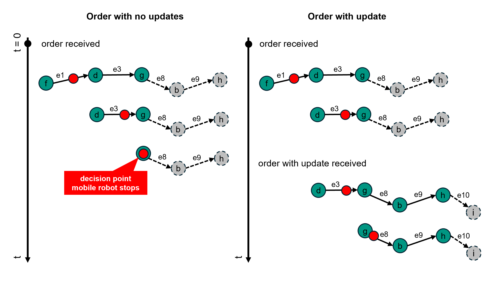
>图 3 - 扩展行驶路线 "Horizon" 的程序

在图 3 中，fleet control 首先在时间 t = 0 发送了一个初始 order。
图 4 展示了一个可能的 order 的伪代码。
为了提高可读性，此处省略了完整的 JSON 示例。

```json
{
	"orderId": "1234",
	"orderUpdateId": 0,
	"nodes": [
	 	 "f {released: true}",
	 	 "d {released: true}",
	 	 "g {released: true}",
	 	 "b {released: false}",
	 	 "h {released: false}"
	],
	"edges": [
		"e1 {released: true}",
		"e3 {released: true}",
		"e8 {released: false}",
		"e9 {released: false}"
	]
}
```
>图 4 一个 order 的伪代码。

在随后的某个时间点，通过发送 order 更新（参见图 5 中的伪代码）扩展了该 order。
请注意 `orderUpdateId` 会递增，并且 order update 的第一个 node 对应于上一条 order 消息的最后一个 base node，即拼接节点（stitching node）。之前 base 中的其他 node 和 edge 不会再次发送。

这可以确保 mobile robot 能够执行此 order update，也就是说，通过执行 mobile robot 已经知道的 edge，能够到达 order update 的首个 node。

```json
{
	"orderId": "1234",
	"orderUpdateId": 1,
	"nodes": [
		"g {released: true}",
		"b {released: true}",
		"h {released: true}",
		"i {released: false}"
	],
	"edges": [
		"e8 {released: true}",
		"e9 {released: true}",
		"e10 {released: false}"
	]
}
```
>图 5 order update 的伪代码。请注意 `orderUpdateId` 的变化。

这也有助于在 order update 丢失的情况下（例如由于无线网络不可靠）进行处理。
mobile robot 始终可以检查其已知的最后一个 base node 的 `nodeId`（和 `sequenceId`）是否与新 order update 的第一个 node 相同。

此外请注意，node g 是唯一被再次发送的 base node。
由于 base 不能被更改，因此重新发送 node f 和 d 是无效的。

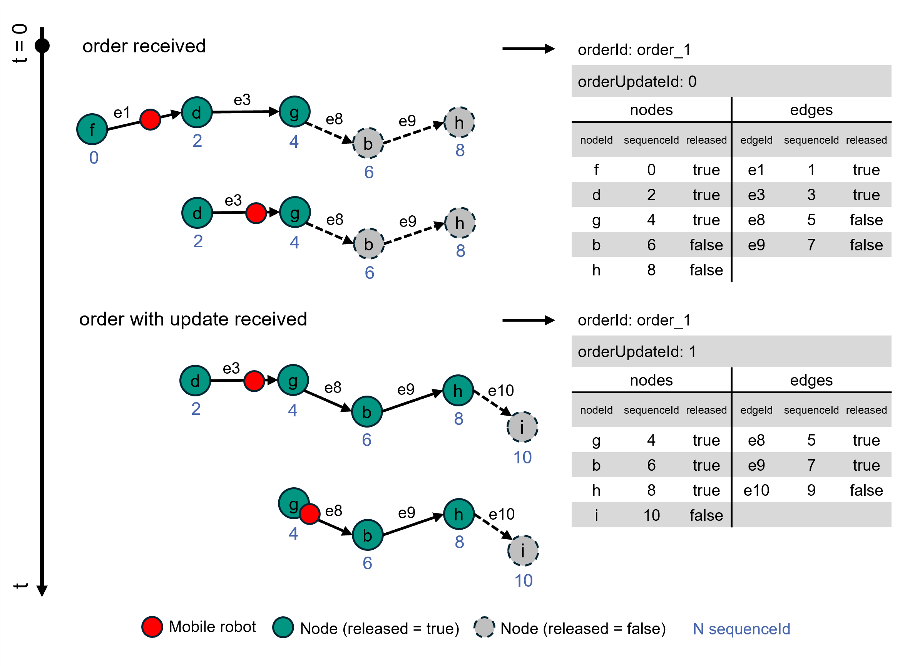
>图 6 - 常规更新流程 - order 扩展。

图 6 描述了应当如何扩展一个 order。

它展示了目前在 mobile robot 上可用的信息。
`orderId` 保持不变，且 `orderUpdateId` 递增。

重要的是不能更改决策点（图 6 中的 node g）的内容。这意味着 actions、deviation range（偏差范围）等应当被重新发送（参见图 7，`orderUpdateId` 1）。
为了通过 order update 释放 action 以让 mobile robot 在其已定位的 node 上执行，fleet control 应当将这个带有上一条 order update 中所有元数据（包括可能已经处于 'FINISHED'/'RUNNING' 状态的 action，这些 action 不会被 mobile robot 再次执行）的 node 重新发送一次，然后再添加一个 node，其中包含此 order update 将要执行的新释放的 actions。这个新 node 的 `nodeId` 可以与决策 node 相同，也可以是不同 `nodeId` 但位置与决策 node 相同的 node。新 node 的 `sequenceId` 始终为决策 node 的 `sequenceId` 加 2。

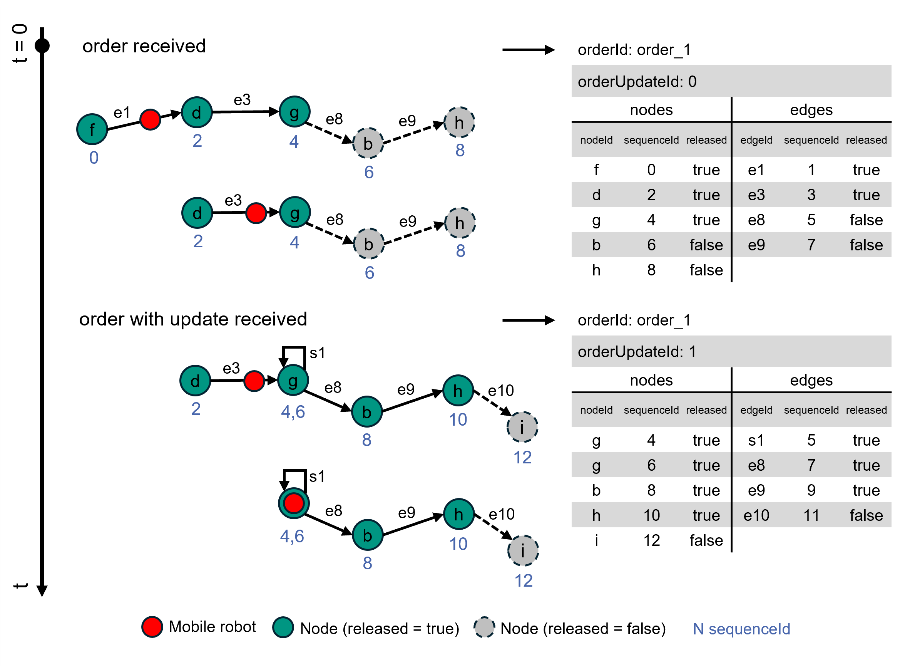
>图 7 - 带有附加拼接 node 的 order update（例如，在决策点上执行新 action）

可以通过任何 order update 修改或完全删除 horizon，或者以不同于先前 horizon 的方式扩展 base。

一旦分配了 `sequenceId` 并释放了 node，它就不会随着 order update 而改变（见图 6）。

图 8 描述了接受 order 或 order update 的过程。

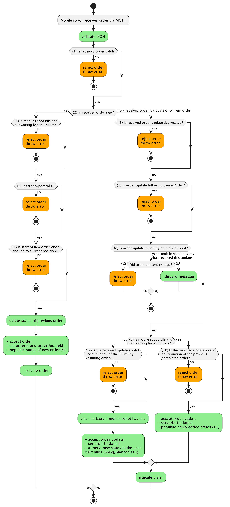
>图 8 - 接受 order 或 order update 的过程。

1) **Is received order valid? (接收到的 order 有效吗？)**:
所有格式和 JSON data types（数据类型）是否正确？

2) **Is received order new or an update of the current order? (接收到的 order 是新的，还是对当前 order 的 update？)**:
接收到的 order 的 `orderId` 与 mobile robot 当前持有的 order 的 `orderId` 不同吗？

3) **Is mobile robot idle and not waiting for an update? (mobile robot 是否处于 idle 状态并且没有在等待 update？)**:
mobile robot 是否根据 [6.6.8 Idle state of the mobile robot](#668-idle-state-of-the-mobile-robot) 处于 idle 状态并且没有在等待 update？由于 order horizon 的 node 和 edge 及其对应的 action state 也包含在 state 内部，因此 mobile robot 可能仍具有一个 horizon，因而在等待 update 并执行 order。

4) **Is OrderUpdateId 0?**: 新 order 的 `orderUpdateId` 是 0 吗？

5) **Is start of new order close enough to current position? (新 order 的起点距离当前位置足够近吗？)**:	mobile robot 是否已经停在 node 上，或者它是否位于该 node 的偏差范围内（[6.1.1 Concept and logic](#611-concept-and-logic)）？

6) **Is received order update deprecated? (接收到的 order update 已经过期了吗？)**: `orderUpdateId` 是否小于或等于 mobile robot 上当前的 `orderUpdateId`？

7) **Is order update following cancelOrder? (order update 是在 cancelOrder 之后发生的吗？)**: fleet control 不应再发送，mobile robot 也不应接受关于已取消 order 的进一步 order update。

8) **Is received order update currently on mobile robot? (接收到的 order update 目前在 mobile robot 上吗？)**: `orderUpdateId` 是否等于 mobile robot 上当前的 `orderUpdateId`？

9) **Is the received update a valid continuation of the currently still running order? (接收到的 update 是当前仍在运行的 order 的有效延续吗？)**:	接收到的 order 的第一个 node 是否是根据 order update 章节规定的当前决策点？mobile robot 仍在移动或执行与先前 order update 中释放的 base 相关的 actions，或者仍然有一个 horizon，因此正在等待该 order 的继续。在这种情况下，仅当新 base 的第一个 node 等于上一个 base 的最后一个 node 时，才会接受 order update。

10) **Is the received update a valid continuation of the previously completed order? (接收到的 update 是之前已完成的 order 的有效延续吗？)**: 接收到的 order 的第一个 node 是否是根据 order update 章节规定的当前决策点？mobile robot 不再执行任何 actions，也不再等待该 order 的继续（意味着它已完成其 base 及所有相关的 action，并且没有 horizon）。在这种情况下，仅当新 base 的第一个 node 等于上一个 base 的最后一个 node 时，才会接受 order update。

11) **Populate/append (填充/追加)** 新的 states 到 `actionStates`/`nodeStates`/`edgeStates` 中。

#### 6.1.2.1 Finishing an order (完成 order)

在 mobile robot 遍历完 order 的最后一个 node 并完成所有与 order 相关的移动和 action 后，它将处于 idle 状态，并应准备好接收新 order（参见 [6.6.8 Idle state of the mobile robot](#668-idle-state-of-the-mobile-robot)）。

### 6.1.3 Order cancellation (取消 Order)

Fleet control 可以使用 instantAction `cancelOrder` 来取消活动中的 order。

Fleet control 可以选择传递一个 `orderId` 来引用应该被取消的 order。
接收到 instantAction `cancelOrder` 后，mobile robot 应尝试尽快停止。
对于导引式 mobile robots，这可能是下一个可行 node。自由导航 mobile robot 应当尽快停止，而不仅仅是在下一个 node。

如果在 `actionStates` 中有被调度的 action，这些 action 应被取消并在其 `actionState` 中报告为 'FAILED'。
如果在 `actionStates` 中有正在运行的 action，这些 action 应被取消并且同样报告为 'FAILED'。
如果 action 无法被取消，该 action 的 `actionState` 应通过在运行时报告 'RUNNING'，并在那之后报告相应的 state（如果成功则报告 'FINISHED'，否则报告 'FAILED'）来反映这一点。
当 `actionStates` 中有正在运行的 action 时，`cancelOrder` action 应当报告 'RUNNING'，直到所有 action 都被取消/完成。无法取消的 action (cancelAllowed = false) 应当被执行完毕。
在 mobile robot 的所有运动以及 `actionStates` 中的所有 action 都停止后，`cancelOrder` action 的 status 应当报告为 'FINISHED'。
之后 mobile robot 将变为 idle 状态并准备好接收新 orders。

`orderId` 和 `orderUpdateId` 被保留。

图 9 显示了针对不同 mobile robot 能力的预期行为。

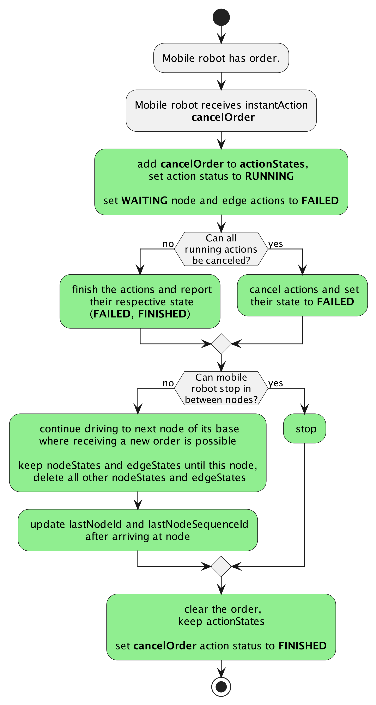
>图 9 - `cancelOrder` 之后的预期行为。

#### 6.1.3.1 Receiving a new order after cancellation (取消后接收新 order)

在取消一个 order 之后，mobile robot 处于 idle 状态并且应准备好接收新的 order。fleet control 不应再发送对已取消 order 的进一步 order update。如果 mobile robot 接收到 order update，它应报告类型为 'ORDER_UPDATE_FOLLOWING_CANCEL' 和级别为 'WARNING' 的错误。

在 mobile robot 只能将其自身定位在 node 上的情况下，新 order 应从 mobile robot 当前所处的 node 开始（另见图 4）。

在 mobile robot 可以停在 node 之间的情况下，fleet control 可以决定如何开始下一个 order。
mobile robot 应接受这两种方法。

有两种选项：

- 新 order 的第一个 node 是位于 mobile robot 当前位置的临时 node。随后 mobile robot 应当识别出该 node 是轻而易举可达的并接受该 order。
- 新 order 的第一个 node 是前一个 order 最后一个被遍历的 node。该 node 的允许偏差被设置得足够大，以确保 mobile robot 处于此范围内。因此，mobile robot 应当立即将该 node 视为已被遍历并接受该 order。

#### 6.1.3.2 Receiving a cancelOrder action when mobile robot is idle (在 mobile robot 处于 idle 状态时接收到 cancelOrder action)

如果 mobile robot 接收到一个 `cancelOrder` instant action，但该 mobile robot 当前处于 idle 状态，或者该 action 中指定的 `orderId` 与 mobile robot 当前正在活动的 order 的 `orderId` 不匹配，则 `cancelOrder` action 应被报告为 'FAILED'。

mobile robot 应当报告一个类型为 'NO_ORDER_TO_CANCEL' 且级别设置为 'WARNING' 的错误。`instantAction` 的 `actionId` 应作为 `errorReference` 传递。

### 6.1.4 Order rejection (Order 拒绝)

在某些场景下，一个 order 应当被拒绝。
这些场景如图 8 所示并在下方描述。

#### 6.1.4.1 Mobile robot receives a malformed order (Mobile robot 收到格式错误的 order)

处理方案：

1. mobile robot 不应在其内部缓冲区中接收该新 order。
2. mobile robot 应当报告一个类型为 'VALIDATION_FAILURE' 且级别为 'WARNING' 的错误。
3. 该 warning 应当被报告，直到 mobile robot 接受了一个新 order。

#### 6.1.4.2 Mobile robot receives an order with optional fields it cannot use (Mobile robot 收到包含其无法使用的可选 fields 的 order)

处理方案：

1. mobile robot 不应在其内部缓冲区中接收该新 order。
2. mobile robot 应当报告一个类型为 'UNSUPPORTED_PARAMETER'、级别为 'CRITICAL' 的错误，并将错误的 fields 作为 errorReferences（错误引用）。
3. 该 error 应当被报告，直到 mobile robot 接受了一个新 order。

#### 6.1.4.3 Mobile robot receives an order with actions it cannot perform (Mobile robot 收到包含其无法执行的 action 的 order)

示例：

- 举升高度高于最大举升高度
- 尽管没有安装行程装置，依然下发了举升 action 等。

处理方案：

1. mobile robot 不应在其内部缓冲区中接收该新 order。
2. mobile robot 应当报告一个类型为 'INVALID_ORDER_ACTION'、级别为 'WARNING' 的错误，并将错误的 fields 作为 errorReferences。
3. 该 warning 应当被报告，直到 mobile robot 接受了一个新 order。

#### 6.1.4.4 Mobile robot receives an order with the same orderId, but a lower orderUpdateId than the current orderUpdateId (Mobile robot 收到具有相同 orderId 但 orderUpdateId 低于当前 orderUpdateId 的 order)

处理方案：

1. mobile robot 不应在其内部缓冲区中接收该新 order。
2. mobile robot 应当在其缓冲区中保留先前的 order。
3. mobile robot 应当报告一个类型为 'OUTDATED_ORDER_UPDATE' 且级别为 'WARNING' 的错误。
4. mobile robot 应当继续执行先前的 order。
5. 该 warning 应当被报告，直到 mobile robot 接受了一个新 order。

#### 6.1.4.5 Mobile robot receives an order with the same orderId and same orderUpdateId as the current orderUpdateId (Mobile robot 收到具有相同 orderId 且 orderUpdateId 等于当前 orderUpdateId 的 order)

示例：

- Fleet control 重新发送了 order，因为它尚未收到带有相应 `orderUpdateId` 的任何 state 消息。

处理方案：

1. mobile robot 不应在其内部缓冲区中接收该新 order。
2. mobile robot 应当在其缓冲区中保留先前的 order。
3. 报告情况取决于消息的内容：
	- 如果新 order 的内容与前一个 order 的内容相同，mobile robot 应当忽略该新 order。
	- 如果新 order 的内容不同，mobile robot 应当报告一个类型为 'SAME_ORDER_UPDATE_ID' 且级别为 'WARNING' 的错误。
4. mobile robot 应当继续执行先前的 order。
5. 该 warning 应当被报告，直到 mobile robot 接受了一个新 order。

3. mobile robot 应当报告一个类型为 'OTHER_ORDER_ACTIVE' 且级别为 'WARNING' 的错误。
4. mobile robot 应当继续执行先前的 order。
5. 该 warning 应当被报告，直到 mobile robot 接受了一个新 order。

#### 6.1.4.7 Mobile robot receives an order with the start node being out of range (Mobile robot 收到起始 node 超出范围的 order)

处理方案：

1. mobile robot 不应在其内部缓冲区中接收该新 order。
2. mobile robot 应当报告一个类型为 'START_NODE_OUT_OF_RANGE' 且级别为 'WARNING' 的错误。
3. 该 warning 应当被报告，直到 mobile robot 接受了一个新 order。

#### 6.1.4.8 Mobile robot receives an order with at least one node not being reachable (Mobile robot 收到至少有一个 node 无法到达的 order)

处理方案：

1. mobile robot 不应在其内部缓冲区中接收该新 order。
2. mobile robot 应当报告一个类型为 'NO_ROUTE_TO_TARGET' 且级别为 'WARNING' 的错误。
3. 该 warning 应当被报告，直到 mobile robot 接受了一个新 order。


#### 6.1.4.9 Mobile robot receives an order while in an operating mode that does not allow new orders (Mobile robot 在不允许新 order 的 operating mode 下接收到 order)

处理方案：

1. mobile robot 不应在其内部缓冲区中接收该新 order。
2. mobile robot 应当报告一个类型为 'MOBILE_ROBOT_NOT_AVAILABLE' 且级别为 'WARNING' 的错误。
3. 该 warning 应当被报告，直到 mobile robot 处于允许接收新 order 的 operating mode（操作模式）。

#### 6.1.4.10 Mobile robot receives an order containing nodes with unknown mapId (Mobile robot 收到包含 mapId 未知的 node 的 order)

处理方案：

1. mobile robot 不应在其内部缓冲区中接收该新 order。
2. mobile robot 应当报告一个类型为 'UNKNOWN_MAP_ID' 且级别为 'WARNING' 的错误。
3. 该 warning 应当被报告，直到 mobile robot 接受了一个新 order。


### 6.1.5 Corridors (走廊)

可选的 `corridor` edge 属性允许 mobile robot 为了避开障碍物而偏离 edge 的轨迹，并定义了允许 mobile robot 运行的边界范围。
若要使用 `corridor` 属性，需要一条预定义的轨迹，即如果未定义 `corridor` 属性时 mobile robot 将会遵循的轨迹。这可以是定义在 mobile robot 上且 fleet control 已知的轨迹，也可以是在 order 中发送的轨迹。使用 `corridor` 属性的 mobile robot 其行为仍然是导引式 mobile robot 的行为，区别在于它被允许暂时偏离轨迹以避开障碍物。
请注意，默认情况下，在 order 中传达的 corridor 对于 mobile robot 来说是已释放的 (released)。如果 `releaseRequired` 标志被设置为 true，则 mobile robot 在使用 corridor 之前应当向 fleet control 请求批准，如第 [6.6.10 Request use of Corridors](#6610-request-use-of-corridors) 节所述。

*备注：
order 中的一条 edge 定义了两个 node 之间的逻辑连接，而不一定代表 mobile robot 从起始 node 行驶到终点 node 时所遵循的（实际）轨迹。
根据 mobile robot 类型的不同，mobile robot 在起始和终点 node 之间采取的轨迹，要么由 fleet control 通过轨迹 edge 属性定义，要么作为预定义轨迹分配给 mobile robot。
根据 mobile robot 内部状态的不同，所选轨迹可能会有所变化。*

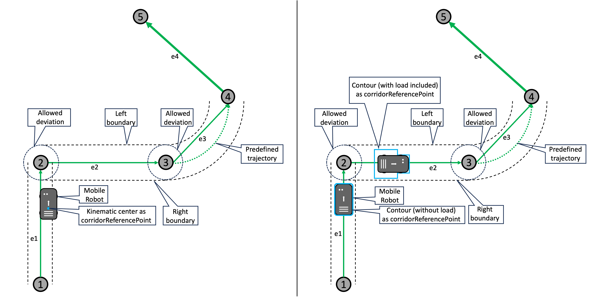
>图 10 - 带有 `corridor` 属性的 edge。该属性定义了允许 mobile robot 为了避开障碍物而偏离其预定义轨迹的左右边界。在左侧，运动学中心定义了允许的偏差；而在右侧，mobile robot 的轮廓（可能被载荷所扩展）定义了允许的偏差。这是由 `corridorReferencePoint` 参数定义的。

允许 mobile robot 独立导航（并偏离原始 edge 轨迹）的区域由左边界和右边界来定义。
可选的 `corridorReferencePoint` field 指定了移动机器人控制点或移动机器人轮廓应当位于已定义的边界内。
edge 的边界应当以这样一种方式来定义，即只要 mobile robot 通过了一个 node，它就处于新的且现在为当前的 edge 边界内。
如果 mobile robot 不应偏离轨迹，fleet control 不应将 corridor 边界设置为零，而是不应该使用 `corridor` 属性。

mobile robot 的运动控制软件应当不断检查 mobile robot 是否在规定的边界内。
如果不在，mobile robot 应当停止（因为它超出了允许的导航空间）并报告一个类型为 'OUTSIDE_OF_CORRIDOR' 且级别为 'CRITICAL' 的错误。
fleet control 可以决定是否需要用户干预，或者取消当前 order 并发送一条包含新的 corridor 信息的 order，以允许 mobile robot 再次移动从而让其继续运行。

*备注：允许 mobile robot 偏离轨迹会增加移动机器人在行驶过程中可能占据的 footprint (占用空间)。在初步运行时，以及当 fleet control 基于 mobile robot 的 footprint 做出交通控制决策时，应当考虑到这种情况。*
更多信息还请参见 [6.6.2 Traversal of nodes and edges](#662-traversal-of-nodes-and-edges) 节。


## 6.2 Actions (动作)

如果 mobile robot 支持除行驶 (driving) 之外的 action，这些 action 可以通过附加在 node 或 edge 上的 `actions` 数组进行指示、通过单独的 topic `instantActions` 发送（参见第 [6.2.1 Instant actions](#621-instant-actions) 节）或者通过 action zones 配置（参见第 [6.4.1 Zone types](#641-zone-types) 节）。
要在 edge 上执行的 action 应当仅在 mobile robot 位于该 edge 上时运行（参见第 [6.6.2 Traversal of nodes and entering/leaving edges, triggering of actions](#662-traversal-of-nodes-and-enteringleaving-edges-triggering-of-actions) 节）。

在 node 上触发的 action 可以根据需要持续运行，且应当能够自行终止（例如，持续五秒钟的声音信号或抓取动作在抓取载荷后完成），或者是成对出现的（例如，"activateWarningLights" (打开警告灯) 与 "deactivateWarningLights" (关闭警告灯)）。

### 6.2.1 Instant actions (即时 Action)

在某些情况下，有必要向 mobile robot 发送需要立即执行的 action。
这可以通过向 topic `instantActions` 发布 `instantAction` 消息来实现。
这些 action 不得与 mobile robot 当前 order 的内容相冲突（例如，`instantAction` 要求降低货叉，而 order 要求升高货叉）。

一些可能涉及 instant action 的相关示例包括：

- 暂停 mobile robot 而不更改当前 order 中的任何内容
- 暂停后恢复 order
- 激活信号（光学、声学等）

当 mobile robot 收到一条 `instantAction` 时，应当在其 state 的 `instantActionStates` 数组中添加一个适当的 `actionStatus`。
`actionStatus` 应当根据该 action 的进度进行更新。
关于 `actionStatus` 的不同转换，请参见图 11。
instant action 的 `blockingType` 始终为 'NONE'。

当 mobile robot 收到一条它无法执行的 `instantAction` 时，它应当报告一个类型为 'INVALID_INSTANT_ACTION'、级别为 'WARNING' 的错误，并将该 `instantAction` 的 `actionId` 作为 `errorReference` 传递。

### 6.2.2 Action blocking types and sequence (Action 阻塞类型与执行顺序)

列表中多个 action 的顺序定义了 mobile robot 执行它们的顺序。

action 的并行执行受到其各自 `blockingType` 的约束。
Action 可以有四种不同的阻塞类型，如表 3 所述。

| -                                              | Parallel execution allowed (允许并行执行) | Parallel execution not allowed (不允许并行执行) |
| ---------------------------------------------- | ----------------------------------------- | ----------------------------------------------- |
| Automatic driving allowed (允许自动行驶)       | NONE                                      | SINGLE                                          |
| Automatic driving not allowed (不允许自动行驶) | SOFT                                      | HARD                                            |

>表 3 基于行驶和并行执行对 action 阻塞类型的定义

图 11 描述了 mobile robot 应当如何处理 action 的阻塞类型。每当 mobile robot 到达一个需要执行新 action 的点（即当它到达一个 node、edge 或 action zone）时，这些 action 会按照与 actions 数组中相同的顺序进入队列。此队列会按照图 11 所示持续处理。如果队列中任何 action 的阻塞类型是 'SOFT' 或 'HARD'，mobile robot 应当停止自动行驶。如果 action 的阻塞类型为 'NONE' 或 'SOFT'，则收集这些 action 以便并行执行。如果要执行一个阻塞类型为 'SINGLE' 或 'HARD' 的 action，则在启动该 action 之前，所有收集到的用于并行执行的 action 必须处于 'FINISHED'（完成）或 'FAILED'（失败）状态。如果队列中不再有阻塞类型为 'SOFT' 或 'HARD' 的 action，则 mobile robot 可以恢复自动行驶。'FINISHED' 或 'FAILED' 状态的 action 应当从队列中被移除。

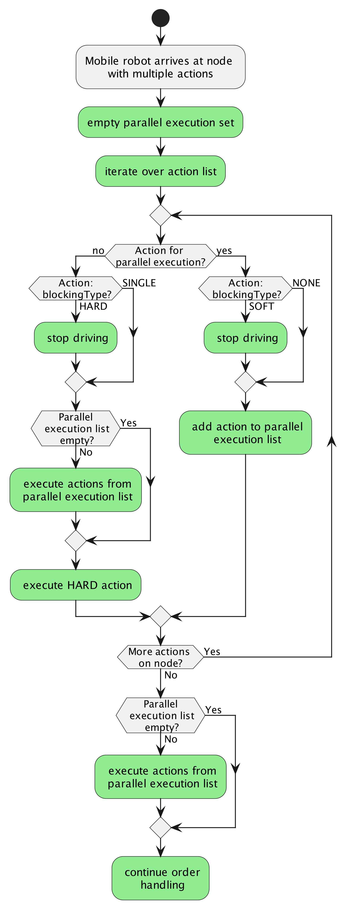
>图 11 - 处理多个 action

### 6.2.3 Predefined actions (预定义 Action)

本节展示了预定义的 action，如果 mobile robot 的能力与该 action 描述相匹配，则 mobile robot 应当使用这些预定义的 action。
如果存在一种使用所定义参数的合理方式，则应当使用它们。
如果为了成功执行某个 action 需要额外的参数，则可以定义附加参数。
所有 mobile robot 应当支持 `cancelOrder`、`startPause` 以及 `stopPause` 等 action。

如果无法将某些 action 映射到以下章节中的 action，mobile robot 制造商可以定义 fleet control 应当使用的额外 action。

#### 6.2.3.1 Definition, parameters, effects and scope (定义、参数、作用与范围)

| action type (Action 类型) | counter action (对应反向 Action) | description (描述)                                                                                                                                                                                                                                                                                                                                                                                                                                                                                                                                                                                                                                                                                                                                                             | idempotent (幂等性) | parameters (参数)                                                                                                                                                                                                                                                                                   | linked state (关联状态)                                                                                                         | instant (即时) | node              | edge | zone |
| ------------------------- | -------------------------------- | ------------------------------------------------------------------------------------------------------------------------------------------------------------------------------------------------------------------------------------------------------------------------------------------------------------------------------------------------------------------------------------------------------------------------------------------------------------------------------------------------------------------------------------------------------------------------------------------------------------------------------------------------------------------------------------------------------------------------------------------------------------------------------ | ------------------- | --------------------------------------------------------------------------------------------------------------------------------------------------------------------------------------------------------------------------------------------------------------------------------------------------- | ------------------------------------------------------------------------------------------------------------------------------- | -------------- | ----------------- | ---- | ---- |
| startPause                | stopPause                        | 激活 pause (暂停) 模式。 <br>由于许多 mobile robot 可以通过硬件开关来暂停，因此需要一个关联的 state。<br>停止自动行驶 - 不需要到达下一个 node。可以暂停的 action (`pauseAllowed`=`true`) 应当被暂停，其他 action 继续执行。在执行 stopPause 后将恢复 order 的执行。                                                                                                                                                                                                                                                                                                                                                                                                                                                                                                            | yes                 | -                                                                                                                                                                                                                                                                                                   | paused                                                                                                                          | yes            | no                | no   | no   |
| stopPause                 | startPause                       | 停用 pause 模式。 <br>将恢复移动以及所有其他 action（如果有）。<br>由于许多 mobile robot 可以通过硬件开关来暂停，因此需要一个关联的 state。<br>如果经过配置，stopPause 也可以重新启动由触发了 startPause 的硬件按钮所停止的 mobile robot。                                                                                                                                                                                                                                                                                                                                                                                                                                                                                                                                     | yes                 | -                                                                                                                                                                                                                                                                                                   | paused                                                                                                                          | yes            | no                | no   | no   |
| startHibernation          | stopHibernation                  | 启动 hibernate (休眠) 模式，在此模式下，mobile robot 应当保持与 MQTT broker 的连接，但不再需要发送 state 消息。mobile robot 应当在停止发布 state 消息之前将该 action 报告为 'FINISHED'，并发布一个 'HIBERNATING' 的 connection state（连接状态）。如果 mobile robot 当前有活跃的 order，它应当清除该 order。不需要到达下一个 node。<br>在 'HIBERNATING' 连接状态下，mobile robot 不应处于移动中。mobile robot 应当只接收并响应 instant action 'stopHibernation'，并且不应当响应任何其他命令（如 order 或额外的 instant action）。<br>如果在此模式下 mobile robot 的电池电量严重不足，它可能会自主停止 'HIBERNATING' 以报告错误。如果设置了 wake‑up time (唤醒时间)，mobile robot 能够在该指定时间自主退出 'HIBERNATING' 连接状态，并在恢复正常运行之前发布相应的连接状态转换。 | yes                 | wakeUpTime (string, optional)                                                                                                                                                                                                                                                                       | -                                                                                                                               | yes            | no                | no   | no   |
| stopHibernation           | startHibernation                 | 结束 hibernate 模式。若要在 mobile robot 处于 'HIBERNATING' 状态时启动唤醒，一个控制设备（车载或外部）应当订阅 `instantAction` topic 并保持与 MQTT broker 的连接。由于在休眠期间 mobile robot 的标准控制设备可能已部分关闭，唤醒操作可由一个单独的 MQTT 客户端（不同于 mobile robot 通常的通信客户端）来触发。<br>成功后，mobile robot 应当发布 ONLINE 的 connection state。                                                                                                                                                                                                                                                                                                                                                                                                   | yes                 | -                                                                                                                                                                                                                                                                                                   | -                                                                                                                               | yes            | no                | no   | no   |
| shutdown                  | -                                | 启动 mobile robot 的协调 shutdown (关机)，此时它将断开与 MQTT broker 的连接。执行 shutdown action 需要 mobile robot 处于 idle 状态。在 VDA 5050 协议中，没有办法因连接断开而自动重启。<br>如果 mobile robot 处于休眠模式但应当被关闭，它必须在执行 shutdown 之前先退出休眠（通过 stopHibernation）。                                                                                                                                                                                                                                                                                                                                                                                                                                                                           | yes                 | -                                                                                                                                                                                                                                                                                                   | -                                                                                                                               | yes            | no                | no   | no   |
| startCharging             | stopCharging                     | 激活 charging (充电) 过程。<br>充电可以在充电点进行（mobile robot 停止）或在充电车道上进行（行驶中）。<br>防止过度充电是 mobile robot 的责任。                                                                                                                                                                                                                                                                                                                                                                                                                                                                                                                                                                                                                                 | yes                 | -                                                                                                                                                                                                                                                                                                   | powerSupply.charging                                                                                                            | yes            | yes               | no   | no   |
| stopCharging              | startCharging                    | 终止 charging 过程。<br>充电过程也可以由 mobile robot 或充电站中断（例如，电池已满）。                                                                                                                                                                                                                                                                                                                                                                                                                                                                                                                                                                                                                                                                                         | yes                 | -                                                                                                                                                                                                                                                                                                   | powerSupply.charging                                                                                                            | yes            | yes               | no   | no   |
| initializePosition        | -                                | 使用给定参数重置（覆盖）mobile robot 的姿态。                                                                                                                                                                                                                                                                                                                                                                                                                                                                                                                                                                                                                                                                                                                                  | yes                 | x (float64)<br>y (float64)<br>theta (float64)<br>mapId (string)<br>lastNodeId (string)                                                                                                                                                                                                              | mobileRobotPosition.x<br>mobileRobotPosition.y<br>mobileRobotPosition.theta<br>mobileRobotPosition.mapId<br>lastNodeId<br> maps | yes            | yes<br>(Elevator) | no   | no   |
| enableMap                 | -                                | 显式启用之前已下载的 map (地图)，以便在 order 中使用，而无需初始化新的位置。                                                                                                                                                                                                                                                                                                                                                                                                                                                                                                                                                                                                                                                                                                   | yes                 | mapId (string)<br>mapVersion (string)                                                                                                                                                                                                                                                               | maps                                                                                                                            | yes            | yes               | no   | no   |
| downloadMap               | -                                | 触发下载新的 map。在下载期间保持活跃。错误将在 mobile robot 的 state 中报告。在验证下载成功、准备使用地图并在 state 中设置好该地图后，报告为已完成。                                                                                                                                                                                                                                                                                                                                                                                                                                                                                                                                                                                                                           | yes                 | mapId (string)<br>mapVersion (string)<br>mapDownloadLink (string)<br>mapHash (string, optional)                                                                                                                                                                                                     | maps                                                                                                                            | yes            | no                | no   | no   |
| deleteMap                 | -                                | 触发将 map 从 mobile robot 的内存中删除。                                                                                                                                                                                                                                                                                                                                                                                                                                                                                                                                                                                                                                                                                                                                      | yes                 | mapId (string)<br>mapVersion (string)                                                                                                                                                                                                                                                               | maps                                                                                                                            | yes            | no                | no   | no   |
| downloadZoneSet           | -                                | 触发 zone set 的下载。在下载期间保持活跃。错误将在 mobile robot state 中报告。在验证下载成功、准备使用 zone set 并将其设置到 state 后报告为已完成。                                                                                                                                                                                                                                                                                                                                                                                                                                                                                                                                                                                                                            | yes                 | zoneSetId (string)<br>zoneSetDownloadLink (string)<br>zoneSetHash (string, optional)                                                                                                                                                                                                                | zoneSets                                                                                                                        | yes            | no                | no   | no   |
| enableZoneSet             | -                                | 显式启用之前下载的 zone set，以便在 order 中使用。                                                                                                                                                                                                                                                                                                                                                                                                                                                                                                                                                                                                                                                                                                                             | yes                 | zoneSetId (string)<br>                                                                                                                                                                                                                                                                              | zoneSets                                                                                                                        | yes            | yes               | no   | no   |
| deleteZoneSet             | -                                | 触发将 zone set 从 mobile robot 的内存中移除。                                                                                                                                                                                                                                                                                                                                                                                                                                                                                                                                                                                                                                                                                                                                 | yes                 | zoneSetId (string)                                                                                                                                                                                                                                                                                  | zoneSets                                                                                                                        | yes            | no                | no   | no   |
| clearInstantActions       | -                                | 从 mobile robot 的 state 中移除所有 finished (已完成) 或 failed (失败) 的 instant action。                                                                                                                                                                                                                                                                                                                                                                                                                                                                                                                                                                                                                                                                                     | yes                 | -                                                                                                                                                                                                                                                                                                   | instantActionStates                                                                                                             | yes            | yes               | no   | no   |
| clearZoneActions          | -                                | 从 mobile robot 的 state 中移除所有 finished 或 failed 的 zone action。                                                                                                                                                                                                                                                                                                                                                                                                                                                                                                                                                                                                                                                                                                        | yes                 | -                                                                                                                                                                                                                                                                                                   | zoneActionStates                                                                                                                | yes            | yes               | no   | no   |
| stateRequest              | -                                | 请求 mobile robot 发送一条新的 state 消息。                                                                                                                                                                                                                                                                                                                                                                                                                                                                                                                                                                                                                                                                                                                                    | yes                 | -                                                                                                                                                                                                                                                                                                   | -                                                                                                                               | yes            | no                | no   | no   |
| logReport                 | -                                | 请求 mobile robot 生成并存储一份 log (日志) 报告。                                                                                                                                                                                                                                                                                                                                                                                                                                                                                                                                                                                                                                                                                                                             | yes                 | reason<br>(string)                                                                                                                                                                                                                                                                                  | -                                                                                                                               | yes            | no                | no   | no   |
| pick                      | drop<br><br>(如果是自动化的)     | 请求 mobile robot 抓取 (pick) 载荷。<br>具有多个载荷搬运设备的 mobile robot 可以并行处理多个 pick 操作。<br>在这种情况下，需要存在 lhd 参数（例如，LHD1）。<br>stationType 参数通知了详细处理抓取操作的方式（例如，地面位置、货架位置、被动输送机、主动输送机等）。<br>load type 提供了关于载荷单元的信息，并可用于例如切换区域扫描范围（例如，EPAL，INDU 等）。<br>为了准备载荷搬运设备（例如，基于 height 参数进行起升前操作），该 action 可以提前在 horizon 中被通告。<br>但是，因为相关 node 尚未被释放，预起升等操作不会在 mobile robot state 中被报告为 'RUNNING'。<br>如果在 edge 上，mobile robot 可以使用其传感器设备来检测抓取 node 的位置。                                                                                                                         | no                  | lhd (string, optional)<br>stationType (string, optional)<br>stationName (string, optional)<br>loadType (string, optional) <br>loadId (string, optional)<br>height (float64, optional)<br>定义与地面相关的载荷底部<br>depth (float64, optional) 适用于叉车<br>side (string, optional) 例如，输送机侧 | .load                                                                                                                           | no             | yes               | yes  | no   |
| drop                      | pick<br><br>(如果是自动化的)     | 请求 mobile robot 放置 (drop) 载荷。<br>有关详细信息，请参阅 action pick。                                                                                                                                                                                                                                                                                                                                                                                                                                                                                                                                                                                                                                                                                                     | no                  | lhd (string, optional)<br>stationType (string, optional)<br>stationName (string, optional)<br>loadType (string, optional)<br>loadId (string, optional)<br>height (float64, optional)<br>depth (float64, optional) <br>…                                                                             | .load                                                                                                                           | no             | yes               | yes  | no   |
| detectObject              | -                                | mobile robot 检测 object (对象)，例如载荷、充电点或空置停车位。                                                                                                                                                                                                                                                                                                                                                                                                                                                                                                                                                                                                                                                                                                                | yes                 | objectType (string, optional)                                                                                                                                                                                                                                                                       | -                                                                                                                               | no             | yes               | yes  | yes  |
| finePositioning           | -                                | 在 node 上，mobile robot 将在一个目标上精确定位。<br>允许 mobile robot 偏离其 node 的原始位置。<br>在 edge 上，mobile robot 将在遍历 edge 时，例如与固定设备对齐。                                                                                                                                                                                                                                                                                                                                                                                                                                                                                                                                                                                                             | yes                 | stationType (string, optional)<br>stationName (string, optional)                                                                                                                                                                                                                                    | -                                                                                                                               | no             | yes               | yes  | yes  |
| waitForTrigger            | -                                | mobile robot 应当等待由 triggerType 参数指定的预定义类型的 trigger (触发器)，该参数是一个字符串数组。如果语义合适，应当使用两个预定义的值：'FLEET_CONTROL' 表示触发源自 fleet control，'LOCAL' 表示触发源自 mobile robot 上的输入（例如按下按钮、手动装载）。如果预定义值无法满足特定要求，可以定义自定义值。<br>fleet control 负责处理超时，并应当在必要时取消 order。                                                                                                                                                                                                                                                                                                                                                                                                        | yes                 | triggerType [string] (array)                                                                                                                                                                                                                                                                        | -                                                                                                                               | no             | yes               | no   | yes  |
| trigger                   | -                                | fleet control 系统通知 mobile robot 一个 waitForTrigger action 已被释放。通常，这发生在 fleet control 接收到第三方系统的信息，表明 mobile robot 等待的流程已完成时。                                                                                                                                                                                                                                                                                                                                                                                                                                                                                                                                                                                                           | yes                 | -                                                                                                                                                                                                                                                                                                   | -                                                                                                                               | yes            | no                | no   | no   |
| retry                     | -                                | mobile robot 重试 (retry) 通过 actionId 定义且当前处于 RETRIABLE 状态的 action。                                                                                                                                                                                                                                                                                                                                                                                                                                                                                                                                                                                                                                                                                               | yes                 | actionId (string)                                                                                                                                                                                                                                                                                   | -                                                                                                                               | yes            | no                | no   | no   |
| skipRetry                 | -                                | mobile robot 应当跳过 (skip) 通过 actionId 定义且当前处于 RETRIABLE 状态的 action，并将该 action 的状态设置为 FAILED。                                                                                                                                                                                                                                                                                                                                                                                                                                                                                                                                                                                                                                                         | yes                 | actionId (string)                                                                                                                                                                                                                                                                                   | -                                                                                                                               | yes            | no                | no   | no   |
| cancelOrder               | -                                | mobile robot 尽快停止。这可能是立刻停止，也可能是在下一个 node 停止。参见 6.1.3 Order cancellation 章节。                                                                                                                                                                                                                                                                                                                                                                                                                                                                                                                                                                                                                                                                      | yes                 | orderId (string, optional)                                                                                                                                                                                                                                                                          | -                                                                                                                               | yes            | no                | no   | no   |
| factsheetRequest          | -                                | 请求 mobile robot 发送 factsheet (数据表)                                                                                                                                                                                                                                                                                                                                                                                                                                                                                                                                                                                                                                                                                                                                      | yes                 | -                                                                                                                                                                                                                                                                                                   | -                                                                                                                               | yes            | no                | no   | no   |
| updateCertificate         | -                                | 请求 mobile robot 下载并激活新的 certificate set (证书集)，service 参数是一个可扩展枚举，预定义参数 'MQTT' 用于 mqtt 连接。                                                                                                                                                                                                                                                                                                                                                                                                                                                                                                                                                                                                                                                    | yes                 | service (string)<br>keyDownloadLink (string)<br>certificateDownloadLink (string)<br>certificateAuthorityDownloadLink (string, optional)                                                                                                                                                             | -                                                                                                                               | yes            | no                | no   | no   |

>表 4 - 预定义的 action 及其适用范围 (instant, node, edge, zone)


#### 6.2.3.2 Action states (Action 状态)

| action type         | 'INITIALIZING'                                | 'RUNNING'                                                                                                  | 'PAUSED'                                                                               | 'FINISHED'                                                                                                                                                                                                                    | 'FAILED'                                                                                                                                   | 'RETRIABLE'                                                                               |
| ------------------- | --------------------------------------------- | ---------------------------------------------------------------------------------------------------------- | -------------------------------------------------------------------------------------- | ----------------------------------------------------------------------------------------------------------------------------------------------------------------------------------------------------------------------------- | ------------------------------------------------------------------------------------------------------------------------------------------ | ----------------------------------------------------------------------------------------- |
| startPause          | -                                             | 模式的激活正在准备中。<br>如果 mobile robot 支持即时转换，则可以省略此状态。                               | -                                                                                      | mobile robot 未在移动。<br>所有可暂停的 action 均被暂停。<br>已激活 pause 模式。<br>mobile robot 报告 paused: "true"。                                                                                                        | 由于某种原因无法激活 pause 模式（例如被硬件开关覆盖）。                                                                                    | -                                                                                         |
| stopPause           | -                                             | 模式的停用正在准备中。<br>如果 mobile robot 支持即时转换，则可以省略此状态。                               | -                                                                                      | 已停用 pause 模式。<br>所有已暂停的 action 已恢复。<br>mobile robot 报告 paused: "false"。                                                                                                                                    | 由于某种原因无法停用 pause 模式（例如被硬件开关覆盖）。                                                                                    | -                                                                                         |
| startHibernation    | -                                             | hibernate 模式的激活正在准备中。如果 mobile robot 支持即时转换，则可以省略此状态。                         | -                                                                                      | mobile robot 未在移动。如果有的话，活动的 order 已被清除。mobile robot 不再发送 state 消息。<br>已激活 hibernate 模式。mobile robot 报告 connection state 为 "HIBERNATING"。                                                  | 无法发布 HIBERNATING 连接状态（例如被硬件开关覆盖）。                                                                                      | -                                                                                         |
| stopHibernation     | -                                             | hibernate 模式的停用正在准备中。如果 mobile robot 支持即时转换，则可以省略此状态。                         | -                                                                                      | 已停用 hibernate 模式。<br>mobile robot 报告 connectionState 为 "ONLINE"。                                                                                                                                                    | 无法停用 hibernate 模式（例如被硬件开关覆盖）。                                                                                            | -                                                                                         |
| shutdown            | -                                             | OFFLINE 连接状态的激活正在准备中。如果 mobile robot 支持即时转换，则可以省略此状态。                       | -                                                                                      | mobile robot 未在移动。mobile robot 与 broker 之间的连接被协调终止。<br>mobile robot 报告 connection state 为 "OFFLINE"。                                                                                                     | shutdown 由于某些原因无法执行（例如，mobile robot 未处于 idle 状态，被硬件开关覆盖）。                                                     | -                                                                                         |
| startCharging       | -                                             | 充电过程的激活正在进行中（与充电器的通信正在运行）。<br>如果 mobile robot 支持即时转换，则可以省略此状态。 | -                                                                                      | 充电过程已开始。<br>mobile robot 报告 powerSupply.charging: "true"。                                                                                                                                                          | 由于某种原因无法开始充电过程（例如，未对准充电器）。充电问题应当对应一个错误。                                                             | 充电过程无法启动。mobile robot 正在等待 fleet control 或操作员的干预。                    |
| stopCharging        | -                                             | 充电过程的停用正在进行中（与充电器的通信正在运行）。<br>如果 mobile robot 支持即时转换，则可以省略此状态。 | -                                                                                      | 充电过程已停止。<br>mobile robot 报告 powerSupply.charging: "false"                                                                                                                                                           | 由于某种原因无法停止充电过程（例如，未对准充电器）。<br>充电问题应当对应一个错误。                                                         | -                                                                                         |
| initializePosition  | -                                             | 正在进行新姿态的初始化（置信度检查等）。<br>如果 mobile robot 支持即时转换，则可以省略此状态。             | -                                                                                      | 姿态已被重置。<br>mobile robot 报告 <br>mobileRobotPosition.x = x, <br>mobileRobotPosition.y = y, <br>mobileRobotPosition.theta = theta <br>mobileRobotPosition.mapId = mapId <br>mobileRobotPosition.lastNodeId = lastNodeId | 姿态无效或无法被重置。<br>一般的定位问题应当对应一个错误。                                                                                 | -                                                                                         |
| downloadMap         | 正在初始化到地图服务器的连接。                | mobile robot 正在下载该 map。                                                                              | -                                                                                      | 下载已完成。mobile robot 通过设置 mapId/mapVersion 及将相应的 mapStatus 设为 'DISABLED' 来更新其状态。                                                                                                                        | 下载失败，在 mobile robot 状态中被更新（例如连接丢失、地图服务器不可达、地图服务器上不存在该 mapId/mapVersion）。                          | 下载失败或被中断。mobile robot 正在等待 fleet control 的干预。                            |
| enableMap           | -                                             | mobile robot 启用了请求的 mapId 和 mapVersion 的地图，并禁用了具有相同 mapId 的任何其他地图。              | -                                                                                      | 地图已启用。mobile robot 更新请求的地图的相应 mapStatus 为 'ENABLED'，将具有相同 mapId 的其他版本设为 'DISABLED'。                                                                                                            | 请求的 mapId/mapVersion 组合不存在。                                                                                                       | -                                                                                         |
| deleteMap           | -                                             | mobile robot 从其内部内存中删除了所请求 mapId 和 mapVersion 的地图。                                       | -                                                                                      | 地图已被删除。mobile robot 从其 state 中移除该 mapId/mapVersion。                                                                                                                                                             | 无法删除地图，例如因为该地图当前正在使用，或者请求的 mapId/mapVersion 组合之前已被删除。                                                   | -                                                                                         |
| downloadZoneSet     | 正在初始化到 zone set (区域集) 服务器的连接。 | mobile robot 正在下载该 zone set。                                                                         | -                                                                                      | 下载已完成。mobile robot 通过在其 state 中设置具有 zoneSetStatus 'DISABLED' 的相应 zoneSet 对象来更新状态。                                                                                                                   | 下载失败，在 mobile robot 状态中被更新（例如连接丢失、服务器不可达、zone set 不存在、mobile robot 上已有具有相同 zoneSetId 的 zone set）。 | 下载失败或被中断。mobile robot 正在等待 fleet control 的干预。                            |
| enableZoneSet       | -                                             | mobile robot 启用了具有请求 zoneSetId 的 zone set，并禁用了同属该 mapId 的任何其他 zone set。              | -                                                                                      | 该 zone set 已启用。mobile robot 将请求 zoneSet 的相应 zoneSetStatus 更新为 'ENABLED'，并将同一 mapId 下的其他 zone sets 设为 'DISABLED'。                                                                                    | 请求的 zone set 不存在。                                                                                                                   | -                                                                                         |
| deleteZoneSet       | -                                             | mobile robot 从其内部内存中删除所请求 zoneSetId 的 zone set。                                              | -                                                                                      | 该 zone set 已被删除。mobile robot 从其 state 中移除该 zoneSet 对象。                                                                                                                                                         | 无法删除 zone set，例如因为该 zone set 当前正在被使用，或者请求的 zone set 之前已被删除过。                                                | -                                                                                         |
| clearInstantActions | -                                             |                                                                                                            | -                                                                                      | instant actions 数组已被清理，所有的 FINISHED 或 FAILED 的 instantAction 都已移除。                                                                                                                                           | -                                                                                                                                          | -                                                                                         |
| clearZoneActions    | -                                             |                                                                                                            | -                                                                                      | zone actions 数组已被清理，所有的 FINISHED 或 FAILED 的 zone action 都已移除。                                                                                                                                                | -                                                                                                                                          | -                                                                                         |
| stateRequest        | -                                             | -                                                                                                          | -                                                                                      | 状态已经通讯发出                                                                                                                                                                                                              | -                                                                                                                                          | -                                                                                         |
| logReport           | -                                             | 报告正在生成中。<br>如果 mobile robot 支持即时生成，则可以省略此状态。                                     | -                                                                                      | 报告已被存储。<br>日志的名称作为该 action state 的一部分被报告。                                                                                                                                                              | 报告无法被存储（例如由于没有空间）。                                                                                                       | -                                                                                         |
| pick                | 初始化 pick 过程，例如悬空的提升操作。        | pick 过程正在运行（mobile robot 正在进入工位，载荷搬运设备处于繁忙状态，与工位的通信正在运行等）。         | pick 过程正在被暂停，例如因为违反了安全区域。<br>在解除违规后，pick 过程将继续。       | Pick 已经完成。<br>载荷已经进入 mobile robot 并且 mobile robot 报告了新的 load 状态。                                                                                                                                         | Pick 失败，例如工位意外变空。<br>失败的 pick 操作应当对应一个错误。                                                                        | Pick 失败，但是可以重试 (retriable)。mobile robot 正在等待 fleet control 或操作员的干预。 |
| drop                | 初始化 drop 过程，例如悬空的提升操作。        | drop 过程正在运行（mobile robot 正在进入工位，载荷搬运设备处于繁忙状态，与工位的通信正在运行等）。         | drop 过程正在被暂停，例如因为违反了安全区域。<br>在解除违规后，drop 过程将继续。       | Drop 已经完成。<br>载荷已经离开 mobile robot 并且 mobile robot 报告了新的 load 状态。                                                                                                                                         | Drop 失败，例如工位意外被占用。<br>失败的 drop 操作应当对应一个错误。                                                                      | Drop 失败，但是可以重试。mobile robot 正在等待 fleet control 或操作员的干预。             |
| detectObject        | -                                             | 对象检测正在运行中。                                                                                       | -                                                                                      | 对象已经被检测到。                                                                                                                                                                                                            | 无法检测到该对象。                                                                                                                         | 对象检测失败，但是可以重试。mobile robot 正在等待 fleet control 或操作员的干预。          |
| finePositioning     | -                                             | mobile robot 正在将自身精确定位到一个目标上。                                                              | 精确定位过程正在被暂停，例如因为违反了安全区域。<br>例如在违规解决之后，精确定位继续。 | 已到达相对于工位的目标位置。                                                                                                                                                                                                  | 无法到达相对于工位的目标位置。                                                                                                             | 精确定位失败但可重试。mobile robot 正在等待 fleet control 或操作员的干预。                |
| waitForTrigger      | -                                             | mobile robot 正在等待触发器 (trigger)                                                                      | -                                                                                      | 触发器已经被触发。                                                                                                                                                                                                            | 如果 order 被取消，waitForTrigger 将失败。                                                                                                 | -                                                                                         |
| cancelOrder         | -                                             | mobile robot 正在停止或正在行驶直至到达下一个 node。                                                       | -                                                                                      | mobile robot 没有在移动。mobile robot 已经取消了 order 的执行，并且处于 idle 状态。                                                                                                                                           | <br>mobile robot 没有活跃的 order。<br>先前的 order 已经被取消。<br>传递的 orderId 与当前活跃的 orderId 不匹配。                           | -                                                                                         |
| factsheetRequest    | -                                             | -                                                                                                          | -                                                                                      | factsheet 已经被通讯发出                                                                                                                                                                                                      | -                                                                                                                                          | -                                                                                         |
| updateCertificate   | -                                             | mobile robot 正在下载并安装证书                                                                            | -                                                                                      | 证书已经被下载、安装并处于激活状态。                                                                                                                                                                                          | 下载或安装失败。                                                                                                                           | -                                                                                         |

>表 5 - 预定义 action 在各 action state 下的预期行为

#### 6.2.3.3 Update mobile robot certificate (更新 mobile robot 证书)

出于安全原因，mobile robot 的通信（至少针对 fleet management 的通信）应当被保护。通常，与 MQTT broker 之间的通信通过 TLS 进行保护，这需要一个或多个根证书以及特定于 mobile robot 的密钥对。`service` 参数指定了将使用这些证书的服务（例如 'MQTT'）。`certificateAuthorityDownloadLink` 参数指定了根证书的 URL。`certificateDownloadLink` 和 `keyDownloadLink` 参数分别指定了特定于 mobile robot 的公钥和私钥的 URL。

下载过程也应当通过 TLS 进行保护，因为无法验证 `instantAction` 的发送方。在激活证书链之前，建议对其进行验证。


## 6.3 Maps (地图)

为了确保不同类型 mobile robot 之间的导航一致性，位置始终参考特定于项目的坐标系（参见图 12）。该项目特定坐标系是指为 fleet control 与 mobile robot 之间的交互所定义的坐标系。
为了区分站地或位置的不同层级（楼层），使用唯一的 `mapId`。
地图坐标系应被指定为一个 z 轴指向上方的右手坐标系。
因此，正旋转应被理解为逆时针旋转。
mobile robot 坐标系同样被指定为右手坐标系（ISO 9787 4.1），其中 x 轴指向 mobile robot 的前进方向，z 轴指向上方（ISO 9787 5.5）。除非另有说明，mobile robot 的参考点在 mobile robot 参考系中被定义为 (0,0,0)。

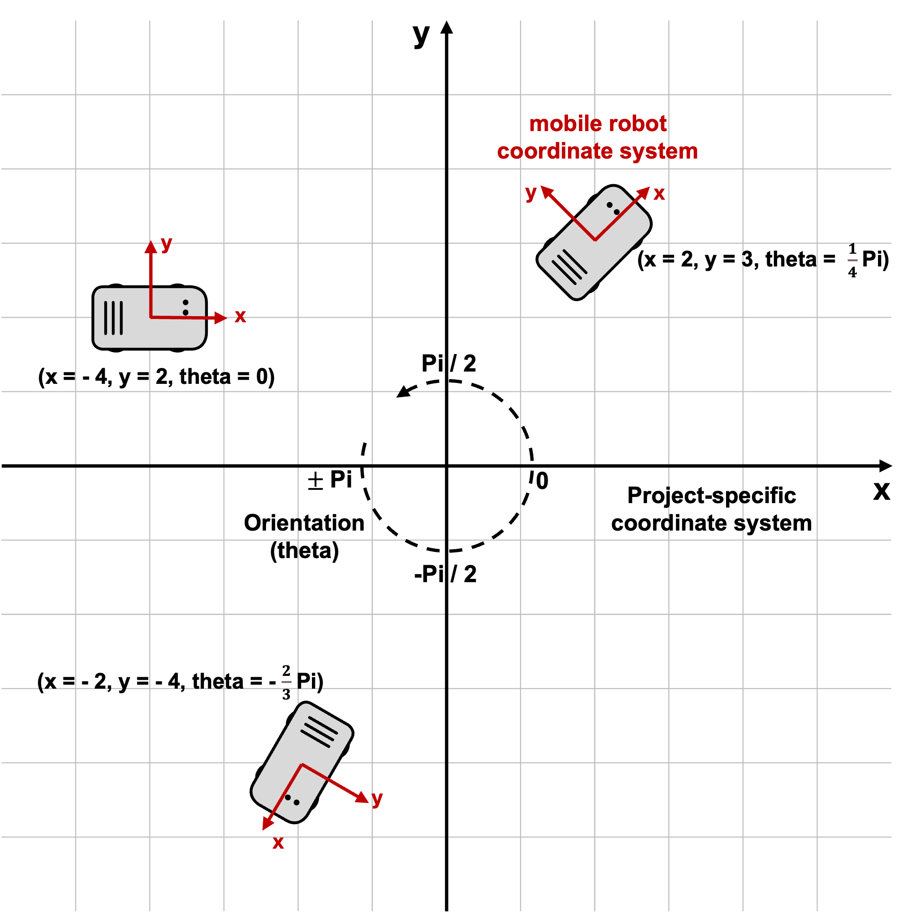
>图 12 - 带有示例 mobile robot 和方向的坐标系

X、Y、Z 坐标应当以米为单位。
方向 (orientation) 应当以弧度为单位，并且其值应在 -Pi 到 +Pi 之间。


### 6.3.1 Map distribution (地图分发)

为了实现地图的自动分发以及在必要时对 mobile robot 的重启进行智能管理，fleet control 可以在 mobile robot 上管理地图。

要分发的地图文件存储在 mobile robot 可以访问的专用地图服务器上。为确保高效传输，每次传输应包含一个单独的文件。如果需要多个地图或文件，它们应当被打包或捆绑成一个单独的文件。将地图从地图服务器传输到 mobile robot 的过程是一个 pull（拉取）操作，由 fleet control 使用 `instantAction` 触发下载命令来启动。

每张地图都由地图标识符（字段 `mapId`）和地图版本（字段 `mapVersion`）的组合来唯一标识。地图标识符描述了 mobile robot 物理工作空间的一个特定区域，而地图版本则表明了对先前版本的更新。在接受一个新 order 之前，mobile robot 应当检查在被请求的 order 中的每个地图标识符是否存在于 mobile robot 的地图中。如果在可用地图列表中缺少相应的 `mapId`，mobile robot 应当报告一个类型为 'UNKNOWN_MAP_ID' 且级别为 'WARNING' 的错误。fleet control 有责任确保激活正确的地图以供 mobile robot 运行。

为了最小化停机时间并使 fleet control 更容易同步启用新地图的过程，地图应当在 mobile robot 上被预加载或缓冲。mobile robot 上的地图状态反映在 mobile robot 的 state 中。将地图传输到 mobile robot 与启用该地图是不同的过程。要启用 mobile robot 上预加载的地图，fleet control 应当发送一个 instant action。随后，任何具有相同地图标识符但地图版本不同的其他地图都应被 mobile robot 禁用。

地图的删除也可以由 fleet control 通过 instant action 完成。

地图分发过程如图 13 所示。

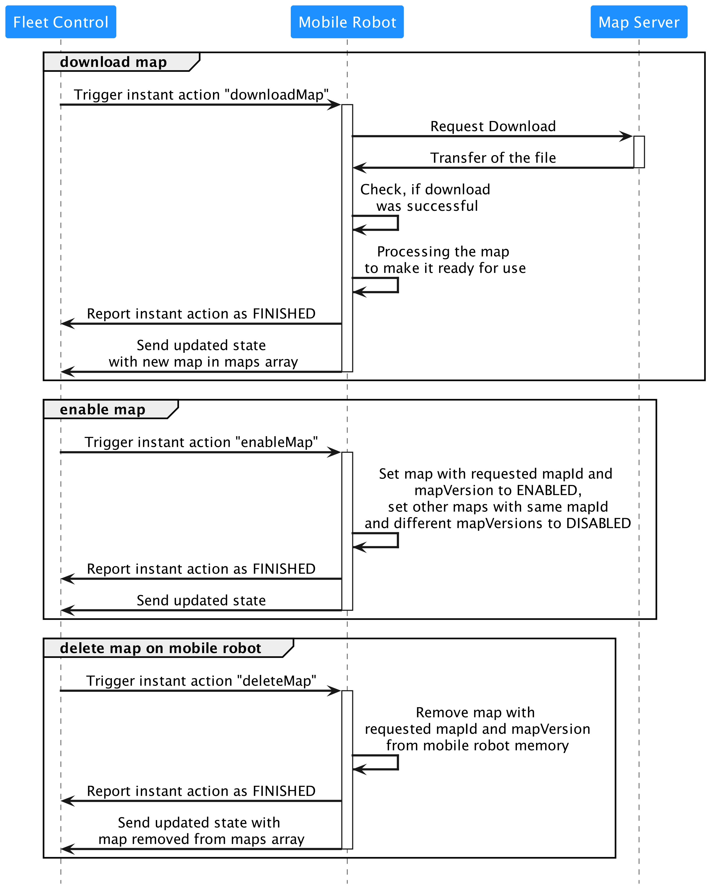
>图 13 - 下载、启用和删除地图所需的 fleet control、mobile robot 与地图服务器之间的通信。

### 6.3.2 Maps in the mobile robot state (mobile robot 状态中的地图)

状态 `mobileRobotPosition` 中的 `mapId` 字段代表当前处于活跃状态的地图。

关于 mobile robot 上可用地图的信息呈现在 `maps` 数组中，该数组是 state 消息的一个组件。该数组中的每个条目是一个 JSON 对象，由必填字段 `mapId`、`mapVersion` 和 `mapStatus` 组成，`mapStatus` 可以是 'ENABLED' 或 'DISABLED'。如果有必要，mobile robot 可以使用一个 'ENABLED'（已启用）的地图。不应当使用 'DISABLED'（已禁用）的地图。下载过程的状态通过当前 action 是否完成来指示。错误也会在 state 中报告。
请注意，可以同时启用具有不同 `mapId` 的多个地图。同一时间只能有一个具有相同 `mapId` 的地图版本被启用。如果 `maps` 数组为空，则表示 mobile robot 上当前没有任何地图可用。


### 6.3.3 Map download (地图下载)

地图下载应当由 fleet control 的 `downloadMap` instant action 触发。该 action 应当包含必填参数 `mapId` 和 `mapDownloadLink`，该链接指向地图在地图服务器上的存储位置，并且能够被 mobile robot 访问。

mobile robot 开始下载地图文件后立即将其 `actionStatus` 设置为 'RUNNING'。如果下载成功，`actionStatus` 被更新为 'FINISHED'。如果下载不成功，状态则被设置为 'FAILED'。下载成功完成后，该地图应当被添加到 state 的 `maps` 数组中。地图在其准备好被启用之前，不应在 state 中被报告。

下载地图的过程不应当修改、删除、启用或禁用 mobile robot 上任何现有的地图。
如果下载的地图具有 mobile robot 上已存在的 `mapId` 和 `mapVersion`，mobile robot 应当拒绝该下载。应当报告一个类型为 'DUPLICATE_MAP' 且级别为 'WARNING' 的错误，并将该 instant action 的状态设置为 'FAILED'。fleet control 应当首先删除 mobile robot 上的该地图，然后再重新启动下载。


### 6.3.4 Enable downloaded maps (启用已下载的地图)

有两种方式可以启用 mobile robot 上的地图：

1. **Fleet control 启用地图**: 使用 `enableMap` instant action 将 mobile robot 上的地图设置为 'ENABLED'。同一 `mapId` 的具有不同 `mapVersion` 的其他版本将被设置为 'DISABLED'。
2. **在 mobile robot 上手动启用地图**: 在某些情况下，可能需要直接在 mobile robot 上启用地图。该结果应当在 mobile robot state 中被报告。

当在 order 中的 `nodePosition` 发送相应的 `mapId` 时，Fleet control 应当确保相应的正确地图已在 mobile robot 上激活。
如果要将 mobile robot 设置到新地图上的特定位置，应当使用 `initializePosition` instant action。


### 6.3.5 Delete maps on the mobile robot (删除 mobile robot 上的地图)

fleet control 可以请求从 mobile robot 中删除特定的地图。这应当通过使用 instant action `deleteMap` 来完成。当 mobile robot 内存不足时，它应当向 fleet control 报告，然后由 fleet control 启动删除地图的操作。mobile robot 自身不应当删除地图。
在成功删除地图后，mobile robot 应当从 state 消息的 `maps` 数组中移除相应的条目。

## 6.4 Zones (区域)

Zone 用于为 mobile robot 工作空间的特定区域定义规则。通过这种方式，zone 允许 mobile robot 在 node 之间自由导航，同时赋予 fleet control 管理交通的能力。Zone 可以被用于在局部拒绝 mobile robot 进入特定区域，或将访问权限与条件挂钩（zone 类型：'BLOCKED' 和 'RELEASE'）。还可以强制要求在 zone 内具备特定行为（zone 类型：'LINE_GUIDED', 'SPEED_LIMIT', 'COORDINATED_REPLANNING', 以及 'ACTION'），或通过对某些区域施加激励或惩罚来影响驾驶行为（zone 类型：'PRIORITY' 和 'PENALTY'），亦或是给定预定义的行驶方向（zone 类型：'DIRECTED', 'BIDIRECTED'）。以下章节定义了这些 zone 类型。

订单中由于 zone 重叠，或 zone 与 edge 属性组合引起的潜在冲突及如何解决，在第 [6.4.4 Interaction between zones](#644-interactions-between-zones) 节中进行了阐述。对于被释放的 node，如果它是 order 的一部分，但由于 zone（例如，位于 'BLOCKED' 或 'RELEASE' zone 内的 node）受到了限制，机器人应当按照 zone 的规则行动（例如，不进入或等待请求的 'GRANTED' 状态）。
某些 mobile robot 完全无法处理 zones，而另一些 mobile robot 可能只能使用某种特定子集的 zone 类型，比如 'BLOCKED'。因此，所有 mobile robot 应当通过将其所支持的 zone 名称添加到 factsheet 的 `typeSpecifications` 下的 `supportedZones` 数组中，向 fleet control 报告其能够理解的 zone 类型。
（虚拟的）导引式 mobile robots 如果能够实现下文定义的对应 zone 类型的逻辑，也可以选择支持基于 zone 的导航。
zone set 应当仅由 fleet control 进行更改和分发，以保持系统中的一致性。

### 6.4.1 Zone types (Zone 类型)

我们区分出两类 zone：基于轮廓的 zone 和基于运动学中心的 zone。这种区分依据的是将 mobile robot 视为进入和退出 zone 时的不同条件。

#### 6.4.1.1 Contour-based zones (基于轮廓的 zone)

对于基于轮廓的 zone，mobile robot 的轮廓（包括其载荷）决定了 zone 的进入与退出。轮廓的任何部分进入该 zone 即视为 zone 准入（进入）。只要 mobile robot 的轮廓没有任何部分留在该 zone 内，即视为 zone 退出。


>图 14 - 描绘了基于轮廓进入 zone 的 mobile robot（左侧）和带有相应扩展边界框的负载 mobile robot 退出 zone（右侧）

定义了以下基于轮廓的 zone：

| **Zone Type (Zone 类型)** | **Zone Parameters (Zone 参数)** | **Data type (数据类型)** | **Description (描述)**                                                                                                                                                                                                                                                                                                                                                                                                                                                                                                                                                                                                                                                                                                                                |
| ------------------------- | ------------------------------- | ------------------------ | ----------------------------------------------------------------------------------------------------------------------------------------------------------------------------------------------------------------------------------------------------------------------------------------------------------------------------------------------------------------------------------------------------------------------------------------------------------------------------------------------------------------------------------------------------------------------------------------------------------------------------------------------------------------------------------------------------------------------------------------------------- |
| BLOCKED                   | none                            |                          | Mobile robots 不得进入此 zone。如果 mobile robot 已经进入了该 zone 或发现自身位于其中，它应当停止并抛出一个类型为 'BLOCKED_ZONE_VIOLATION' 且级别设置为 'CRITICAL' 的错误。                                                                                                                                                                                                                                                                                                                                                                                                                                                                                                                                                                           |
| LINE_GUIDED               | none                            |                          | 此 zone 内不允许自由导航，mobile robots 必须沿着 edge 上预定义的轨迹行驶。只有当 fleet control 以 node-edge graph（节点-边图）的形式明确指定了路线时，mobile robots 才可能进入此 zone。mobile robot 任何需要进入此 zone 的移动都必须遵循预定义的轨迹。当进入此 zone 时，mobile robot 应当处于穿过该 zone 的 edge 轨迹上。进入和位于线导引 zone 内部的 edges 需要从 fleet control 发送的轨迹或 mobile robot 上预定义的轨迹。可以发送一个 corridor (走廊) 来允许 mobile robot 偏离轨迹。                                                                                                                                                                                                                                                                |
| RELEASE                   |                                 | -                        | Mobile robots 只有在通过 fleet control 获得准许后才允许进入此 zone。                                                                                                                                                                                                                                                                                                                                                                                                                                                                                                                                                                                                                                                                                  |
|                           | releaseLossBehavior             | string                   | Enum {'STOP', 'CONTINUE', 'EVACUATE'}<br>当对此 zone 的访问权限被撤销或过期时，mobile robot 可以选择 'STOP' (停止)，'CONTINUE' (继续)，或 'EVACUATE' (撤离) 该 zone。该 action 仅在 mobile robot 已经在此 zone 内且 release 权限过期或被撤销时才会执行。如果未定义，mobile robot 预期会 STOP 并报告一个错误。<br>'STOP'：Mobile robot 停止并发送级别为 'CRITICAL' 的 'RELEASE_LOST' 错误。<br>'EVACUATE'：执行 mobile robot 的撤离行为以离开该 zone，在其状态中保留授予 release 权限的 `zoneRequest` 对象直到离开该 zone。<br>'CONTINUE'：如果 release 权限在 mobile robot 已经进入 zone 后被撤销或过期，mobile robot 会继续其路径，在其状态中保留授予 zone release 的 `zoneRequest` 对象。如果 order 在 zone 内结束，mobile robot 会等待新的 order。 |
| COORDINATED_REPLANNING    | none                            |                          | 在此 zone 内不允许自主重新规划路径。Mobile robots 只有在获得 fleet control 许可的情况下才允许调整其路径。                                                                                                                                                                                                                                                                                                                                                                                                                                                                                                                                                                                                                                             |
| SPEED_LIMIT               |                                 |                          | Mobile robots 在此 zone 内的行驶速度不得超过定义的最大速度。                                                                                                                                                                                                                                                                                                                                                                                                                                                                                                                                                                                                                                                                                          |
|                           | maximumSpeed                    | float64                  | Mobile robot 在该 zone 内的最大允许速度，单位为 m/s。应当在进入 zone 时就已经达到该速度限制。                                                                                                                                                                                                                                                                                                                                                                                                                                                                                                                                                                                                                                                         |
| ACTION                    |                                 |                          | Mobile robot 应当在进入、穿过或退出该 zone 时执行预定义的 action。Factsheet 定义了哪些 action 可以在何时执行。                                                                                                                                                                                                                                                                                                                                                                                                                                                                                                                                                                                                                                        |
|                           | entryActions[action]            | array                    | 进入 zone 时触发的 action。如果不需要 action，则为空数组。                                                                                                                                                                                                                                                                                                                                                                                                                                                                                                                                                                                                                                                                                            |
|                           | duringActions[action]           | array                    | 穿过 zone 时执行的 action。如果不需要 action，则为空数组。                                                                                                                                                                                                                                                                                                                                                                                                                                                                                                                                                                                                                                                                                            |
|                           | exitActions[action]             | array                    | 离开 zone 时触发的 action。如果不需要 action，则为空数组。                                                                                                                                                                                                                                                                                                                                                                                                                                                                                                                                                                                                                                                                                            |

>表 6 - 基于轮廓的 zone 类型及其参数

#### 6.4.1.2 Kinematic center-based zones (基于运动学中心的 zone)

在基于运动学中心的 zone 中，mobile robot 的运动学中心决定了它进入和退出 zone 的时机。当 mobile robot 的运动学中心位于 zone 内时，mobile robot 应当遵循定义的行为。
'PRIORITY'（优先级）和 'PENALTY'（惩罚）zone 是只影响 mobile robot 路径规划的 zone。
'DIRECTED'（定向）zone 定义了在 zone 内优先的行驶方向。'BIDIRECTED'（双向定向）zone 定义了要使用的行驶方向及其相反方向。应当避免其他方向。`directedLimitation` 和 `bidirectedLimitation` 枚举指定了 mobile robot 允许偏离其行驶方向的限制。行驶方向是项目特定坐标系中的速度向量。


>图 15 - 描绘了基于其运动学中心进入 zone 的 mobile robot（左侧）和基于其运动学中心退出 zone 的加载了负载的 mobile robot（右侧）

| **Zone Type (Zone 类型)** | **Zone Parameters (Zone 参数)** | **Data type (数据类型)** | **Description (描述)**                                                                                                                                                                                                                                                            |
| ------------------------- | ------------------------------- | ------------------------ | --------------------------------------------------------------------------------------------------------------------------------------------------------------------------------------------------------------------------------------------------------------------------------- |
| PRIORITY                  |                                 |                          | 与地图上没有这种 zone 的其他同等区域相比，该 zone 所包含的工作空间关联了一种激励，促使 mobile robot 规划通过此 zone 的路线。                                                                                                                                                      |
|                           | priorityFactor                  | float64                  | [0.0...1.0]<br>决定与没有 zone 的工作空间相比该 zone 优先程度的相对系数。0.0 意味着没有优先偏好，如同没有 zone 一样；1.0 是最大优先偏好。                                                                                                                                         |
| PENALTY                   |                                 |                          | 与地图上没有这种 zone 的其他同等区域相比，该 zone 所包含的工作空间关联了一种抑制（惩罚），阻止 mobile robot 规划通过此 zone 的路线。                                                                                                                                              |
|                           | penaltyFactor                   | float64                  | [0.0...1.0]<br> 决定与没有该 zone 的工作空间相比该 zone 的惩罚程度的相对系数。0.0 意味着没有惩罚，如同没有 zone 一样；1.0 是最大惩罚，导致 mobile robot 只有在找不到任何其他可行路线时才走这条路径。                                                                              |
| DIRECTED                  |                                 |                          | Mobile robots 应当在一个特定的行驶方向上穿过此 zone。                                                                                                                                                                                                                             |
|                           | direction                       | float64                  | 在该 zone 内的首选行驶方向，以弧度表示。行驶方向是 mobile robot 的速度向量在项目特定坐标系中的角方向。                                                                                                                                                                            |
|                           | directedLimitation              | string                   | Enum {'SOFT','RESTRICTED','STRICT'}<br>SOFT: Mobile robots 可以偏离定义的行驶方向，但应尽量避免；RESTRICTED: mobile robot 可以偏离定义的行驶方向（例如避障），但绝不得与定义的行驶方向相反行驶；STRICT: mobile robot 应当在其技术能力允许的范围内尽可能精确地保持定义的行驶方向。 |
| BIDIRECTED                |                                 |                          | 处于此 zone 内时，mobile robots 应当仅以定义的行驶方向及其直接相反方向 (+ Pi) 移动，mobile robots 不应以任何其他方向穿过此 zone。                                                                                                                                                 |
|                           | direction                       | float64                  | 该 zone 内的首选行驶方向，以弧度表示。行驶方向是 mobile robot 的速度向量在项目特定坐标系中的角方向。                                                                                                                                                                              |
|                           | bidirectedLimitation            | string                   | Enum {'SOFT', 'RESTRICTED'}<\br>SOFT: Mobile robots 可以偏离定义的行驶方向，但应尽量避免；RESTRICTED: 除避障外，mobile robot 不得沿行驶方向以外的任何其他方向穿越。                                                                                                               |

>表 7 - 基于运动学中心的 zone 类型及其参数

### 6.4.2 Zone set transfer (区域集传输)

Zone sets (区域集) 应当仅由 fleet control 更改和分发，以保持系统中的一致性。分发 zone sets 的首选方法是通过 `zoneSet` topic (主题)。如果 mobile robot 支持 zones，应当支持通过 `zoneSet` topic 进行更新。遵循图 13 中的地图分发概念，也可以通过 `downloadZoneSet` instant action (即时动作) 共享较大的 zone sets。

一个 `zoneSet` 是由具有全局唯一标识符 `zoneSetId` 的 `zone` 对象组成的数组。它与通过 `mapId` 引用的单个地图相关联。不应引用 `mapVersion`，因为同一个 zone set 可能旨在用于一张地图的多个版本。一般而言，除了单张地图外，还可以定义多个 zone set，fleet control 的责任是确保在 mobile robot 上的每个地图启用正确的 zone set。与地图一样，`zoneSetStatus` 表示 mobile robot 当前正在使用哪个 zone set。mobile robot 上的每个 `mapId` 同一时间只能激活一个单一的 zone set。Zones 不应超出地图的空间边界。
具有唯一 `zoneSetId` 的 zone set 内容不得更改。如果在一个 zone set 内需要进行更改，应使用新的 `zoneSetId` 进行引用。

新添加的 zone set 的 `zoneSetStatus` 应当始终被设置为 'DISABLED'，并在使用前通过 `enableZoneSet` instant action 启用。

如果 mobile robot 通过 `zoneSet` topic 或 `downloadZoneSet` instant action 接收到一个具有与现有 `zoneSetId`相同 `zoneSetId` 的新 zone set，它不应将此 zone set 接管到其内部内存中，并应报告一个级别为 'WARNING' 的 'DUPLICATE_ZONE_SET' 类型错误，报告时间要足够合理，以便 fleet control 能够注意到 zone 更新失败。


## 6.4.3 Communication for interactive zones (互动区域的通信)

为了传达针对互动 zones 'RELEASE' (释放) 和 'COORDINATED_REPLANNING' (协调重新规划) 的请求，使用了 state 消息中的 `zoneRequests` 字段。 fleet control 使用独立的 `responses` topic 来响应这些请求。

在进入互动 zone 之前，mobile robot 应当发出请求 (request)。
即使 order 包含 zone 内的释放 node，进入互动 zone 之前的请求也是必需的。
mobile robot 自行决定在进入 zone 之前的哪一点发出请求。
如果未及时收到响应，mobile robot 不得进入该 zone。

请求仅应当针对已启用的 zone sets 中的 zones 发出。也可以针对属于 mobile robot 当前不在其上的地图的 zone sets 发出 zone 请求。

`requestId` 允许 fleet control 区分不同的请求，并允许 mobile robot 在同一时间为同一 zone 发出多个替代请求。
每次请求尝试都应在每个 mobile robot 上使用唯一的标识符。在 mobile robot 重启后，ID 可以重复使用。

对于进入 'RELEASE' zone 的请求，应当在 state 消息中添加一个 `requestType` 为 'ACCESS' 的 `zoneRequest` 对象。
对于请求允许携带规划路径进入 'COORINATED_REPLANNING' zone，或在 zone 内重新规划其路径，`requestType` 应当设置为 'REPLANNING'。
对于 'REPLANNING' 请求，规划的路径应作为 NURBS 添加到 `zoneRequest` 的 `trajectory` 字段中。可以针对同一个 zone 发出具有不同轨迹的多个请求。每条路径应使用其自身的 `zoneRequest` 对象提出请求。
如果 mobile robot 需要进入被两个或更多 'RELEASE' zone 覆盖的工作空间，它应当在进入该区域前，为所有必要的 zone 请求准入并获得批准。
如果 mobile robot 在地图上导航穿过被两个或更多 'COORDINATED REPLANNING' zone 覆盖的工作空间，它应针对每个 zone 分别请求其在该区域内的路径，并在进入或更改路径之前获得 fleet control 的批准。

在发起请求时，mobile robot 应将 `requestStatus` 参数初始设置为 'REQUESTED'。

Fleet control 通过 `responses` topic 响应 zone 请求。
响应消息包含一个 `response` 对象数组。每个 `response` 只能响应由 `requestId` 引用的单个请求。
每个 response 都有一个 `responseType`，它可以是 'GRANTED'、'QUEUED'、'REVOKED' 或 'REJECTED'。
如果 `responseType` 是 'GRANTED'，则允许 mobile robot 进入 zone 或使用请求的轨迹。
Fleet control 可以将 `responseType` 设置为 'QUEUED' 以确认 mobile robot 的请求而不给予许可，从而通知 mobile robot 其请求正在被处理。
如果 `responseType` 是 'REJECTED'，则 mobile robot 不得进入该 zone 或使用请求的轨迹。
`responseType` 为 'REVOKED' 表明权限不再有效。fleet control 应当假定 'REVOKED' 请求仍为 'GRANTED' 状态，直到 mobile robot 的 `requestStatus` 被设置为 'REVOKED'。
`response` 对象可以包含一个 `leaseExpiry` (租期届满时间)，它指定了 'GRANTED' 请求的有效期。为了延长 `leaseExpiry`，fleet control 可以重新发送一个带有已更新的 `leaseExpiry` 时间的 response 消息。

mobile robot 应当通过相应地设置 `requestStatus` 来确认 fleet control 的响应，并在它认为该信息具有相关性的整个期间内保留该请求。另请参阅第 [6.9 Request/response mechanism](#69-requestresponse-mechanism) 节。

mobile robot 与 fleet control 之间针对 'RELEASE' zones 的交互应当如图 16 所示。

当 mobile robot 仍留在 'RELEASE' zone 内时，它在其 state 中保留该 `zoneRequest` 对象，并继续报告 `requestStatus` 为 'GRANTED'，以通知 fleet control 它仍在 zone 内。在 mobile robot 离开该 zone 后，它应当从其 state 消息中移除相应的 `zoneRequest` 条目。
当收到 `responseType` 为 'REVOKED' 的响应时，mobile robot 应当从其 state 中移除该请求。当 `leaseExpiry` 过去后，requestStatus 应当设置为 'EXPIRED' 且不得进入该 zone。如果当 `leaseExpiry` 过去或请求变为 'REVOKED' 时，mobile robot 已经位于 'RELEASE' zone 内部，它应当报告一个警告并根据 zone 定义中定义的 `releaseLossBehavior` 做出反应。

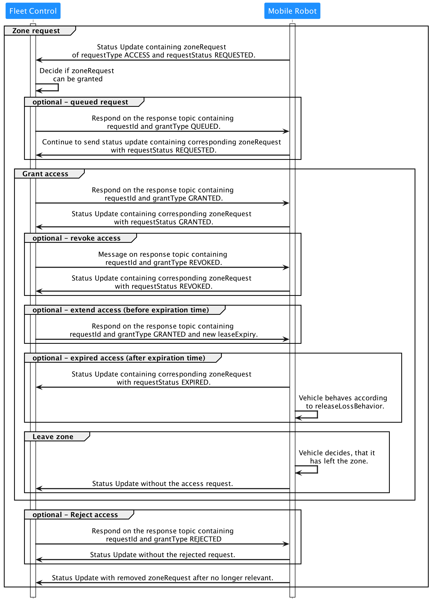
>图 16 - RELEASE zone 的区域请求行为。

mobile robot 与 fleet control 之间针对 'COORDINATED_REPLANNING' zones 的交互应当如图 17 所示。

mobile robot 应当从针对该 zone 的所有 'GRANTED' 请求中选择一个轨迹，并将相应的 `requestStatus` 设置为 'GRANTED'，同时从其状态中移除所有其他请求。
当收到 `responseType` 为 'REVOKED' 的响应时，mobile robot 应当从其状态中移除该请求，并且不进入 'COORDINATED_REPLANNING' zone。当 `leaseExpiry` 过期后，`requestStatus` 应当被设置为 'EXPIRED' 且不得进入该 zone。如果当 `leaseExpiry` 过期或请求被 'REVOKED' 时，mobile robot 已经位于 'RELEASE' zone 内部，它应当停止行驶并报告警告。若要继续，mobile robot 应当发起一个新的请求。

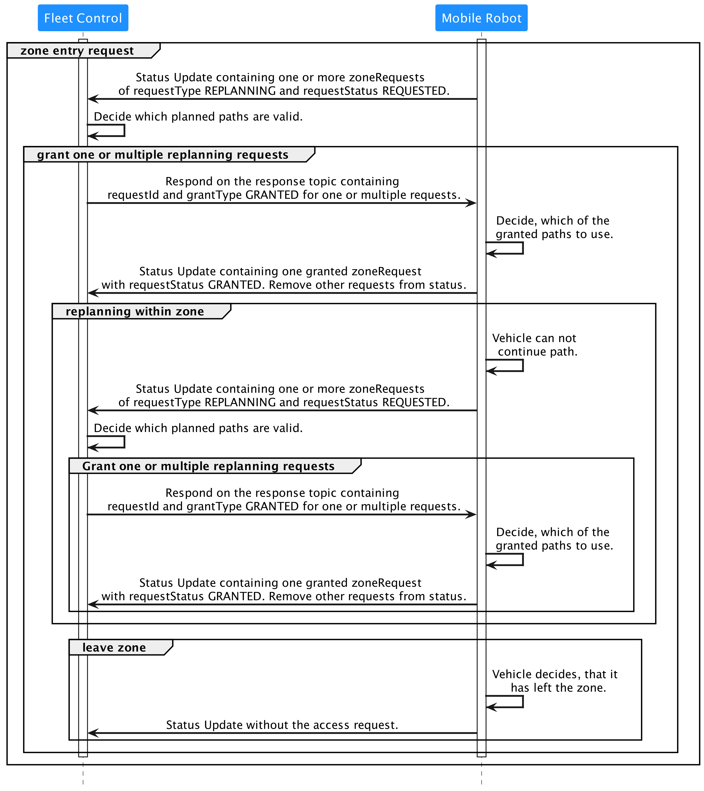
>图 17 - COORDINATED_REPLANNING zone 的区域请求行为。


### 6.4.4 Interactions between zones (区域间的交互)

下表描述了 zone 之间可能的交互。该矩阵是对称的，因为两个 zone 之间的交互是相同的，无论考虑它们的顺序如何。对于每种组合，要么是一种 zone 行为覆盖了另一种（例如，'BLOCKED' zone 覆盖了 'LINE_GUIDED' zone），要么是不存在冲突（例如，'LINE_GUIDED' zone 和 'COORDINATED_REPLANNING' zone）。'DIRECTED' 和 'BIDIRECTED' zone 不应当重叠，因为这可能导致未定义的行为。“无 Zone (No Zone)”列定义了基于轮廓的 zone 的行为，其中 mobile robot 可能同时处于定义的 zone 类型和没有 zone 的区域内。对于基于运动学中心的 zone，mobile robot 只能完全处于 zone 内或 zone 外，因此不存在可能的交互。

|                            | **BLOCKED** | **RELEASE** | **LINE_GUIDED** | **COORDINATED_REPLANNING** | **SPEED_LIMIT** | **ACTION** | **PRIORITY** | **PENALTY** | **DIRECTED** | **BIDIRECTED** | **No Zone**            | **EDGE-PROPERTIES** |
| -------------------------- | ----------- | ----------- | --------------- | -------------------------- | --------------- | ---------- | ------------ | ----------- | ------------ | -------------- | ---------------------- | ------------------- |
| **BLOCKED**                | BLOCKED     | BLOCKED     | BLOCKED         | BLOCKED                    | BLOCKED         | BLOCKED    | BLOCKED      | BLOCKED     | BLOCKED      | BLOCKED        | BLOCKED                | BLOCKED             |
| **RELEASE**                |             | 无冲突      | 无冲突          | 无冲突                     | 无冲突          | 无冲突     | 无冲突       | 无冲突      | 无冲突       | 无冲突         | 无冲突                 | 无冲突              |
| **LINE_GUIDED**            |             |             | 无冲突          | LINE_GUIDED                | 无冲突          | (1)        | LINE_GUIDED  | LINE_GUIDED | LINE_GUIDED  | 无冲突         | LINE_GUIDED            | 无冲突              |
| **COORDINATED_REPLANNING** |             |             |                 | (2)                        | 无冲突          | (1)        | 无冲突       | 无冲突      | 无冲突       | 无冲突         | COORDINATED_REPLANNING | (3)                 |
| **SPEED_LIMIT**            |             |             |                 |                            | (4)             | 无冲突     | 无冲突       | 无冲突      | 无冲突       | 无冲突         | SPEED_LIMIT            | (4)                 |
| **ACTION**                 |             |             |                 |                            |                 | (5)        | 无冲突       | 无冲突      | 无冲突       | 无冲突         | ACTION                 | (5)                 |
| **PRIORITY**               |             |             |                 |                            |                 |            | (6)          | (6)         | 无冲突       | 无冲突         | (7)                    | 无冲突              |
| **PENALTY**                |             |             |                 |                            |                 |            |              | (6)         | 无冲突       | 无冲突         | (7)                    | 无冲突              |
| **DIRECTED**               |             |             |                 |                            |                 |            |              |             | (8)          | (8)            | (7)                    | (9)                 |
| **BIDIRECTED**             |             |             |                 |                            |                 |            |              |             |              | (8)            | (7)                    | (9)                 |

>表 8 - Zone 交互矩阵

1) 如果 action 与其他 zone 的行为冲突，报告级别为 'CRITICAL' 的 'ZONE_ACTION_CONFLICT' 错误（order 错误）并停止 mobile robot。
2) 规划的轨迹 (trajectory) 必须针对所有 'COORDINATED_REPLANNING' zone 获得准许。
3) 如果为 edge 预定义了轨迹，则应在 zone 请求中发送该轨迹。
4) 适用所有竞争的 `maximumSpeed` 值中的最低值。
5) 执行所有 action。
6) 此处始终选择限制最严的一个；对于 PRIORITY zone，使用最低的 `priorityFactor`；对于重叠的 PRIORITY 和 PENALTY zone，使用最高的 `penaltyFactor`；对于重叠的 PENALTY zone，使用最高的 `penaltyFactor`。
7) 对于基于运动学中心的 zone，mobile robot 只能完全处于 zone 内或 zone 外，因此这种重叠是不可能的。
8) Zone 不应当重叠，因为行为未定义。
9) 作为 edge 属性的一部分的 `trajectory` 应当覆盖 directed 和 bidirected zone。

### 6.4.5 Error handling within zones (Zone 内的错误处理)

如果在 order 执行的任何时刻，mobile robot 意识到它无法到达其 order 中的某个 node，它应当向 fleet control 报告级别为 'CRITICAL' 的 'NODE_UNREACHABLE' 错误。随后由 fleet control 决定如何继续。mobile robot 不应当尝试再次到达该 node，而是等待来自 fleet control 的进一步指示。


## 6.5 Connection (连接)

在 mobile robot 客户端连接到 broker 期间，应当设置遗嘱 (last will) 主题和消息，当 mobile robot 客户端与 broker 断开连接时，由 broker 发布该消息。
因此，fleet control 可以通过订阅所有 mobile robot 的 connection 主题来检测断开连接事件。
断开连接是通过 broker 和客户端之间交换的心跳 (heartbeat) 来检测的。
因此，fleet control 可以通过订阅每个 mobile robot 的 `connection` 主题来检测断开连接事件。

在这种情况下，timestamp 和 headerId 字段将始终是过时的。

Mobile robot 想要正常断开连接：

1. Mobile robot 发送 "vda5050/v3/manufacturer/serialNumber/connection"，其中 `connectionState` 设置为 `OFFLINE`。
2. 使用 disconnect 命令断开 MQTT connection。

Mobile robot 上线：

1. 创建 MQTT connection 时，将遗嘱 (last will) 设置为 "vda5050/v3/manufacturer/serialNumber/connection"，字段 `connectionState` 设置为 'CONNECTION_BROKEN'。
2. 发送主题 "vda5050/v3/manufacturer/serialNumber/connection"，其中 `connectionState` 设置为 'ONLINE'。

该主题上的所有消息都应当带有 `retained` 标志。

当 mobile robot 与 broker 之间的连接意外停止时，broker 将向主题 "vda5050/v3/manufacturer/serialNumber/connection" 发送遗嘱，字段 `connectionState` 设置为 'CONNECTION_BROKEN'。


## 6.6 State (状态)

mobile robot 的 state (状态) 应当发布在单个主题上。
与单独的消息（例如，针对当前 order 进度、电池状态和错误）相比，使用单个主题可以减少 broker 和 fleet control 系统在处理消息时的工作负载，同时还能保持 mobile robot 的状态信息同步。

mobile robot 状态消息应当在相关事件发生时发布，或者至少每 30 秒发布一次。

以下事件应当触发状态消息的传输：

- 接收 order
- 接收 order update (订单更新)
- `load` 对象发生变化
- `errors` 数组发生变化
- `operatingMode` 字段发生变化
- `driving` 字段发生变化
- `paused` 字段发生变化
- `safetyState` 对象发生变化
- `newBaseRequest` 字段发生变化
- `lastNodeId` 或 `lastNodeSequenceId` 字段发生变化
- `edgeRequests` 或 `zoneRequests` 数组发生变化
- `powerSupply.charging` 字段发生变化
- `nodeStates` 或 `edgeStates` 数组发生变化
- `actionStates`、`instantActionStates` 或 `zoneActionStates` 数组发生变化
- `zoneSets` 数组发生变化
- `maps` 数组发生变化

*备注：对于上述提到的数组，数组中单个项目的更改以及条目的添加或移除均应当触发状态消息的传输。*

应当努力限制通信量。
如果两个事件相互关联（例如，接收新订单通常会强制更新 `nodeStates` 和 `edgeStates`；经过节点时也是如此），则触发一次状态更新而非多次是明智的。两次连续状态消息之间的最小时间由 factsheet 定义（[7.10 factsheet 消息的实现](#710-implementation-of-the-factsheet-message) `protocolLimits.timing.minimumStateInterval`）。

### 6.6.1 Concept and logic (概念与逻辑)

订单进度通过 `nodeStates` 和 `edgeStates` 进行跟踪。
此外，如果 mobile robot 能够确定其当前位置，则应当通过 `mobileRobotPosition` 字段发布该位置。

`nodeStates` 和 `edgeStates` 包含了 mobile robot 即将遍历的所有节点和边。

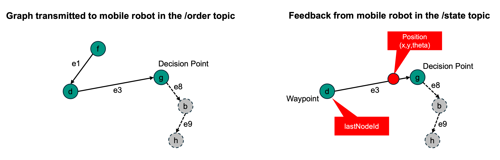
>图 18 - state 主题提供的订单信息。仅传输最后一个节点的 ID 以及剩余的节点和边。

### 6.6.2 Traversal of nodes and edges (节点和边的遍历)

mobile robot 自行决定何时一个节点应当计为已遍历。
遍历的一个要求是 mobile robot 的控制点应当处于节点的 `allowedDeviationXY` 范围内，且其方向处于 `allowedDeviationTheta` 范围内。
`allowedDeviationXY` 定义了有轨导引 (line-guided) 的 mobile robot 在何处可以偏离其预定义轨迹，以便沿着更平滑的路径切弯，而不是到达节点的精确位置。在离开 `allowedDeviationXY` 时，mobile robot 应当回到后续边的预定义轨迹上。
如果设置了后续边的边属性 `corridor`（走廊），则应当额外满足这些边界要求。

如果 mobile robot 距离订单的第一个节点太远，fleet control 可以为该节点添加一个扩展的 `allowedDeviationXY`，以包含 mobile robot 的当前位置。

mobile robot 应当通过从 `nodeStates` 数组中移除该节点的 `nodeState`，并将 `lastNodeId` 和 `lastNodeSequenceId` 设置为已遍历节点的值，来报告节点的遍历。

一旦 mobile robot 报告节点已遍历，它应当触发与该节点关联的 action（如果有）。
遍历一个节点必然意味着离开通向该节点的边。
随后，该边也应当从 `edgeStates` 中移除，且在该边上处于活跃状态的 action 应当完成。

节点的遍历也标志着 mobile robot 进入下一条边（如果有）的时刻。
应当触发该边的 action（如果有）。
此规则的一个例外是：如果 mobile robot 应当在节点上停止（由于 soft 或 hard 阻塞 action），则 mobile robot 只有在再次开始行驶时才会进入下一条边。

当存在活跃订单时，只有当 mobile robot 遍历作为该订单一部分的已释放节点时，`lastNodeId` 和 `lastNodeSequenceId` 字段才应当更新。例如，如果物理线导式 mobile robot 检测到一个不属于活跃订单 `nodes` 的物理标记/标签，该检测不应导致 `lastNodeId` 或 `lastNodeSequenceId` 的更改。

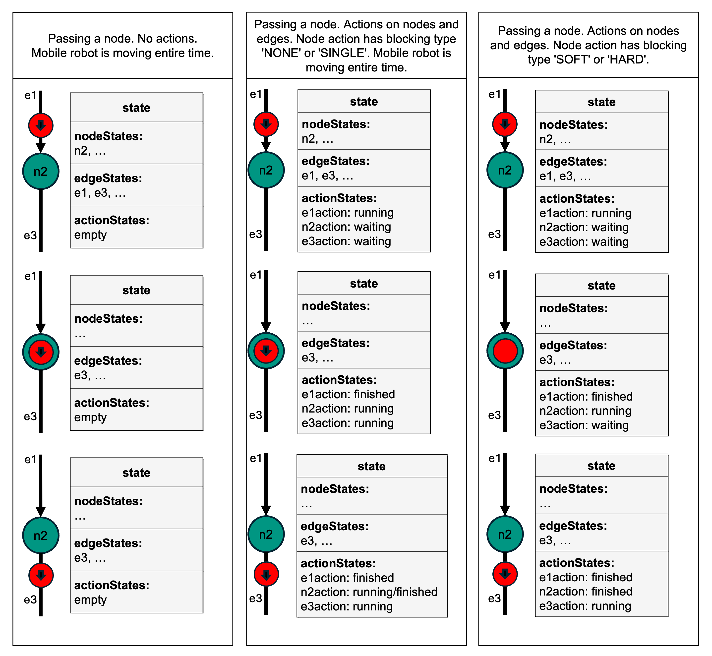
>图 19 - 订单处理过程中的 `nodeStates`、`edgeStates` 和 `actionStates` 描绘

#### 6.6.2.1 Definition of allowedDeviationXY as an ellipse (allowedDeviationXY 定义为椭圆)

`allowedDeviationXY` 被定义为节点位置周围的一个椭圆，以允许更灵活地靠近节点。

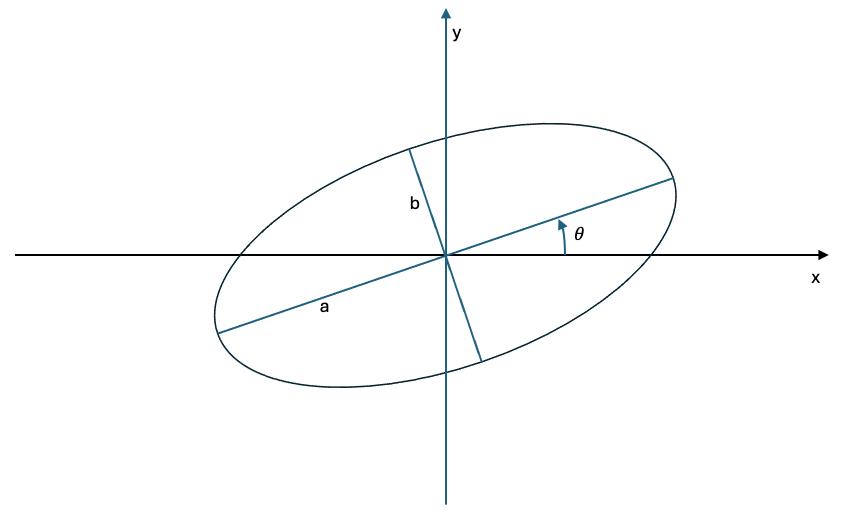
>图 20 - allowedDeviation 椭圆


### 6.6.3 Base request (Base 请求)

如果 mobile robot 检测到其 base 即将运行结束，它可以将 `newBaseRequest` 标志设置为 "true"，以尝试防止不必要的制动。

### 6.6.4 Information (信息)

mobile robot 可以通过 `information` 数组向 fleet control 提交任意附加信息。
由 mobile robot 自行决定通过信息消息报告信息的时间长短。

fleet control 不得将该信息用于逻辑判断；它们应当仅用于可视化和调试目的。

### 6.6.5 Errors (错误)

mobile robot 通过 `errors` 数组报告任何问题。

#### 6.6.5.1 Error levels (错误级别)

问题可以有四个级别：'WARNING'、'URGENT'、'CRITICAL' 和 'FATAL'。

- 'WARNING'（警告）级别的问题不需要立即处理。mobile robot 可以继续其当前订单并能够接受新订单。错误可能是自愈的，例如激光雷达传感器脏污。
- 'URGENT'（紧急）级别的问题（例如电池电量低）需要立即处理。mobile robot 可以继续其当前订单并能够接受新订单。
- 'CRITICAL'（严重）级别的问题需要立即处理，例如尝试取走一个并不存在的物体。mobile robot 应当停止行驶，因为它无法继续执行当前订单，但能够接受新订单。
- 'FATAL'（致命）级别的问题需要人工干预，例如丢失定位。mobile robot 应当停止行驶，因为它既不能继续执行当前活跃订单，也不能接受任何新订单。

mobile robot 可以通过 `errorReferences` 数组添加有助于查找错误原因的引用。
`errorDescription` 和 `errorHint` 字段可以提供易于理解的文本，解释错误或建议可能的解决方案。

无论问题的级别如何，mobile robot 都绝不应因此清除其订单。


#### 6.6.5.2 Error references (错误引用)

如果由于错误的订单或执行失败而发生错误，mobile robot 可以在 `errorReferences` 字段中返回有意义的错误引用，以支持查找错误原因。
这可以包括以下信息：

- `headerId`
- 主题（`order` 或 `instantAction`）
- `orderId` 和 `orderUpdateId`（如果错误是由订单更新引起的）
- `actionId`（如果错误是由某个 action 引起的）
- 参数列表（如果错误是由错误的 action 参数引起的）


#### 6.6.5.3 Error translations (错误翻译)

对于 `errorDescription` 和 `errorHint`，mobile robot 可以通过使用 `errorDescriptionTranslations` 和 `errorHintTranslations` 数组提供翻译。
每项翻译由一个 ISO 639-1 语言代码和对应的翻译文本组成。

#### 6.6.5.4 Predefined error types (预定义错误类型)

mobile robot 应当使用预定义的错误类型来报告特定问题。下表列出了预定义的错误类型及其描述。

| 错误类型 (Error Type)           | 错误级别 (Error level) | 描述 (Description)                                                     | 引用 (Reference)                                          | 报告时长 (Report duration)                                    |
| :------------------------------ | :--------------------- | :--------------------------------------------------------------------- | :-------------------------------------------------------- | :------------------------------------------------------------ |
| 'UNSUPPORTED_PARAMETER'         | 'CRITICAL'             | 收到带有不支持的可选参数的消息。                                       | 参数名称                                                  | 直到接受新订单。                                              |
| 'NO_ORDER_TO_CANCEL'            | 'WARNING'              | mobile robot 收到 `cancelOrder` action，但没有可取消的活跃订单。       | `cancelOrder` 的 `actionId`                               | 直到接受新订单。                                              |
| 'VALIDATION_FAILURE'            | 'WARNING'              | 收到格式错误的订单。                                                   | 如果可能，提供被拒绝消息的 `orderId` 和 `orderUpdateId`。 | 直到接受新订单。                                              |
| 'INVALID_ORDER_ACTION'          | 'WARNING'              | 收到包含不支持 action 的订单。                                         | 被拒绝消息的 `orderId` 和 `orderUpdateId`。               | 直到接受新订单。                                              |
| 'INVALID_INSTANT_ACTION'        | 'WARNING'              | 收到不支持的 instant action。                                          | `instantAction` 的 `actionId`                             | 直到接受新的 instant action。                                 |
| 'OUTDATED_ORDER_UPDATE'         | 'WARNING'              | 收到 `orderId` 正确但 `orderUpdateId` 已过期的订单。                   | 被拒绝消息的 `orderId` 和 `orderUpdateId`。               | 直到接受新订单。                                              |
| 'SAME_ORDER_UPDATE_ID'          | 'WARNING'              | 收到重复的订单消息（相同的 `orderId` 和 `orderUpdateId`）。            | 被拒绝消息的 `orderId` 和 `orderUpdateId`。               | 直到接受新订单。                                              |
| 'ORDER_UPDATE_FOLLOWING_CANCEL' | 'WARNING'              | 收到针对已取消订单的订单更新。                                         | 被拒绝消息的 `orderId` 和 `orderUpdateId`。               | 直到接受新订单。                                              |
| 'OUTSIDE_OF_CORRIDOR'           | 'CRITICAL'             | 偏离了为边定义的 corridor (走廊)。                                     | `edgeId`                                                  | 直到 mobile robot 不再违反走廊边界。                          |
| 'INSUFFICIENT_MEMORY'           | 'URGENT'               | mobile robot 没有足够的内存来处理接收到的订单。                        | 如果可能，提供被拒绝消息的 `orderId` 和 `orderUpdateId`。 | 直到接受新订单。                                              |
| 'DUPLICATE_MAP'                 | 'WARNING'              | 收到已存在的 `mapId` 和 `mapVersion` 的地图。                          | 重复地图的 `mapId` 和 `mapVersion`                        | 直到接受新的地图相关 instantAction。                          |
| 'BLOCKED_ZONE_VIOLATION'        | 'CRITICAL'             | 进入 'BLOCKED' 区域。                                                  | `zoneId`                                                  | 直到 mobile robot 不再违反阻塞区域规则。                      |
| 'DUPLICATE_ZONE_SET'            | 'WARNING'              | 收到已存在的 `zoneSetId` 的区域集。                                    | `zoneSetId` 或 `instantAction` 的 `actionId`              | 足够让 fleet control 注意到区域更新失败的时间。               |
| 'RELEASE_LOST'                  | 'CRITICAL'             | 丢失 'RELEASE' 区域的释放权限。                                        | `zoneId`                                                  | 直到 mobile robot 不再处于 'RELEASE' 区域或再次获得释放权限。 |
| 'ZONE_ACTION_CONFLICT'          | 'CRITICAL'             | 区域行为与区域 action 之间存在冲突。                                   | 'ACTION' 区域的 `zoneId`                                  | 直到 mobile robot 不再违反区域行为。                          |
| 'NODE_UNREACHABLE'              | 'CRITICAL'             | mobile robot 无法到达订单中的节点。                                    | `nodeId`                                                  | 直到接受新订单。                                              |
| 'LOCALIZATION_ERROR'            | 'FATAL'                | mobile robot 未定位。                                                  |                                                           | 直到重新获得定位。                                            |
| 'NO_ROUTE_TO_TARGET'            | 'WARNING'              | 收到包含至少一个无法到达节点的订单。                                   | `orderId`                                                 | 直到接受新订单。                                              |
| 'OTHER_ORDER_ACTIVE'            | 'WARNING'              | 在另一个订单仍处于活跃状态时收到新订单。                               | `orderId`                                                 | 直到接受新订单。                                              |
| 'START_NODE_OUT_OF_RANGE'       | 'WARNING'              | 收到第一个节点无法到达的订单。                                         | `orderId`                                                 | 直到接受新订单。                                              |
| 'MOBILE_ROBOT_NOT_AVAILABLE'    | 'WARNING'              | 在非 'AUTOMATIC'、'SEMIAUTOMATIC' 或 'INTERVENED' 运行模式下收到订单。 | `orderId`                                                 | 直到运行模式允许新订单。                                      |
| 'UNKNOWN_MAP_ID'                | 'WARNING'              | 收到包含引用未知 `mapId` 节点的订单。                                  | `orderId`                                                 | 直到接受新订单。                                              |

>表 9 - 预定义错误类型

### 6.6.6 Operating Mode (运行模式)

为了正常的订单执行，fleet control 应当完全控制 mobile robot。然而在某些情况下这是不可能的，例如需要对 mobile robot 进行手动交互。mobile robot 应当使用 `operatingMode` 字段报告此情况。

下表描述了 `operatingMode` 字段的值、其含义以及对 mobile robot 与 fleet control 交互的影响：

| 运行模式 (Operating Mode) | 描述 (Description)                                                                                                                                                                                                                                                                                                                                                                                                                                                                                                                                                                                                                                                                                                                                                                                                                                                                                                                                                                                                                                                                                                                                           |
| :------------------------ | :----------------------------------------------------------------------------------------------------------------------------------------------------------------------------------------------------------------------------------------------------------------------------------------------------------------------------------------------------------------------------------------------------------------------------------------------------------------------------------------------------------------------------------------------------------------------------------------------------------------------------------------------------------------------------------------------------------------------------------------------------------------------------------------------------------------------------------------------------------------------------------------------------------------------------------------------------------------------------------------------------------------------------------------------------------------------------------------------------------------------------------------------------------- |
| AUTOMATIC                 | Fleet control 完全控制 mobile robot。<br>mobile robot 根据来自 fleet control 的订单移动并执行 action。                                                                                                                                                                                                                                                                                                                                                                                                                                                                                                                                                                                                                                                                                                                                                                                                                                                                                                                                                                                                                                                       |
| SEMIAUTOMATIC             | Fleet control 控制 mobile robot。<br>mobile robot 根据来自 fleet control 的订单移动并执行 action。<br>行驶速度由 HMI 控制。<br>转向处于自动控制下。                                                                                                                                                                                                                                                                                                                                                                                                                                                                                                                                                                                                                                                                                                                                                                                                                                                                                                                                                                                                          |
| INTERVENED                | Fleet control 未控制 mobile robot。mobile robot 正确报告其状态。<br>HMI 可用于控制 mobile robot 的转向、速度和搬运设备。<br>允许 fleet control 向 mobile robot 发送订单或订单更新，以便在切换回 'AUTOMATIC' 或 'SEMI-AUTOMATIC' 运行模式后执行。fleet control 不得发送除 `cancelOrder` 以外的任何 instant action。<br>mobile robot 不得清除订单，但应当从状态中移除所有区域请求 (zone requests)，即使 mobile robot 已经处于 'RELEASE' 区域内也是如此。（*备注：如有必要，fleet control 可以继续跟踪 mobile robot 的位置，并决定是否可以为其他 mobile robot 释放空间。*）mobile robot 不得请求进入 'RELEASE' 区域的权限，也不得在 'COORDINATED_REPLANNING' 区域内请求重新规划。<br>如果进入 'INTERVENED' 运行模式对正在运行的 action 有任何影响，mobile robot 应当在状态消息中相应地反映出来。<br>如果 mobile robot 离开此运行模式且未直接切换到 'AUTOMATIC' 或 'SEMI-AUTOMATIC' 模式，它应当根据新的运行模式行动。如果 mobile robot 离开此运行模式并直接切换到 'AUTOMATIC' 或 'SEMI-AUTOMATIC' 模式，mobile robot 应当继续执行任何当前订单。如果 mobile robot 在 'INTERVENED' 运行模式期间检测到无法继续当前订单，它应当切换到 'MANUAL' 运行模式并据此行动。 |
| MANUAL                    | Fleet control 未控制 mobile robot。<br>fleet control 不得向 mobile robot 发送订单或 action。<br>HMI 可用于控制 mobile robot 的转向、速度和搬运设备。<br>mobile robot 的位置被发送给 fleet control。<br>当 mobile robot 进入此模式时，它立即清除任何当前订单。<br>在此模式下，如果 mobile robot 检测到其被移动到了一个无法将 `lastNodeId` 当前值用作新订单起始节点的位置，它应当将 `lastNodeId` 设置为空字符串 ("")。                                                                                                                                                                                                                                                                                                                                                                                                                                                                                                                                                                                                                                                                                                                                         |
| STARTUP                   | Fleet control 未控制 mobile robot。mobile robot 正在启动且未准备好接收订单。在启动完成前，状态消息参数可能不完整或无效。                                                                                                                                                                                                                                                                                                                                                                                                                                                                                                                                                                                                                                                                                                                                                                                                                                                                                                                                                                                                                                     |
| SERVICE                   | Fleet control 未控制 mobile robot。<br>fleet control 不得向 mobile robot 发送订单或 action。<br>当 mobile robot 进入此模式时，它立即清除任何当前订单。<br>mobile robot 应当将 `lastNodeId` 设置为空字符串 ("")。<br>授权人员可以重新配置 mobile robot。                                                                                                                                                                                                                                                                                                                                                                                                                                                                                                                                                                                                                                                                                                                                                                                                                                                                                                      |
| TEACH_IN                  | Fleet control 未控制 mobile robot。<br>fleet control 不得向 mobile robot 发送订单或 action。<br>当 mobile robot 进入此模式时，它立即清除任何当前订单。<br>mobile robot 应当将 `lastNodeId` 设置为空字符串 ("")。<br>mobile robot 正在接受示教，例如由操作员进行地图构建。                                                                                                                                                                                                                                                                                                                                                                                                                                                                                                                                                                                                                                                                                                                                                                                                                                                                                    |

>表 10 - mobile robot 的运行模式

| 运行模式 (Operating Mode) | Fleet Control 控制中 | 有效的状态消息内容 | 进入时清除订单 | 将 `lastNodeId` 设为空 | 进入时清除区域请求 | 允许发送 instant actions | 允许发送订单 (orders) |
| :------------------------ | :------------------- | :----------------- | :------------- | :--------------------- | :----------------- | :----------------------- | :-------------------- |
| AUTOMATIC                 | 是                   | 是                 | 否             | 否                     | 否                 | 是                       | 是                    |
| SEMIAUTOMATIC             | 是                   | 是                 | 否             | 否                     | 否                 | 是                       | 是                    |
| INTERVENED                | 否                   | 是                 | 否             | 否                     | 是                 | 仅允许 `cancelOrder`     | 是                    |
| MANUAL                    | 否                   | 是                 | 是             | 是（如果无法继续订单） | 是                 | 否                       | 否                    |
| STARTUP                   | 否                   | 否                 | 是             | 是                     | 是                 | 否                       | 否                    |
| SERVICE                   | 否                   | 是                 | 是             | 是                     | 是                 | 否                       | 否                    |
| TEACH_IN                  | 否                   | 是                 | 是             | 是                     | 是                 | 否                       | 否                    |

>表 11 - 运行模式概述及其影响

### 6.6.7 Clearing the order on the mobile robot (在 mobile robot 上清除订单)

响应于以下事件之一，mobile robot 应当停止执行当前订单：

- mobile robot 将运行模式更改为 'MANUAL'、'STARTUP'、'SERVICE' 或 'TEACH_IN'（另请参阅 [6.6.6 Operating Mode](#666-operating-mode)）。
- mobile robot 收到来自 fleet control 的 `cancelOrder` instant action。
- mobile robot 收到 `startHibernation` instant action。

在这些情况下，mobile robot 应当清除其当前订单，这意味着：

- `actionStates` 中的任何计划中 (scheduled) 的 action 应当被取消，并在 `actionStates` 中报告为 'FAILED'。
- `actionStates` 中任何正在运行的 action，如果：
    - 可以被取消 (cancelAllowed = true)，则应当被取消并在 `actionStates` 中报告为 'FAILED'。
    - 不可以被取消 (cancelAllowed = false)，则应当在执行期间反映为 'RUNNING'，随后反映为各自的状态（成功则为 'FINISHED'，否则为 'FAILED'）。
- `orderId`、`orderUpdateId`、`lastNodeId` 和 `lastNodeSequenceId` 的值保持不变。
- `nodeStates` 和 `edgeStates` 数组设置为空列表。
- 任何请求应当从状态中移除。

只要订单的 action 不处于 'FINISHED' 或 'FAILED' 状态，mobile robot 就不应报告运行模式为 'MANUAL'、'SERVICE' 或 'TEACH_IN'。在报告运行模式 'MANUAL'、'SERVICE' 或 'TEACH_IN' 之前，不应清空 `nodesStates` 和 `edgeStates`。

订单取消只能由 fleet control 触发。

### 6.6.8 Idle state of the mobile robot (mobile robot 的 idle 状态)

如果 mobile robot 的 `nodeStates` 和 `edgeStates` 为空，且 `actionStates` 中的所有 action 均为 'FINISHED' 或 'FAILED'，则该 mobile robot 处于空闲 (idle) 状态。只有当 mobile robot 处于 idle 状态时，才应当接受新订单 (order)。当 mobile robot 处于 idle 状态或在订单执行期间，可以接受订单更新 (order update)。在 idle 状态下，mobile robot 可以执行 instantActions。

### 6.6.9 Action states (Action 状态)

当 mobile robot 接收到作为订单一部分的 `action`（附属于订单的 `node` 或 `edge`）时，它应当在其 `actionStates` 数组中通过 `actionState` 报告该 `action`。
当 mobile robot 接收到 `instantAction` 时，它应当在其 `instantActionStates` 数组中通过 `actionState` 报告该 `action`。
当 mobile robot 执行 `zoneAction` 时，它应当在其 `zoneActionStates` 数组中通过 `actionState` 报告该 `action`。mobile robot 也可以选择在此处报告任何计划中的 `zoneAction`。

action 的当前阶段应当反映在对应 `actionState` 的 `actionStatus` 字段中（见表 2）。

| actionStatus   | 描述 (Description)                                                                                                                 |
| :------------- | :--------------------------------------------------------------------------------------------------------------------------------- |
| 'WAITING'      | mobile robot 已接收到 action，但尚未遍历相应的节点或尚未进入相应的边。                                                             |
| 'INITIALIZING' | action 已触发，启动准备措施。                                                                                                      |
| 'RUNNING'      | action 正在运行。                                                                                                                  |
| 'PAUSED'       | action 由于 `pause` instantAction 或外部触发（mobile robot 上的暂停按钮）而暂停。                                                  |
| 'RETRIABLE'    | 失败但可重试的 action，由订单 action 中的 `retriable` 参数指定。从此状态的转换由 `retry` 或 `skipRetry` instantAction 或外部触发。 |
| 'FINISHED'     | action 已完成。<br>通过 `actionResult` 报告结果。                                                                                  |
| 'FAILED'       | 无论出于何种原因，action 无法完成。                                                                                                |

>表 12 - `actionStatus` 字段的可行值

所有可能的 action 状态转换如图 21 所示，下表给出了一些示例：

| **从 / 到 →**    | **WAITING**      | **INITIALIZING**                   | **PAUSED** | **RUNNING**                        | **RETRIABLE**             | **FAILED**                                                               | **FINISHED**                                                                                 |
| :--------------- | :--------------- | :--------------------------------- | :--------- | :--------------------------------- | :------------------------ | :----------------------------------------------------------------------- | :------------------------------------------------------------------------------------------- |
| **初始状态**     | 排队等待稍后执行 | 立即开始初始化（如 instantAction） | -          | 立即开始执行（如 instantAction）   | -                         | instantAction 执行失败（mobile robot 未知，参数无效）                    | action 立即完成（如设置参数）                                                                |
| **WAITING**      | -                | 需要准备（顶升、传感器通电）       | -          | 无需准备                           | -                         | 通过取消 (cancel) 终止，切换到手动模式                                   | 达到节点/边后 action 立即成功                                                                |
| **INITIALIZING** | -                | -                                  | 外部触发   | 初始化完成，action 开始            | -                         | 初始化失败，通过取消终止，切换到手动模式                                 | -                                                                                            |
| **PAUSED**       | -                | 外部触发                           | -          | 外部触发                           | -                         | 通过 `cancelOrder` 终止，切换到手动模式                                  | -                                                                                            |
| **RUNNING**      | -                | -                                  | 外部触发   | -                                  | action 未成功完成但可重试 | 通过取消终止，切换到手动模式，由于未返回期望结果导致 action 最终失败     | action 返回了期望结果，在通过 `cancelOrder` 中止后如果 action 无法中断且必须完成也可能发生。 |
| **RETRIABLE**    | -                | 通过 `retry` 或外部输入重试 action | -          | 通过 `retry` 或外部输入重试 action | -                         | 通过 `skipRetry` 失败，通过 `cancelOrder` 失败，外部触发，切换到手动模式 | 由操作员通过外部输入修复                                                                     |

>表 13 - 可能的 action 状态转换示例

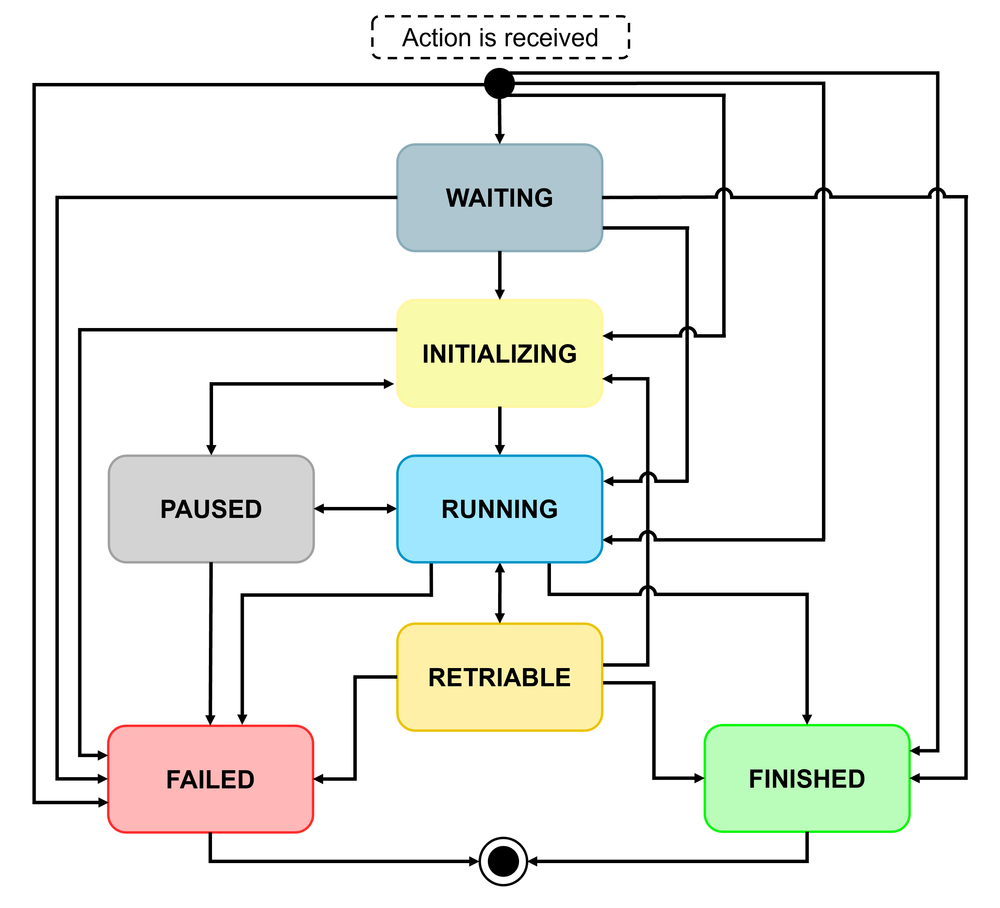
>图 21 - actionStates 的所有可能状态转换

#### 6.6.9.1 Reporting of horizon actions in the mobile robot's state (在 mobile robot 状态中上报 horizon actions)

mobile robot 的状态应当始终代表其当前拥有订单的完整状态。因此，机器人应当始终同时上报其 base 和 horizon 中包含的 action 的 `actionStates`。所有 horizon action 都报告为 'WAITING'。如果 mobile robot 收到订单更新，其中部分先前的 horizon 被移除或更改，则附属于这些节点和边的所有 action 都应当从 `actionStates` 中移除以反映此变化。base action 的 `actionStates` 绝不应在 `orderUpdate` 的上下文中被移除，因为 base 一旦释放就无法修改。

### 6.6.10 Request Use of Corridors (请求使用走廊)

如果 mobile robot 当前活跃订单中的走廊将 `releaseRequired` 标志设置为 true，则它应当在偏离边的预定义轨迹之前发出请求。为此，机器人应当在其状态消息中添加一个 `edgeRequest` 对象。`requestId` 在 mobile robot 发出的所有请求（如 `zoneRequest`、`edgeRequest`）中应当是唯一的。

`requestStatus` 设置为 'REQUESTED'，且 `edgeId` 和 `sequenceId` 的组合引用了机器人请求偏离的边的轨迹。只要这些边是其当前 base 的一部分，mobile robot 就可以选择同时请求多个边的批准。每个走廊的使用应当在一个专门的 `edgeRequest` 中请求，并且每个请求应当由 fleet control 通过 `response` 主题单独批准（见第 [6.9 Request/response mechanism](#69-requestresponse-mechanism) 节）。

Fleet control 应当仅释放属于 base 的边的走廊。在收到来自 fleet control 的 `response` 之前，机器人应当保持在其当前边的预定义轨迹上。一旦机器人收到开始操纵的批准，它将 `requestStatus` 设置为 'GRANTED'，现在可以使用该走廊。

只要机器人需要该走廊，它就应当在状态中保留 `edgeRequest`。如果 mobile robot 不再需要使用走廊（例如，因为它可能已经成功完成了避障程序，不再需要避开障碍物等），它通过从其状态中移除相应的 `edgeRequest` 对象来向 fleet control 指示这一点。从此以后，mobile robot 应当再次作为有轨导引机器人行动。如果它希望再次偏离预定义轨迹，它应当发出一个新的 `edgeRequest`。
如果在避障过程中机器人到达了其当前边的 `corridor` 尽头，并计划继续进入下一个尚未释放的走廊，它应当在当前 `corridor` 的边界处停止，发送一个专门的边请求，并等待 fleet control 的批准。

如果 mobile robot 的批准根据响应的 `leaseExpiry` 到期，或者当 fleet control 撤销已授予的请求时，mobile robot 应当启动在边的走廊 `releaseLossBehavior` 中预定义的后备操作 (fallback action)。
丢失释放权限后的恢复策略要么是 mobile robot 沿着偏离时的路径返回到边的预定义轨迹，要么是停止在当前位置并等待人工干预。

## 6.7 Visualization (可视化)

为了近乎实时的位置和计划轨迹更新，mobile robot 可以在 `visualization` 主题上广播其位置、速度和计划轨迹。

visualization 对象的字段使用与状态中的位置、速度、计划路径和中间路径对象相同的结构。
更多信息见 [visualization 消息的实现](#79-implementation-of-the-visualization-message)。
该主题的更新率由集成商定义。


## 6.8 Sharing of planned paths for freely navigating mobile robots (自由导航 mobile robot 的计划路径共享)

自由导航的 mobile robot 应当通过状态消息向 fleet control 系统传达其计划轨迹。为了更高频率的共享，可以使用 `visualization` 主题。

mobile robot 共享它们的 `intermediatePath`（中间路径）和 `plannedPath`（计划路径）。`intermediatePath` 代表到达 mobile robot 能够通过其传感器感知的较近航点的预计到达时间，而 `plannedPath` 代表 mobile robot 当前活跃订单中较长的路径。两条路径都应当从 mobile robot 的当前位置开始，独立于属于订单的任何节点。mobile robot 可以根据具体情况决定共享路径的长度。如果 mobile robot 是自由导航的，则在每个状态中都应当共享 `intermediatePath` 和 `plannedPath`。

- `plannedPath` 被定义为 NURBS，如 `edgeState` 的 `trajectory` 字段中所定义。`plannedPath` 可以包含一系列节点（由其 `nodeId` 引用），这些节点将作为当前路径的一部分被遍历。每当 mobile robot 的 `plannedPath` 发生重大变化时，都应当对其进行更新。`plannedPath` 应当至少覆盖 mobile robot 的当前 base。
- `intermediatePath` 被定义为折线 (polyline)。折线由航点之间的线性线段组成。每个 `waypoint` 由其 `x` 和 `y` 位置、可选的 mobile robot 方向以及指示预计到达时间的 `ETA` 组成。
`intermediatePath` 应当随每条发送的状态或可视化消息进行更新，并且始终从 mobile robot 的当前位置开始。

参数 `plannedPath` 和 `intermediatePath` 应当仅用于 mobile robot 规划的轨迹。`edgeState` 中的轨迹字段应当仅用于“确认”已经在布局或订单中预先定义的轨迹。


## 6.9 Request/response mechanism (请求/响应机制)

mobile robot 与 fleet control 之间的某些协调任务在 mobile robot 被允许执行操作之前需要来自 fleet control 的显式许可。对于这些情况，使用请求/响应机制。请求的生命周期在图 22 中描述。

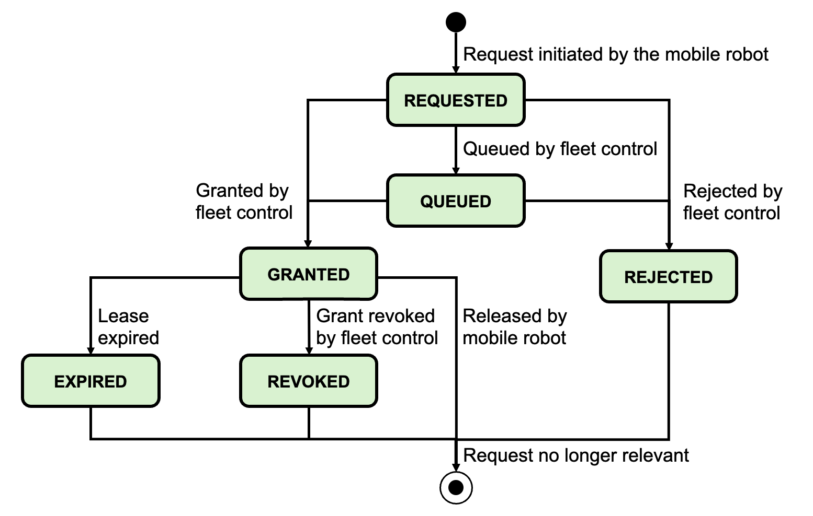
>图 22 - 请求生命周期：请求状态和可能转换的逻辑。

请求始终由 mobile robot 发起，并作为状态消息的一部分进行传达。Fleet control 应当评估该请求并通过 `responses` 主题返回其决定。

每个请求在 mobile robot 上应当由状态消息中包含的一个请求对象（例如 zoneRequest）来表示。请求对象应当至少包含：

- 一个 `requestId`，对于该 mobile robot 所有当前活跃的请求来说是唯一的，
- 一个 `requestType`，指定请求涉及的操作类型（访问、重新规划、走廊使用），
- 对请求所针对的资源的引用（例如区域、区域集、地图、edgeId、sequenceId），以及
- 一个 `requestStatus`。

`requestStatus` 字段描述了请求的生命周期，并应当支持以下值：

- 'REQUESTED'：mobile robot 提出请求。
- 'GRANTED'：fleet control 授予请求。
- 'REVOKED'：fleet control 撤回之前授予的请求。
- 'EXPIRED'：请求已过期。
- 'QUEUED'：确认 mobile robot 向 fleet control 提出的请求，但尚未给出许可。请求已被添加到某种队列中。

Fleet control 从状态主题接收请求，并应当通过 `responses` 主题进行回答，其中包含一个响应对象，该对象包括：

- 对应请求的 `requestId`，
- 一个具有 'GRANTED'、'QUEUED'、'REJECTED' 或 'REVOKED' 之一值的决定 (decision)，以及
- 可选的一个 `leaseExpiry`（租约到期）时间戳，用于限制 'GRANTED' 决定的有效期。

如果请求被回答为 'QUEUED'，fleet control 确认收到了请求，但尚未授权许可。此时 mobile robot 应当继续等待，且不得执行所请求的操作。如果请求被回答为 'REJECTED'，mobile robot 不得执行所请求的操作，并且当不再需要时可以从其状态中移除相应的请求对象。

如果请求被回答为 'GRANTED'，允许 mobile robot 根据请求类型的语义执行所请求的操作。如果存在 `leaseExpiry`，许可仅在此时之前被视为有效。Fleet control 可以通过发送具有相同 `requestId` 和新 `leaseExpiry` 的更新响应来延长租约。

如果请求被回答为 'REVOKED'，或者达到了 `leaseExpiry`，mobile robot 应当根据为请求资源定义的 `releaseLossBehavior` 行动。
如果请求的操作已经开始，mobile robot 应当相应地更新 `requestStatus`（'REVOKED' 或 'EXPIRED'），并将其保留在状态中，直到 `releaseLossBehavior` 结束。如果请求的操作尚未开始，mobile robot 应当从其状态中移除该请求。

如果在应用所需的时限内未收到响应，mobile robot 应当表现得好像请求未被授予一样，并且不得执行需要显式许可的操作。超时和重试的处理应当在集成期间定义。

一旦相应的操作完成、中止或被拒绝，且不再需要来自 fleet control 的进一步决定，请求应当从 mobile robot 的状态中移除。


## 6.10 Factsheet (Factsheet)

factsheet 提供了关于特定 mobile robot 型号系列的基本信息。
这些信息允许比较不同的 mobile robot 类型，并可应用于 mobile robot 系统的规划、尺寸设计、仿真或集成。

mobile robot factsheet 中某些字段的值只能在系统集成期间指定，例如为 mobile robot 分配特定项目的负载。
factsheet 旨在作为人类可读的文档并用于机器处理（例如由 fleet control 应用导入），因此被指定为 JSON 文档。

Fleet control 可以通过发送 `factsheetRequest` instant action 向 mobile robot 请求 factsheet。

此主题上的所有消息都应当带有 `retained` 标志发送。

# 7 Message specification (消息规范)

不同的消息以表格的形式呈现，描述了 JSON 字段的内容。

此外，在公共 git 仓库 (https://github.com/VDA5050/VDA5050) 中提供了用于验证的 JSON schema。
JSON schema 随 VDA5050 的每个版本进行更新。如果 JSON schema 与本文档之间存在差异，则以本文档中的变体为准。


## 7.1 Symbols of the tables and meaning of formatting (表格符号及格式含义)

对象结构表包含标识符的名称、其单位、其数据类型以及描述（如果有）。

| 标识 (Identification)            | 描述 (Description)                                                           |
| :------------------------------- | :--------------------------------------------------------------------------- |
| standard                         | 变量是基本数据类型                                                           |
| **bold** (加粗)                  | 变量是非基本数据类型（如 JSON 对象或数组）且单独定义                         |
| *italic* (斜体)                  | 变量是可选的                                                                 |
| ***italic and bold*** (斜体加粗) | 变量是可选的且是非基本数据类型                                               |
| arrayName[arrayDataType]         | 变量（此处为 arrayName）是方括号中所含数据类型（此处为 arrayDataType）的数组 |

>表 14 - 表格符号及格式含义

所有字段名称均采用小驼峰式 (camelCase)。


### 7.1.1 Optional fields (可选字段)

如果一个变量被标记为可选，则对于发送方来说它是可选的，因为在某些情况下该变量可能不适用（例如，当 fleet control 向 mobile robot 发送订单时，一些 mobile robot 会自行规划轨迹，此时订单中 `edge` 对象的 `trajectory` 字段可以省略）。

如果 mobile robot 收到包含在本协议中标记为可选字段的消息，mobile robot 应当据此行动，且不得忽略该字段。
如果 mobile robot 由于不支持的参数而无法处理订单，它应当通过类型为 'UNSUPPORTED_PARAMETER' 且错误级别为 'CRITICAL' 的错误进行传达，并拒绝该订单。

Fleet control 应当仅发送 mobile robot 支持的可选字段。

示例：轨迹 (Trajectories) 是可选的。
如果 mobile robot 无法处理轨迹，fleet control 不得向该 mobile robot 发送轨迹。

mobile robot 应当通过 mobile robot `factsheet` 消息传达其需要哪些可选参数。


### 7.1.2 Permitted characters and field lengths (允许的字符及字段长度)

所有通信均采用 UTF-8 编码，以便对描述进行国际化适配。
建议 ID 仅使用以下字符：

A-Z a-z 0-9 _ - . :

最大消息长度未定义，但受到 MQTT 协议规范以及可能由 factsheet 定义的技术约束的限制。

如果 mobile robot 的内存不足以处理传入的订单，它应当拒绝该订单并报告类型为 'INSUFFICIENT_MEMORY' 且错误级别为 'URGENT' 的错误。

最大字段长度、字符串长度或数值范围的匹配由集成商决定。

为了便于集成，mobile robot 供应商应当提供一份 mobile robot factsheet，其详细信息见第 [7.10 Implementation of the factsheet message](#710-implementation-of-the-factsheet-message) 节。


### 7.1.3 Notation of fields, topics and enumerations (字段、主题和枚举的记法)

本文档中的主题和字段以下列样式突出显示：`exampleField` 和 `exampleTopic`。
枚举应当使用大写字母书写，并使用下划线分隔单词，例如 'EXAMPLE_ENUMERATION'。这些值在文档中用单引号括起来。
这包括关键字，如 `actionStatus` 字段中的值（'WAITING'、'FINISHED' 等）。
可扩展枚举包括但不限于为该参数预定义的值。


### 7.1.4 JSON data types (JSON 数据类型)

在可能的情况下，应当使用 JSON 数据类型。
因此，布尔值通过 "true" 或 "false" 编码，而不是使用枚举（'TRUE'、'FALSE'）或魔术数字。
数值数据类型指定了类型和精度，例如 float64 或 uint32。不支持来自 IEEE 754 的特殊数值，如 NaN 和 infinity（无穷大）。


## 7.2 Protocol header (协议头)

每个 JSON 消息都以一个 header 开头。
header 由以下各个元素组成。
header 不是一个 JSON 对象（译者注：即其字段直接位于消息根级）。

| 对象结构 (Object structure) | 数据类型 (Data type) | 描述 (Description)                                                                   |
| :-------------------------- | :------------------- | :----------------------------------------------------------------------------------- |
| headerId                    | uint32               | 消息的 Header ID。<br>headerId 按主题定义，每发送一条（但不一定被接收）消息递增 1。  |
| timestamp                   | string               | 时间戳 (ISO 8601, UTC)；YYYY-MM-DDTHH:mm:ss.fffZ (例如 "2017-04-15T11:40:03.123Z")。 |
| version                     | string               | 协议版本 [Major].[Minor].[Patch] (例如 1.3.2)。                                      |
| manufacturer                | string               | mobile robot 的制造商。                                                              |
| serialNumber                | string               | mobile robot 的序列号。                                                              |


## 7.3 Implementation of the order message (order 消息的实现)

| 对象结构 (Object structure) | 单位 (Unit) | 数据类型 (Data type) | 描述 (Description)                                                                                                           |
| :-------------------------- | :---------- | :------------------- | :--------------------------------------------------------------------------------------------------------------------------- |
| headerId                    |             | uint32               | 消息的 Header ID。<br>header ID 按主题定义，每发送一条（但不一定被接收）消息递增 1。                                         |
| timestamp                   |             | string               | 时间戳 (ISO 8601, UTC)；YYYY-MM-DDTHH:mm:ss.fffZ (例如 "2017-04-15T11:40:03.123Z")。                                         |
| version                     |             | string               | 协议版本 [Major].[Minor].[Patch] (例如 1.3.2)。                                                                              |
| manufacturer                |             | string               | mobile robot 的制造商。                                                                                                      |
| serialNumber                |             | string               | mobile robot 的序列号。                                                                                                      |
| orderId                     |             | string               | 订单标识。<br>用于标识属于同一订单的多个订单消息。                                                                           |
| orderUpdateId               |             | uint32               | 订单更新标识。<br>对于每个 `orderId` 应当是唯一的，且新订单从 0 开始。<br>如果订单更新被拒绝，该字段应当在相应的错误中传递。 |
| *orderDescription*          |             | string               | 额外的可读信息，仅用于可视化目的；不得用于任何逻辑过程。                                                                     |
| **nodes [node]**            |             | array                | 完成订单所需遍历的节点 (node) 对象数组。                                                                                     |
| **edges [edge]**            |             | array                | 完成订单所需遍历的边 (edge) 对象数组。                                                                                       |


| 对象结构 (Object structure) | 单位 (Unit) | 数据类型 (Data type) | 描述 (Description)                                                                                                                                               |
| :-------------------------- | :---------- | :------------------- | :--------------------------------------------------------------------------------------------------------------------------------------------------------------- |
| **node** {                  |             | JSON object          |                                                                                                                                                                  |
| nodeId                      |             | string               | 节点的唯一标识符。<br>在一条订单消息中可以多次引用同一个节点。`sequenceId` 用于区分遍历的顺序。                                                                  |
| sequenceId                  |             | uint32               | 用于跟踪订单中节点和边顺序的数字，并简化订单更新。<br>主要目的是区分在同一个 `orderId` 中多次经过的节点。<br>`sequenceId` 在节点和边之间共享，并定义了遍历顺序。 |
| *nodeDescriptor*            |             | string               | 节点的附加信息。                                                                                                                                                 |
| released                    |             | boolean              | "true" 表示该节点是 base（基准）的一部分。<br>"false" 表示该节点是 horizon（远景）的一部分。                                                                     |
| ***nodePosition***          |             | JSON object          | 节点位置。<br>对于不需要节点位置的 mobile robot 类型（例如有轨导引机器人）是可选的。                                                                             |
| **actions [action]** <br> } |             | array                | 在节点上执行的 action 数组。<br>如果不需要 action，则为空数组。                                                                                                  |

| 对象结构 (Object structure) | 单位 (Unit) | 数据类型 (Data type) | 描述 (Description)                                                                                                                                                                                                                                                                                                                                                                                                                                                                                                                                                  |
| :-------------------------- | :---------- | :------------------- | :------------------------------------------------------------------------------------------------------------------------------------------------------------------------------------------------------------------------------------------------------------------------------------------------------------------------------------------------------------------------------------------------------------------------------------------------------------------------------------------------------------------------------------------------------------------ |
| **nodePosition** {          |             | JSON object          | 在特定于项目的全局世界坐标系中的地图上定义位置。<br>每一层楼都有自己的地图。<br>所有地图应当使用相同的特定于项目的全局原点。                                                                                                                                                                                                                                                                                                                                                                                                                                        |
| x                           | m           | float64              | 地图上相对于全局项目特定坐标系的 X 位置。<br>精度取决于具体实现。                                                                                                                                                                                                                                                                                                                                                                                                                                                                                                   |
| y                           | m           | float64              | 地图上相对于全局项目特定坐标系的 Y 位置。<br>精度取决于具体实现。                                                                                                                                                                                                                                                                                                                                                                                                                                                                                                   |
| *theta*                     | rad         | float64              | 范围：[-Pi ... Pi] <br><br>mobile robot 在节点上应当匹配的绝对朝向，以便该节点被视为已遍历。<br>如果定义了此值，mobile robot 应当匹配此节点上的朝向。<br>如果前一条边禁止旋转，mobile robot 应当在节点上旋转。<br>如果后一条边定义了不同的朝向但禁止旋转，mobile robot 应当在进入边之前，在节点上旋转到边所要求的旋转角度。                                                                                                                                                                                                                                         |
| ***allowedDeviationXY***    | m           | JSON object          | 指示 mobile robot 在节点位置匹配的精确程度，以便该节点被视为已遍历。<br>（另请参阅 [订单取消](#613-order-cancellation) 和 [节点遍历](#662-traversal-of-nodes-and-enteringleaving-edges-triggering-of-actions) 章节）。                                                                                                                                                                                                                                                                                                                                              |
| *allowedDeviationTheta*     | rad         | float64              | 范围：[0.0 ... Pi] <br><br>如果定义了此值，指示 mobile robot 在节点朝向匹配的精确程度，以便该节点被视为已遍历。<br>最低可接受角度为 *`theta` - `allowedDeviationTheta`*，最高可接受角度为 *`theta` + `allowedDeviationTheta`*。如果未指定 `theta`，则对 mobile robot 的朝向没有要求。<br>如果 = 0.0：不允许偏差，这意味着 mobile robot 应当在技术允许的范围内尽可能精确地达到节点朝向。即使 `allowedDeviationTheta` 小于 mobile robot 的技术公差，此规则也适用。如果 mobile robot 支持此属性，但 fleet control 未为此节点定义，则 mobile robot 应当假设此值为 0.0。 |
| mapId                       |             | string               | 位置所引用的地图的唯一标识。<br>每张地图都有相同的特定于项目的全局坐标原点。<br>当 mobile robot 使用电梯时（例如从出发层到目标层），它将从出发层的地图上消失，并在目标层地图相关的电梯节点处生成。                                                                                                                                                                                                                                                                                                                                                                  |

| 对象结构 (Object structure) | 单位 (Unit) | 数据类型 (Data type) | 描述 (Description)                                                                                                                                                                                                                                                                                                                                                                                                          |
| :-------------------------- | :---------- | :------------------- | :-------------------------------------------------------------------------------------------------------------------------------------------------------------------------------------------------------------------------------------------------------------------------------------------------------------------------------------------------------------------------------------------------------------------------- |
| **allowedDeviationXY** {    |             | JSON object          | 指示 mobile robot 在节点位置匹配的精确程度，以便该节点被视为已遍历。<br> 如果 `a` = `b` = 0.0：不允许偏差，这意味着 mobile robot 应当在技术允许的范围内尽可能精确地让控制点到达或通过节点位置。即使 `allowedDeviationXY` 小于 mobile robot 技术上可行的公差，此规则也适用。如果 mobile robot 支持此属性，但 fleet control 未为此节点定义，则 mobile robot 应当假设 `a` 和 `b` 的值为 0.0。<br> 节点的坐标定义了椭圆的中心。 |
| a                           | m           | float64              | 椭圆半长轴的长度（单位：米）。                                                                                                                                                                                                                                                                                                                                                                                              |
| b                           | m           | float64              | 椭圆半短轴的长度（单位：米）。                                                                                                                                                                                                                                                                                                                                                                                              |
| theta <br>}                 | rad         | float64              | 旋转角度（从正水平轴到项目特定坐标系内椭圆长轴的角度）。                                                                                                                                                                                                                                                                                                                                                                    |

| 对象结构 (Object structure)              | 单位 (Unit) | 数据类型 (Data type) | 描述 (Description)                                                                                                                                                                                                 |
| :--------------------------------------- | :---------- | :------------------- | :----------------------------------------------------------------------------------------------------------------------------------------------------------------------------------------------------------------- |
| **action** {                             |             | JSON object          | 描述 mobile robot 可以执行的 action。                                                                                                                                                                              |
| actionType                               |             | string               | action 的类型。对于预定义的 action，其定义在表 4 的第一列中。<br> 标识 action 的功能。                                                                                                                             |
| actionId                                 |             | string               | 用于标识 action 并将其映射到状态中 `actionState` 的唯一 ID。<br>建议：使用 UUID。                                                                                                                                  |
| *actionDescriptor*                       |             | string               | 用户定义的、易于理解的名称或描述。不应用于逻辑目的。                                                                                                                                                               |
| blockingType                             |             | string               | 枚举 {'NONE', 'SINGLE', 'SOFT', 'HARD'}: <br> 'NONE': 允许行驶和其他 action；<br> 'SINGLE': 允许行驶但不允许其他 action；<br>'SOFT': 允许其他 action 但不允许行驶；<br>'HARD': 该 action 是当时唯一允许的 action。 |
| ***actionParameters [actionParameter]*** |             | array                | 指定 action 的 actionParameter 对象数组，例如 "deviceId", "loadId", "external triggers"。<br><br> 示例实现可以在 [7.3.1 Format of action parameters]((#731-format-of-action-parameters)) 中找到。                  |
| *retriable* <br> }                       |             | boolean              | "true": action 如果失败可以进入 RETRIABLE 状态。<br>"false": action 失败后直接进入 FAILED 状态。<br>默认值: "false"。                                                                                              |

| 对象结构 (Object structure)         | 单位 (Unit) | 数据类型 (Data type) | 描述 (Description)                                                                                                                                                                                                                                                                                                                                                                                                                                                                                                                                                                                                                     |
| :---------------------------------- | :---------- | :------------------- | :------------------------------------------------------------------------------------------------------------------------------------------------------------------------------------------------------------------------------------------------------------------------------------------------------------------------------------------------------------------------------------------------------------------------------------------------------------------------------------------------------------------------------------------------------------------------------------------------------------------------------------- |
| **edge** {                          |             | JSON object          | 两个节点之间的有向连接。                                                                                                                                                                                                                                                                                                                                                                                                                                                                                                                                                                                                               |
| edgeId                              |             | string               | 边的唯一标识符。<br>在一条订单消息中可以多次引用同一条边。`sequenceId` 用于区分遍历的顺序。                                                                                                                                                                                                                                                                                                                                                                                                                                                                                                                                            |
| sequenceId                          |             | uint32               | 用于跟踪订单中节点和边顺序的数字，并简化订单更新。<br>`sequenceId` 在节点和边之间共享，并定义了遍历顺序。                                                                                                                                                                                                                                                                                                                                                                                                                                                                                                                              |
| *edgeDescriptor*                    |             | string               | 用户定义的、易于理解的名称或描述。不应用于逻辑目的。                                                                                                                                                                                                                                                                                                                                                                                                                                                                                                                                                                                   |
| released                            |             | boolean              | "true" 表示该边是 base 的一部分。<br>"false" 表示该边是 horizon 的一部分。                                                                                                                                                                                                                                                                                                                                                                                                                                                                                                                                                             |
| *maximumSpeed*                      | m/s         | float64              | 边上允许的最大速度。<br>速度由 mobile robot 的最快测量值定义。                                                                                                                                                                                                                                                                                                                                                                                                                                                                                                                                                                         |
| *maximumMobileRobotHeight*          | m           | float64              | 边上允许的 mobile robot（包括负载）的最大高度。                                                                                                                                                                                                                                                                                                                                                                                                                                                                                                                                                                                        |
| *minimumLoadHandlingDeviceHeight*   | m           | float64              | 边上允许的负载处理设备 (LHD) 的最小高度。                                                                                                                                                                                                                                                                                                                                                                                                                                                                                                                                                                                              |
| *orientation*                       | rad         | float64              | mobile robot 在边轨迹上的朝向。`orientationType` 的值定义了应当将其解释为相对于全局项目特定地图坐标系，还是相对于边轨迹的切线方向。在切向情况下，0.0 表示向前行驶，PI 表示向后行驶。<br>示例：朝向 Pi/2 rad 可能导致 90 度的旋转。<br><br>如果 mobile robot 以不同的朝向开始，且 `reachOrientationBeforeEntering` 设置为 "false"，则在边上将 mobile robot 旋转到目标朝向。<br>如果 `reachOrientationBeforeEntering` 为 "true"，则在进入边之前进行旋转。<br>如果无法做到这一点，应当拒绝该订单。<br><br>如果未定义轨迹，则将朝向和任何旋转应用于连接边的两个节点的直接路径上。<br>如果未定义朝向，mobile robot 可以在边上采用任何朝向。 |
| *orientationType*                   |             | string               | 枚举 {'GLOBAL', 'TANGENTIAL'}: <br>'GLOBAL': 相对于全局项目特定地图坐标系，仅对全向 mobile robot 有效。<br>'TANGENTIAL': 相对于边轨迹的切线。示例用法：对于全向 mobile robot，任何朝向都是可能的；对于差速驱动 mobile robot，可能只有 0.0（向前）和 Pi（向后）的朝向是可能的。<br><br>默认值: 'TANGENTIAL'。                                                                                                                                                                                                                                                                                                                           |
| *direction*                         |             | string               | 为导航类型为物理线导的 mobile robot 在分叉口设置方向，可能的值应当预先定义（针对单个 mobile robot）。<br> 示例："left", "right", "straight", "580 Hz"。                                                                                                                                                                                                                                                                                                                                                                                                                                                                                |
| *reachOrientationBeforeEntering*    |             | boolean              | 此参数仅对全向 mobile robot 有效。"true": 应当在进入边之前达到目标边朝向。<br>"false": mobile robot 可以在边上旋转到目标朝向。<br>默认值: "false"。                                                                                                                                                                                                                                                                                                                                                                                                                                                                                    |
| *maximumRotationSpeed*              | rad/s       | float64              | 最大旋转速度<br><br>可选：<br>如果未设置，则无限制。                                                                                                                                                                                                                                                                                                                                                                                                                                                                                                                                                                                   |
| ***trajectory***                    |             | JSON object          | 该边的轨迹 JSON 对象，表示为 NURBS。<br>定义了 mobile robot 在边的起始节点和终止节点之间移动的路径。<br><br>可选：<br>如果 mobile robot 无法处理轨迹，或者如果 mobile robot 自行规划轨迹，则可以省略。                                                                                                                                                                                                                                                                                                                                                                                                                                 |
| *length*                            | m           | float64              | 从起始节点到终止节点的路径长度。<br><br>可选：<br>该值被有轨导引机器人用于在到达停止位置前降低速度。                                                                                                                                                                                                                                                                                                                                                                                                                                                                                                                                   |
| ***corridor***                      |             | JSON object          | mobile robot 可以偏离其轨迹的边界定义，例如为了避障。<br>                                                                                                                                                                                                                                                                                                                                                                                                                                                                                                                                                                              |
| **actions [action]** <br><br><br> } |             | array                | 在边上执行的 action 数组。<br>如果不需要 action，则为空数组。<br>由边触发的 action 仅在 mobile robot 遍历触发该 action 的边期间处于活跃状态。                                                                                                                                                                                                                                                                                                                                                                                                                                                                                          |

| 对象结构 (Object structure)      | 单位 (Unit) | 数据类型 (Data type) | 描述 (Description)                                                                                                                                                                                                                                                                                                                                                                                                   |
| :------------------------------- | :---------- | :------------------- | :------------------------------------------------------------------------------------------------------------------------------------------------------------------------------------------------------------------------------------------------------------------------------------------------------------------------------------------------------------------------------------------------------------------- |
| **trajectory** {                 |             | JSON object          |                                                                                                                                                                                                                                                                                                                                                                                                                      |
| *degree*                         |             | uint32               | 定义轨迹的 NURBS 曲线的阶数。<br><br>范围: [1 ... uint32.max]<br>默认值: 1                                                                                                                                                                                                                                                                                                                                           |
| ***knotVector [float64]***       |             | array                | NURBS 的节点向量数组。<br>`knotVector` 的大小正好比 `controlPoints` 的大小大 `degree` + 1。<br>第一个和最后一个节点的重度 (multiplicities) 都必须是 `degree` + 1（准均匀/夹紧 NURBS）。<br>除第一个或最后一个节点外的其他节点的重度不得大于 `degree`（连续性）。<br><br>节点范围: [0.0 ... 1.0]<br>默认值: 从 0.0 到 1.0 的等距节点，第一个和最后一个节点的重度为 `degree` + 1，所有其他节点的重度为 1（均匀节点）。 |
| **controlPoints [controlPoint]** |             | array                | 定义 NURBS 控制点的 controlPoint 对象数组，显式包含起点和终点（准均匀 NURBS）。<br>控制点的数量至少需要为 `degree` + 1。                                                                                                                                                                                                                                                                                             |
| }                                |             |                      |                                                                                                                                                                                                                                                                                                                                                                                                                      |

| 对象结构 (Object structure) | 单位 (Unit) | 数据类型 (Data type) | 描述 (Description)                                                     |
| :-------------------------- | :---------- | :------------------- | :--------------------------------------------------------------------- |
| **controlPoint** {          |             | JSON object          |                                                                        |
| x                           | m           | float64              | 项目特定坐标系中描述的 X 坐标。                                        |
| y                           | m           | float64              | 项目特定坐标系中描述的 Y 坐标。                                        |
| *weight*                    |             | float64              | 控制点对曲线的权重。<br><br>范围: ]0.0 ... float64.max]<br>默认值: 1.0 |
| }                           |             |                      |                                                                        |

| 对象结构 (Object structure)  | 单位 (Unit) | 数据类型 (Data type) | 描述 (Description)                                                                                                                                                                                                            |
| :--------------------------- | :---------- | :------------------- | :---------------------------------------------------------------------------------------------------------------------------------------------------------------------------------------------------------------------------- |
| ***corridor*** {             |             | JSON object          |                                                                                                                                                                                                                               |
| leftWidth                    | m           | float64              | 范围: [0.0 ... float64.max]<br>定义相对于 mobile robot 轨迹向左的走廊宽度，以米为单位（见图 10）。                                                                                                                            |
| rightWidth                   | m           | float64              | 范围: [0.0 ... float64.max]<br>定义相对于 mobile robot 轨迹向右的走廊宽度，以米为单位（见图 10）。                                                                                                                            |
| *corridorReferencePoint*     |             | string               | 定义边界是对 mobile robot 的运动学中心有效还是对轮廓 (contour) 有效。如果未指定，则边界对 mobile robot 的运动学中心有效。<br> 枚举 { 'KINEMATIC_CENTER' , 'CONTOUR' }                                                         |
| *releaseRequired*            |             | boolean              | 可选标志，指示机器人是否应当向 fleet control 请求批准。<br>默认值: "false"。                                                                                                                                                  |
| *releaseLossBehavior* <br> } |             | string               | 枚举 { 'STOP' , 'RETURN' }<br>定义当走廊释放过期或被 fleet control 撤销时，机器人的行为方式。<br>'STOP': mobile robot 应当停止并等待人工干预。'RETURN': mobile robot 应当返回到其偏离的边的预定义轨迹上。<br>默认值: 'STOP'。 |

### 7.3.1 Format of action parameters (action 参数的格式)

错误、信息和 action 的参数被设计为包含键值对的 JSON 对象数组。

| **字段 (Field)**      | **数据类型 (data type)**                                 | **描述 (description)**                                              |
| :-------------------- | :------------------------------------------------------- | :------------------------------------------------------------------ |
| **actionParameter** { | JSON object                                              | 指定 action 的 actionParameter，例如 deviceId, loadId, 外部触发器。 |
| key                   | string                                                   | 参数的键。                                                          |
| value <br><br><br>}   | array, boolean, number, integer, string, object 中的一种 | 属于该键的参数值。                                                  |

针对具有 stationType 和 loadType 键值对的 "someAction" 动作，其 `actionParameter` 示例如下：

```json
"actionParameters":[
{"key":"stationType", "value": "floor"},
{"key":"weight", "value": 8.5},
{"key": "loadType", "value": "pallet_eu"}
]
```

采用所提议的 "key": "actualKey", "value": "actualValue" 方案的原因是为了保持实现的通用性。"actualValue" 可以是任何可能的 JSON 数据类型，例如数组、布尔值、整数、数值、字符串甚至是一个对象。


## 7.4 Implementation of the instantAction message (instantAction 消息的实现)

| 对象结构 (Object structure) | 数据类型 (Data type) | 描述 (Description)                                                                    |
| :-------------------------- | :------------------- | :------------------------------------------------------------------------------------ |
| headerId                    | uint32               | 消息的 Header ID。<br> header ID 按主题定义，每发送一条（但不一定被接收）消息递增 1。 |
| timestamp                   | string               | 时间戳 (ISO 8601, UTC)；YYYY-MM-DDTHH:mm:ss.fffZ (例如 "2017-04-15T11:40:03.123Z")。  |
| version                     | string               | 协议版本 [Major].[Minor].[Patch] (例如 1.3.2)。                                       |
| manufacturer                | string               | mobile robot 的制造商。                                                               |
| serialNumber                | string               | mobile robot 的序列号。                                                               |
| **actions [action]**        | array                | 需要立即执行且不属于常规订单的 action 数组。                                          |

`action` 对象在 [7.3 Implementation of the order message](#73-implementation-of-the-order-message) 中定义。


## 7.5 Implementation of the response message (response 消息的实现)

| 对象结构/标识符 (Object structure/Identifier) | 数据类型 (Data type) | 描述 (Description) |
| :--- | :--- | :--- |
| headerId | uint32 | 消息的 Header ID。<br> headerId 按主题定义，每发送一条（但不一定被接收）消息递增 1。 |
| timestamp | string | 时间戳 (ISO 8601, UTC)；YYYY-MM-DDTHH:mm:ss.fffZ (例如 "2017-04-15T11:40:03.123Z")。 |
| version | string | 协议版本 [Major].[Minor].[Patch] (例如 1.3.2)。 |
| manufacturer | string | mobile robot 的制造商。 |
| serialNumber | string | mobile robot 的序列号。 |
| **responses[response]** | array | response 对象的数组。 |

| 对象结构/标识符 (Object structure/Identifier) | 数据类型 (Data type) | 描述 (Description) |
| :--- | :--- | :--- |
| **response** { | JSON object | 包含 fleet control 对特定请求的回答的对象。 |
| requestId | string | 在所有活跃请求中对该 mobile robot 唯一的标识符。 |
| grantType | enum | 枚举 {'GRANTED','QUEUED','REVOKED','REJECTED'}<br>'GRANTED': fleet control 批准了请求。'REVOKED': fleet control 撤销之前授予的请求。'REJECTED': fleet control 拒绝请求。'QUEUED': 确认 mobile robot 向 fleet control 提出的请求，但尚未给出许可。请求已被添加到某种队列中。 |
| *leaseExpiry* <br><br> } | string | 时间戳 (ISO 8601, UTC)；YYYY-MM-DDTHH:mm:ss.fffZ (例如 "2017-04-15T11:40:03.123Z")。仅在批准请求的响应中发送发布过期的时间戳。 |


## 7.6 Implementation of the zoneSet message (zoneSet 消息的实现)

| 对象结构 (Object structure) | 数据类型 (Data type) | 描述 (Description) |
| :--- | :--- | :--- |
| headerId | uint32 | 消息的 Header ID。<br> header ID 按主题定义，每发送一条（但不一定被接收）消息递增 1。 |
| timestamp | string | 时间戳 (ISO 8601, UTC)；YYYY-MM-DDTHH:mm:ss.fffZ (例如 "2017-04-15T11:40:03.123Z")。 |
| version | string | 协议版本 [Major].[Minor].[Patch] (例如 1.3.2)。 |
| manufacturer | string | mobile robot 的制造商。 |
| serialNumber | string | mobile robot 的序列号。 |
| **zoneSet** | JSON object| 区域集对象。 |

| 对象结构 (Object structure) | 数据类型 (Data type) | 描述 (Description) |
| :--- | :--- | :--- |
| **zoneSet** { | JSON object | 详细描述特定地图的区域集。 | 
| mapId | string | 该区域集所细化的地图的全球唯一标识符。 | 
| zoneSetId | string | 区域集的全球唯一标识符。 |
| *zoneSetDescriptor* | string | 用户定义的、易于理解的名称或描述。不应用于逻辑目的。 | 
| **zones[zone]** <br> } | array | zone 对象的数组。 | 


## 7.7 Implementation of the connection message (connection 消息的实现)

| 标识符 (Identifier) | 数据类型 (Data type) | 描述 (Description) |
| :--- | :--- | :--- |
| headerId | uint32 | 消息的 Header ID。<br>headerId 按主题定义，每发送一条（但不一定被接收）消息递增 1。 |
| timestamp | string | 时间戳 (ISO 8601, UTC)；YYYY-MM-DDTHH:mm:ss.fffZ (例如 "2017-04-15T11:40:03.123Z")。 |
| version | string | 协议版本 [Major].[Minor].[Patch] (例如 1.3.2)。 |
| manufacturer | string | mobile robot 的制造商。 |
| serialNumber | string | mobile robot 的序列号。 |
| connectionState | string | 枚举 {'ONLINE', 'OFFLINE', 'HIBERNATING', 'CONNECTION_BROKEN'}<br><br>'ONLINE': mobile robot 与 broker 之间的连接处于活跃状态。<br><br>'OFFLINE': mobile robot 与 broker 之间的连接已以协调的方式离线。<br><br>'HIBERNATING': mobile robot 进入低功耗状态并停止发送状态消息。与 MQTT broker 的连接应当保持活跃。此模式旨在节省功耗 or 减少通信。mobile robot 稍后可以在受命或通过配置的唤醒机制切换到 ONLINE 状态。<br><br> 'CONNECTION_BROKEN': mobile robot 与 broker 之间的连接意外终止。 |


## 7.8 Implementation of the state message (state 消息的实现)

| 对象结构 (Object structure) | 单位 (Unit) | 数据类型 (Data type) | 描述 (Description) |
| :--- | :--- | :--- | :--- |
| headerId | | uint32 | 消息的 Header ID。<br> headerId 按主题定义，每发送一条（但不一定被接收）消息递增 1。 |
| timestamp | | string | 时间戳 (ISO 8601, UTC)；YYYY-MM-DDTHH:mm:ss.fffZ (例如 "2017-04-15T11:40:03.123Z")。 |
| version | | string | 协议版本 [Major].[Minor].[Patch] (例如 1.3.2)。 |
| manufacturer | | string | mobile robot 的制造商。 |
| serialNumber | | string | mobile robot 的序列号。 |
| ***maps[map]*** | | array | 当前存储在 mobile robot 上的 map 对象的数组。 |
| ***zoneSets[zoneSet]*** | | Array of zoneSet | 当前存储在 mobile robot 上的 zoneSet 对象的数组。 |
| orderId | | string | 当前订单或之前完成订单的唯一标识符。<br>在收到新订单之前保留 orderId。<br>如果没有可用的之前的 orderId，则为空字符串 ("")。 |
| orderUpdateId | | uint32 | 订单更新标识符，用于标识 mobile robot 已接受订单更新。<br>如果没有可用的之前的 orderUpdateId，则为 "0"。 |
| lastNodeId | | string | 上一个到达节点的节点 ID，或者如果 mobile robot 当前位于节点上，则为当前节点 ID（例如 "node7"）。如果没有可用的 `lastNodeId`，则为空字符串 ("")。 |
| lastNodeSequenceId | | uint32 | 上一个到达节点的序号 (Sequence ID)，或者如果 mobile robot 当前位于节点上，则为当前节点的序号。 <br>该值仅在 `lastNodeId` 不是空字符串 ("") 时有效。如果 `lastNodeId` 是空字符串 ("")，则 `lastNodeSequenceId` 的值可以是任意的且应被忽略。 |
| **nodeStates [nodeState]** | | array | 为完成订单而需要遍历的 nodeState 对象的数组（如果空闲则为空数组）。 |
| **edgeStates [edgeState]** | | array | 为完成订单而需要遍历的 edgeState 对象的数组（如果空闲则为空数组）。 |
| ***plannedPath*** | | JSON object | 以 NURBS 形式表示机器人当前活跃订单中的路径。 |
| ***intermediatePath*** | | JSON object | 表示移动机器人能够通过其传感器感知到的更近路标点的预计到达时间。 |
| ***mobileRobotPosition*** | | JSON object | 移动机器人在地图上的当前位置。<br><br>可选：对于不具备定位能力的移动机器人（例如线路引导的移动机器人）可以省略。 |
| ***velocity*** | | JSON object | 移动机器人在其坐标系下的速度。 |
| ***loads [load]*** | | array | 移动机器人当前处理的载荷。<br><br>可选：如果移动机器人无法确定载荷状态，则应完全省略此字段，而不是报告为空数组。<br>如果移动机器人可以确定载荷状态，但数组为空，则认为移动机器人处于空载状态。 |
| driving | | boolean | "true"：表示移动机器人正在行驶（手动或自动）。此处不包括其他运动（例如升降运动）。<br>"false"：表示移动机器人未在行驶。 |
| *paused* | | boolean | "true"：移动机器人当前处于暂停状态，可能是因为按下了移动机器人上的物理按钮，或者是由于执行了 instantAction。<br>移动机器人可以恢复订单。<br><br>"false"：移动机器人当前不处于暂停状态。 |
| *newBaseRequest* | | boolean | "true"：移动机器人快到 Base 的尽头，如果没有发送新的 Base，它将减速。<br>触发 fleet control 发送新的 Base。<br><br>"false"：不需要 Base 更新。 |
| ***zoneRequests [zoneRequest]*** | | array | 移动机器人上当前活跃的 zoneRequest 对象的数组。<br>如果没有活跃的区域请求，则为空数组。 |
| ***edgeRequests [edgeRequest]*** | | array | 移动机器人上当前活跃的 edgeRequest 对象的数组。<br>如果没有活跃的边请求，则为空数组。 |
| *distanceSinceLastNode* | m | float64 | 用于线路引导的移动机器人，表示其驶过 lastNodeId 后的距离。<br>单位：米。 |
| **actionStates [actionState]** | | array | 包含当前订单中所有动作的数组。动作状态在订单保持活跃期间保留，并在接受新订单时清除。<br>这可能包括之前节点中仍在进行中的动作。<br><br>当动作完成时，会发布一条更新的状态消息，其 `actionStatus` 设置为 'FINISHED'，如果适用，还包含相应的 `resultDescription`。 |
| **instantActionStates [actionState]** | | array | 移动机器人接收到的所有即时动作状态的数组。即时动作保留在状态消息中，直到执行动作 clearInstantActions。如果列表变得太长而无法管理，机器人可能会抛出 errorType 'INSTANT_ACTION_STATES_FULL' 且 errorLevel 为 'URGENT'。建议 fleet control 在实际可行的情况下尽快清除此列表。 |
| ***zoneActionStates [actionState]*** | | array | 所有处于终止状态或当前正在运行的区域动作状态的数组；共享即将进行的动作是可选的。区域动作状态保留在状态消息中，直到执行动作 clearZoneActions。如果支持动作区域，则此字段是必填的。如果列表变得太长而无法管理，机器人可能会抛出 errorType 'ZONE_ACTION_STATES_FULL' 且 errorLevel 为 'URGENT'。建议 fleet control 在实际可行的情况下尽快清除此列表。 |
| **powerSupply** | | JSON object | 包含所有与电源相关的信息。 |
| operatingMode | | string | 枚举 {'STARTUP', 'AUTOMATIC', 'SEMIAUTOMATIC', 'INTERVENED', 'MANUAL', 'SERVICE', 'TEACH_IN'}<br>更多信息请参见 [6.6.6 Operating Mode](#666-operating-mode) 章节。 |
| **errors [error]** | | array | error 对象的数组。<br>移动机器人的所有活跃错误都应在数组中。<br>空数组表示移动机器人没有活跃错误。 |
| ***information [info]*** | | array | info 对象的数组。<br>空数组表示移动机器人没有信息。<br>这应仅用于可视化或调试——不得用于 fleet control 的逻辑。 |
| **safetyState** | | JSON object | 包含所有与安全相关的信息。 |


| 对象结构 (Object structure) | 单位 (Unit) | 数据类型 (Data type) | 描述 (Description) |
| :--- | :--- | :--- | :--- |
| **map**{ | | JSON object | |
| mapId | | string | 描述移动机器人工作空间定义区域的地图 ID。 |
| mapVersion | | string | 地图的版本。 |
| mapStatus | | string | 枚举 {'ENABLED', 'DISABLED'}<br>'ENABLED': 表示该地图当前在移动机器人上正活跃使用。最多只能有一个具有相同 `mapId` 的地图状态设置为 'ENABLED'。<br>'DISABLED': 表示该地图版本当前未在移动机器人上启用，因此可以根据请求启用或删除。 |
| *mapDescriptor* <br>}| | string | 用户定义的、易于理解的名称或描述。不应用于逻辑目的。 |


| 对象结构 (Object structure) | 单位 (Unit) | 数据类型 (Data type) | 描述 (Description) |
| :--- | :--- | :--- | :--- |
| **zoneSet**{ | | JSON object | |
| zoneSetId | | string | 当前为地图启用的区域集的唯一标识符。<br>仅当移动机器人没有为相应地图定义任何区域时，此字段才应留空。 |
| mapId | | string | 相应地图的标识符。 |
| zoneSetStatus <br>}| | string | 枚举 {ENABLED, DISABLED}<br>'ENABLED': 表示该区域集当前在移动机器人上正活跃使用。每个地图最多只能有一个区域集状态设置为 'ENABLED'。<br>'DISABLED': 表示该区域集当前未在移动机器人上启用，因此可以由 fleet control 启用或删除。 |


| 对象结构 (Object structure) | 单位 (Unit) | 数据类型 (Data type) | 描述 (Description) |
| :--- | :--- | :--- | :--- |
| **nodeState** { | JSON object | | |
| nodeId | | string | 节点的唯一标识符。<br>同一个节点可以在一条状态消息中被多次引用。使用 `sequenceId` 来区分遍历的顺序。 |
| sequenceId | | uint32 | 节点的 `sequenceId`，用于区分具有相同 nodeId 的多个节点。 |
| *nodeDescriptor* | | string | 用户定义的、易于理解的名称或描述。不应用于逻辑目的。 |
| released | | boolean | "true" 表示该节点是 Base 的一部分。<br>"false" 表示该节点是 Horizon 的一部分。 |
| ***nodePosition*** <br><br> }| | JSON object | 节点位置。<br>可选：fleet control 拥有此信息。可以额外发送，例如用于调试目的。 |


| 对象结构 (Object structure) | 单位 (Unit) | 数据类型 (Data type) | 描述 (Description) |
| :--- | :--- | :--- | :--- |
| **nodePosition** { | | JSON object | 在项目特定坐标系中定义地图上的位置。<br>每层楼都有自己的地图。<br>所有地图应使用相同的项目特定全局原点。 |
| x | m | float64 | 项目特定坐标系中地图上的 X 位置。<br>精度取决于具体实现。 |
| y | m | float64 | 项目特定坐标系中地图上的 Y 位置。<br>精度取决于具体实现。 |
| *theta* | rad | float64 | 范围：[-Pi ... Pi]<br><br>移动机器人在节点上应匹配的绝对朝向，以便被认为已遍历该节点。<br>可选：移动机器人可以自行规划路径。<br>如果定义了此值，移动机器人应在该节点上保持 theta 角。<br>如果前一条边不允许旋转，移动机器人应在节点上进行旋转。<br>如果后一条边定义了不同的朝向但不允许旋转，移动机器人在进入该边之前应在节点上旋转到该边所需的旋转角度。 |
| mapId | | string | 引用位置的地图的唯一标识。 <br>每个地图都具有相同的项目特定全局坐标原点。<br>当移动机器人使用电梯（例如从出发层到目标层）时，它将从出发层的地图上消失，并出现在目标层地图的相关电梯节点上。 |
| } | | | |


| 对象结构 (Object structure) | 单位 (Unit) | 数据类型 (Data type) | 描述 (Description) |
| :--- | :--- | :--- | :--- |
| **edgeState** { | | JSON object | |
| edgeId | | string | 边的唯一标识符。<br>同一个边可以在一条状态消息中被多次引用。使用 `sequenceId` 来区分遍历的顺序。 |
| sequenceId | | uint32 | 边的 `sequenceId`，用于区分具有相同 edgeId 的多个边。 |
| *edgeDescriptor* | | string | 用户定义的、易于理解的名称或描述。不应用于逻辑目的。 |
| released | | boolean | "true" 表示该边是 Base 的一部分。<br>"false" 表示该边是 Horizon 的一部分。 |
| ***trajectory*** <br><br> } | | JSON object | 报告在布局中预先定义的轨迹，或者是作为订单的一部分为此边发送的轨迹。<br><br>轨迹应以 NURBS 形式进行通信，定义见 [7.3 Implementation of the order message](#73-implementation-of-the-order-message) 章节。<br><br>轨迹段从移动机器人进入边的点开始，到移动机器人报告终点节点已被遍历的点结束。 |


| 对象结构 (Object structure) | 单位 (Unit) | 数据类型 (Data type) | 描述 (Description) |
| :--- | :--- | :--- | :--- |
| **plannedPath** { | | JSON object | |
| **trajectory** | | JSON object | 轨迹应以 NURBS 形式进行通信，定义见 [7.3 Implementation of the order message](#73-implementation-of-the-order-message) 章节。 |
| ***traversedNodes[nodeId]*** | | array | 在共享的规划路径中遍历的当前执行订单中所传达的 `nodeId` 数组。 |
| } | | | |


| 对象结构 (Object structure) | 单位 (Unit) | 数据类型 (Data type) | 描述 (Description) |
| :--- | :--- | :--- | :--- |
| **trajectory** { | | JSON object | |
| *degree* | | uint32 | 定义轨迹的 NURBS 曲线的阶数。<br><br>范围：[1 ... uint32.max]<br>默认值：1 |
| ***knotVector [float64]*** | | array | NURBS 的节点向量数组。<br>`knotVector` 的大小正好比 `controlPoints` 的大小大 `degree` + 1。<br>第一个和最后一个节点的重度必须均为 `degree` + 1（准均匀/夹紧 NURBS）。<br>除第一个或最后一个节点外的节点重度不得大于 `degree`（连续性）。<br><br>节点范围：[0.0 ... 1.0]<br>默认值：从 0.0 到 1.0 的等距节点，第一个和最后一个节点的重度为 `degree` + 1，所有其他节点的重度为 1（均匀节点）。 |
| **controlPoints [controlPoint]** | | array | 定义 NURBS 控制点的 controlPoint 对象数组，显式包含起点和终点（夹紧 NURBS）。<br>控制点的数量至少需要为 `degree` + 1。 |
| } | | | |


| 对象结构 (Object structure) | 单位 (Unit) | 数据类型 (Data type) | 描述 (Description) |
| :--- | :--- | :--- | :--- |
| **controlPoint** { | | JSON object | |
| x | m | float64 | 项目特定坐标系中描述的 X 坐标。 |
| y | m | float64 | 项目特定坐标系中描述的 Y 坐标。 |
| *weight* | | float64 | 控制点在曲线上的权重。<br><br>范围：]0.0 ... float64.max]<br>默认值：1.0 |
| } | | | |


| 对象结构 (Object structure) | 单位 (Unit) | 数据类型 (Data type) | 描述 (Description) |
| :--- | :--- | :--- | :--- |
| **intermediatePath** { | | JSON object | |
| **polyline[waypoint]** | | array | 折线各段终点的数组。 |
| } | | | |


| 对象结构 (Object structure) | 单位 (Unit) | 数据类型 (Data type) | 描述 (Description) |
| :--- | :--- | :--- | :--- |
| **waypoint** { | | JSON object | 定义折线内某段的终点。 |
| x | m | float64 | 项目特定坐标系中描述的 X 坐标。 |
| y | m | float64 | 项目特定坐标系中描述的 Y 坐标。 |
| *theta* | rad | float64 | 项目特定坐标系中移动机器人的绝对朝向。<br>范围：[-Pi ... Pi] |
| eta | | string | 预计到达/遍历时间。ETA 格式为 `timestamp` (ISO 8601, UTC)；YYYY-MM-DDTHH:mm:ss.fffZ (例如 "2017-04-15T11:40:03.123Z")。 |
| } | | | |


| 对象结构 (Object structure) | 单位 (Unit) | 数据类型 (Data type) | 描述 (Description) |
| :--- | :--- | :--- | :--- |
| **mobileRobotPosition** { | | JSON object | 定义在项目特定坐标系下地图上的位置。每层楼都有自己的地图。 |
| x | m | float64 | 参考项目特定坐标系，在地图上的 X 位置。<br>精度取决于具体实现。 |
| y | m | float64 | 参考项目特定坐标系，在地图上的 Y 位置。<br>精度取决于具体实现。 |
| theta | | float64 | 范围：[-Pi ... Pi]<br><br>移动机器人的朝向。 |
| mapId | | string | 引用位置的地图的唯一标识。<br><br>每个地图都具有相同的坐标原点。<br>当移动机器人使用电梯从出发层到目标层时，它离开出发层的地图，并出现在目标层地图上对应的电梯节点上。 |
| localized | | boolean | "true": 移动机器人已定位。`x`、`y` 和 `theta` 是可信的。<br>"false": 移动机器人未定位。`x`、`y` 和 `theta` 不可信。<br>仅当移动机器人无法再确定其位置时，状态才应更改为 "false"。移动机器人应通过错误（`errorType` = 'LOCALIZATION_ERROR'，`errorLevel` = 'FATAL'）报告此状态。当此值设置为 "false" 时，移动机器人不得恢复自动行驶或继续执行订单。 |
| *localizationScore* | | float64 | 范围：[0.0 ... 1.0]<br>描述定位质量，因此可供 SLAM 移动机器人使用，例如用于描述当前位置信息的准确程度。<br>0.0：最低可能置信度<br>1.0：最高可能置信度。<br>仅用于日志记录和可视化目的。 |
| *deviationRange* | m | float64 | 位置偏差范围的值，单位：米。<br>仅用于日志记录和可视化目的。 |
| } | | | |


| 对象结构 (Object structure) | 单位 (Unit) | 数据类型 (Data type) | 描述 (Description) |
| :--- | :--- | :--- | :--- |
| **velocity** { | | JSON object | |
| *vx* | m/s | float64 | 移动机器人在其 X 方向上的速度。 |
| *vy* | m/s | float64 | 移动机器人在其 Y 方向上的速度。 |
| *omega* <br>}| rad/s | float64 | 移动机器人绕其 Z 轴的转速。 |


| 对象结构 (Object structure) | 单位 (Unit) | 数据类型 (Data type) | 描述 (Description) |
| :--- | :--- | :--- | :--- |
| **load** { | | JSON object | |
| *loadId* | | string | 载荷的唯一标识（例如条形码或 RFID）。<br><br>如果移动机器人可以识别载荷但尚未识别，则此字段为空。<br><br>如果移动机器人无法识别载荷，则为可选。 |
| *loadType* | | string | 载荷类型。 |
| *loadPosition* | | string | 指示使用了移动机器人的哪个载荷处理/承载单元，例如，在移动机器人具有多个放置/搬运载荷位置的情况下。<br><br>例如："front"、"back"、"positionC1" 等。<br><br>对于只有一个载荷位置 (loadPosition) 的移动机器人，此项可选。 |
| ***boundingBoxReference*** | | JSON object | 包围盒位置的参考点。<br>参考点始终是包围盒底面（高度 = 0 处）的中心，并按移动机器人坐标系的坐标进行描述。 |
| ***loadDimensions*** | | JSON object | 载荷包围盒的尺寸，单位：米。 |
| *weight* <br>} | kg | float64 | 范围：[0.0 ... float64.max]<br><br>载荷的绝对重量，单位：kg。 |


| 对象结构 (Object structure) | 单位 (Unit) | 数据类型 (Data type) | 描述 (Description) |
| :--- | :--- | :--- | :--- |
| **boundingBoxReference** { | | JSON object | 包围盒位置的参考点。<br>参考点始终是包围盒底面（高度 = 0 处）的中心，并按移动机器人坐标系的坐标进行描述。 |
| x | | float64 | 参考点的 X 坐标。 |
| y | | float64 | 参考点的 Y 坐标。 |
| z | | float64 | 参考点的 Z 坐标。 |
| *theta* <br> } | | float64 | 载荷包围盒的朝向。<br>对于牵引车、拖车队等非常重要。 |


| 对象结构 (Object structure) | 单位 (Unit) | 数据类型 (Data type) | 描述 (Description) |
| :--- | :--- | :--- | :--- |
| **loadDimensions** { | | JSON object | 载荷包围盒的尺寸，单位：米。 |
| length | m | float64 | 载荷包围盒的绝对长度（沿移动机器人坐标系的 x 轴）。 |
| width | m | float64 | 载荷包围盒的绝对宽度（沿移动机器人坐标系的 y 轴）。 |
| *height* <br>}| m | float64 | 载荷包围盒的绝对高度。<br><br>可选：仅在已知时设置值。 |


| 对象结构 (Object structure) | 数据类型 (Data type) | 描述 (Description) |
| :--- | :--- | :--- |
| zoneRequest <br> { | JSON object | 移动机器人发送给 fleet control 的请求信息。 |
| requestId | string | 在所有活跃请求中，每个移动机器人的唯一标识符。 |
| requestType | string | 枚举 {'ACCESS', 'REPLANNING'}<br>指定请求相关的区域类型。可行值为 'ACCESS' 或 'REPLANNING'。 |
| zoneId | string | 在区域集 (zone set) 内唯一的标识符，引用请求相关的区域。 |
| zoneSetId | string | 由于 `zoneId` 仅在 `zoneSet` 内唯一，因此 `zoneSetId` 是请求的一部分。 |
| requestStatus | string | 枚举 {'REQUESTED', 'GRANTED', 'REVOKED', 'EXPIRED'}<br>提出请求时设置为 'REQUESTED'。在收到 fleet control 的响应或更新后设置为 'GRANTED' 或 'REVOKED'。如果租约时间过期，则设置为 'EXPIRED'。 |
| ***trajectory*** <br> } | object | 仅对于 'COORDINATED_REPLANNING' 请求可选，包含穿过该区域的规划轨迹。 |


| 对象结构 (Object structure) | 数据类型 (Data type) | 描述 (Description) |
| :--- | :--- | :--- |
| edgeRequest <br> { | JSON object | 移动机器人发送给 fleet control 的请求信息。 |
| requestId | string | 在所有活跃请求中，每个移动机器人的唯一标识符。 |
| requestType | enum | 枚举 {'CORRIDOR'}<br>指定请求类型的枚举。如果请求偏离已定义工作空间内的预定义轨迹，则设置为 CORRIDOR。 |
| edgeId | string | 全球唯一标识符，引用请求相关的边。 |
| sequenceId | uint32 | 订单内边序号的跟踪编号。用于在订单内唯一标识所引用的边。 |
| requestStatus <br><br> } | enum | 枚举 {'REQUESTED', 'GRANTED', 'REVOKED', 'EXPIRED'}<br>提出请求时设置为 'REQUESTED'。在收到 fleet control 的响应或更新后设置为 'GRANTED' 或 'REVOKED'。如果租约时间过期，则设置为 'EXPIRED'。 |


| 对象结构 (Object structure) | 单位 (Unit) | 数据类型 (Data type) | 描述 (Description) |
| :--- | :--- | :--- | :--- |
| **actionState** { | | JSON object | |
| actionId | | string | 动作的唯一标识符。 |
| *actionType* | | string | 动作的类型。<br><br>可选：仅用于信息或可视化目的。Fleet control 已知订单中分配的动作类型。 |
| *actionDescriptor* | | string | 用户定义的、易于理解的名称或描述。不应用于逻辑目的。 |
| actionStatus | | string | 枚举 {'WAITING', 'INITIALIZING', 'RUNNING', 'PAUSED', 'RETRIABLE', 'FINISHED', 'FAILED'}<br><br>参见 [6.6.9 Action states](#669-action-states) 章节。 |
| *actionResult* <br>} | | string | 结果的描述，例如 RFID 读取的结果。<br><br>错误将通过 errors 传输。 |


| 对象结构 (Object structure) | 单位 (Unit) | 数据类型 (Data type) | 描述 (Description) |
| :--- | :--- | :--- | :--- |
| **powerSupply** { | | JSON object | |
| stateOfCharge | % | float64 | 范围：[0 ... 100]<br><br>移动机器人的电量状态 (SoC)。对于永久供电的移动机器人，此字段应为 100。 |
| *batteryVoltage* | V | float64 | 电池电压。 |
| *batteryCurrent* | A | float64 | 电池电流。 |
| *batteryHealth* | % | int8 | 范围：[0 ... 100]<br><br>描述电池健康状况 (SoH) 的状态。 |
| charging | | boolean | “true”：正在充电。<br>“false”：移动机器人当前未在充电。仅当机器人可接受订单时，才应报告为 "false"。 |
| *range* <br>}| m | uint32 | 范围：[0 ... uint32.max]<br><br>当前电量状态下的预计行驶距离。 |


| 对象结构 (Object structure) | 单位 (Unit) | 数据类型 (Data type) | 描述 (Description) |
| :--- | :--- | :--- | :--- |
| **error** { | | JSON object | |
| errorType | | string | 错误类型，可扩展枚举，包括以下预定义值：<br>枚举 {'UNSUPPORTED_PARAMETER', 'NO_ORDER_TO_CANCEL', 'VALIDATION_FAILURE', 'INVALID_ORDER', 'OUTDATED_ORDER_UPDATE', 'SAME_ORDER_UPDATE_ID', 'ORDER_UPDATE_FOLLOWING_CANCEL', 'OUTSIDE_OF_CORRIDOR', 'DUPLICATE_MAP', 'DUPLICATE_ZONE_SET', 'BLOCKED_ZONE_VIOLATION', 'RELEASE_LOST', 'ZONE_ACTION_CONFLICT', 'NODE_UNREACHABLE', 'LOCALIZATION_ERROR', 'UNKNOWN_MAP_ID', ...}。 |
| ***errorReferences [errorReference]*** | | array | 引用数组（例如 `nodeId`、`edgeId`、`orderId`、`actionId` 等），提供与错误相关的更多信息。 |
| *errorDescription* | | string | 详细描述错误的细节和可能原因。 |
| ***errorDescriptionTranslations[translation]*** || array | 错误描述的翻译数组。如果集合中未包含特定语言，则应将 errorDescription 字段的值（如果存在）用作默认值。 |
| *errorHint* | | string | 关于如何处理或解决报告错误的提示。 |
| ***errorHintTranslations[translation]*** || array | 错误提示的翻译数组。如果集合中未包含特定语言，则应将 errorHint 字段的值（如果存在）用作默认值。 |
| errorLevel <br> }| | string | 枚举 {'WARNING', 'URGENT', 'CRITICAL', 'FATAL'}<br><br>'WARNING': 不需要立即处理，移动机器人能够继续执行当前订单（如果有），并接受订单更新或新订单。<br> 'URGENT': 需要立即处理，移动机器人能够继续执行当前订单（如果有），并接受订单更新或新订单。<br> 'CRITICAL': 需要立即处理，移动机器人无法继续执行当前订单，但能够接受新订单。<br> 'FATAL': 需要人工干预，移动机器人无法继续执行当前订单，也无法接受订单更新或新订单。 |


| 对象结构 (Object structure) | 单位 (Unit) | 数据类型 (Data type) | 描述 (Description) |
| :--- | :--- | :--- | :--- |
| **errorReference** { | | JSON object | |
| referenceKey | | string | 指定所使用的引用类型（例如 `nodeId`、`edgeId`、`orderId`、`actionId` 等）。 |
| referenceValue <br>} | | string | 属于引用键的值。例如，发生错误处的节点 ID。 |


| 对象结构 (Object structure) | 单位 (Unit) | 数据类型 (Data type) | 描述 (Description) |
| :--- | :--- | :--- | :--- |
| **translation** { | | JSON object | |
| translationKey | | string | 根据 ISO 639-1 指定翻译的语言。 |
| translationValue <br>} | | string | 以翻译键指定的语言进行的翻译。 |


| 对象结构 (Object structure) | 单位 (Unit) | 数据类型 (Data type) | 描述 (Description) |
| :--- | :--- | :--- | :--- |
| **info** { | | JSON object | |
| infoType | | string | 信息的类型/名称。 |
| *infoReferences [infoReference]* | | array | 引用数组。 |
| *infoDescriptor* | | string | 用户定义的、易于理解的名称或描述。不应用于逻辑目的。 |
| infoLevel <br>}| | string | 枚举 {'DEBUG', 'INFO'}<br><br>'DEBUG': 用于调试。<br> 'INFO': 用于可视化。 |


| 对象结构 (Object structure) | 单位 (Unit) | 数据类型 (Data type) | 描述 (Description) |
| :--- | :--- | :--- | :--- |
| **infoReference** { | | JSON object | |
| referenceKey | | string | 引用引用的类型（例如 headerId, orderId, actionId 等）。 |
| referenceValue <br>} | | string | 引用属于引用键的值。 |


| 对象结构 (Object structure) | 单位 (Unit) | 数据类型 (Data type) | 描述 (Description) |
| :--- | :--- | :--- | :--- |
| **safetyState** { | | JSON object | |
| activeEmergencyStop | | string | 枚举 {'MANUAL', 'REMOTE', 'NONE'}<br><br> 定义激活了哪种类型的急停：<br>'MANUAL': 急停应在移动机器人上进行手动复位确认。<br>'REMOTE': 设施急停应进行远程复位确认。<br>'NONE': 未激活急停。 |
| fieldViolation<br>} | | boolean | 保护场违规（例如通过激光或保险杠）。<br>"true": 场被侵入<br>"false": 场未被侵入。 |


## 7.9 Implementation of the visualization message (visualization 消息的实现)

| **字段 (Field)** | **数据类型 (Data type)** | **描述 (Description)** |
| :--- | :--- | :--- |
| headerId | uint32 | 消息的 Header ID。<br>headerId 按主题定义，每发送一条（但不一定被接收）消息递增 1。 |
| timestamp | string | 时间戳 (ISO 8601, UTC)；YYYY-MM-DDTHH:mm:ss.fffZ (例如 "2017-04-15T11:40:03.123Z")。 |
| version | string | 协议版本 [Major].[Minor].[Patch] (例如 1.3.2)。 |
| manufacturer | string | mobile robot 的制造商。 |
| serialNumber | string | mobile robot 的序列号。 |
| referenceStateHeaderId | uint32 | 该可视化消息所引用的状态消息的 Header ID。 |
| ***plannedPath*** | JSON object | 以 NURBS 形式表示机器人当前活跃订单中的路径。 |
| ***intermediatePath*** | JSON object | 表示移动机器人能够通过其传感器感知到的更近路标点的预计到达时间。 |
| ***mobileRobotPosition*** | JSON object | 移动机器人在地图上的当前位置。 |
| ***velocity*** | JSON object | 移动机器人在移动机器人坐标系下的速度。 |

对象 `plannedPath`、`intermediatePath`、`mobileRobotPosition` 和 `velocity` 的定义见 [7.8 Implementation of the state message](#78-implementation-of-the-state-message) 章节。


## 7.10 Implementation of the factsheet message (factsheet 消息的实现)

| **字段 (Field)** | **数据类型 (Data type)** | **描述 (Description)** |
| :--- | :--- | :--- |
| headerId | uint32 | 消息的 Header ID。<br>headerId 按主题定义，每发送一条（但不一定被接收）消息递增 1。 |
| timestamp | string | 时间戳 (ISO 8601, UTC)；YYYY-MM-DDTHH:mm:ss.fffZ (例如 "2017-04-15T11:40:03.123Z")。 |
| version | string | 协议版本 [Major].[Minor].[Patch] (例如 1.3.2)。 |
| manufacturer | string | mobile robot 的制造商。 |
| serialNumber | string | mobile robot 的序列号。 |
| **typeSpecification** | JSON object | 这些参数通常指定移动机器人的类别 and 能力。 |
| **physicalParameters** | JSON object | 这些参数指定移动机器人的基本物理属性。 |
| **protocolLimits** | JSON object | MQTT 通信中标识符、数组、字符串及类似项的长度限制。 |
| **protocolFeatures** | JSON object | VDA5050 协议支持的特性。 |
| **mobileRobotGeometry** | JSON object | 移动机器人几何形状的详细定义。 |
| **loadSpecification** | JSON object | 载荷能力的抽象规格。 |
| ***mobileRobotConfiguration*** | JSON object | 移动机器人当前软硬件版本的摘要及可选的网络信息。 |

#### typeSpecification

此 JSON 对象描述移动机器人类型的一般属性。

| **字段 (Field)** | **数据类型 (Data type)** | **描述 (Description)** |
| :--- | :--- | :--- |
| seriesName | string | 制造商指定的自由文本泛化系列名称。 |
| *seriesDescription* | string | 移动机器人类型系列的自由文本人类可读描述。 |
| mobileRobotKinematics | string | 移动机器人运动学类型的简化描述。<br>可扩展枚举：{'DIFFERENTIAL', 'OMNIDIRECTIONAL', 'THREE_WHEEL', ...}<br>'DIFFERENTIAL': 差速驱动，<br>'OMNIDIRECTIONAL': 全向移动机器人，<br>'THREE_WHEEL': 三轮驱动移动机器人或具有类似运动学的移动机器人。 |
| mobileRobotClass | string | 移动机器人类型的简化描述。<br>可扩展枚举：{FORKLIFT, CONVEYOR, TUGGER, CARRIER, ...}<br>FORKLIFT: 叉车，<br>CONVEYOR: 带有输送机的移动机器人，<br>TUGGER: 牵引车，<br>CARRIER: 带有或不带起升单元的载货车。 |
| maximumLoadMass | float64 | [kg], 最大可载重质量。 |
| localizationTypes | array of string | 定位类型的简化描述。<br>可扩展枚举：{'NATURAL', 'REFLECTOR', 'RFID', 'DMC', 'SPOT', 'GRID', ...}<br>NATURAL: 自然特征定位，<br>REFLECTOR: 激光反射板定位，<br>RFID: RFID 标签定位，<br>DMC: 二维码定位，<br>SPOT: 磁钉定位，<br>GRID: 磁栅定位。 |
| navigationTypes | array of string | 移动机器人支持的路径规划类型数组，按优先级排序。<br>可扩展枚举：{'PHYSICAL_LINE_GUIDED', 'VIRTUAL_LINE_GUIDED', 'FREELY_NAVIGATING', ...}<br>'PHYSICAL_LINE_GUIDED': 无路径规划，移动机器人沿着物理安装的路径行驶，<br>'VIRTUAL_LINE_GUIDED': 移动机器人沿着固定的（虚拟）路径行驶，<br>'FREELY_NAVIGATING': 移动机器人自行规划路径。 |
| *supportedZones* | array of string | 移动机器人支持的区域类型数组。<br>枚举 {'BLOCKED', 'LINE_GUIDED', 'RELEASE', 'COORDINATED_REPLANNING', 'SPEED_LIMIT', 'ACTION', 'PRIORITY', 'PENALTY', 'DIRECTED', 'BIDIRECTED'}。 |

#### physicalParameters

此 JSON 对象描述移动机器人的物理属性。

| **字段 (Field)** | **数据类型 (Data type)** | **描述 (Description)** |
| :--- | :--- | :--- |
| minimumSpeed | float64 | [m/s] 移动机器人的最小受控持续速度。 |
| maximumSpeed | float64 | [m/s] 移动机器人的最大速度。 |
| *minimumAngularSpeed* | float64 | [rad/s] 移动机器人的最小受控持续旋转速度。 |
| *maximumAngularSpeed* | float64 | [rad/s] 移动机器人的最大旋转速度。 |
| maximumAcceleration | float64 | [m/s²] 最大负载下的最大加速度。 |
| maximumDeceleration | float64 | [m/s²] 最大负载下的最大减速度。 |
| minimumHeight | float64 | [m] 移动机器人的最小高度。 |
| maximumHeight | float64 | [m] 移动机器人的最大高度。 |
| width | float64 | [m] 移动机器人的宽度。 |
| length | float64 | [m] 移动机器人的长度。 |

#### protocolLimits

此 JSON 对象描述移动机器人的协议限制。
如果某个参数未定义或设置为零，则该参数没有明确的限制。

| **字段 (Field)** | **数据类型 (Data type)** | **描述 (Description)** |
| :--- | :--- | :--- |
| **maximumStringLengths** { | JSON object | 字符串的最大长度。 |
| &emsp;*maximumMessageLength* | uint32 | 最大 MQTT 消息长度。 |
| &emsp;*maximumTopicSerialLength* | uint32 | MQTT 主题中序列号部分的最大长度。<br><br>受影响的参数：<br>order.serialNumber<br>instantActions.serialNumber<br>state.serialNumber<br>visualization.serialNumber<br>connection.serialNumber<br>zoneSet.serialNumber<br>response.serialNumber |
| &emsp;*maximumTopicElementLength* | uint32 | MQTT 主题中所有其他部分的最大长度。<br><br>受影响的参数：<br>order.timestamp<br>order.version<br>order.manufacturer<br>instantActions.timestamp<br>instantActions.version<br>instantActions.manufacturer<br>state.timestamp<br>state.version<br>state.manufacturer<br>visualization.timestamp<br>visualization.version<br>visualization.manufacturer<br>connection.timestamp<br>connection.version<br>connection.manufacturer<br>zoneSet.timestamp<br>zoneSet.version<br>zoneSet.manufacturer<br>response.timestamp<br>response.version<br>response.manufacturer |
| &emsp;*maximumIdLength* | uint32 | ID 字符串的最大长度。<br><br>受影响的参数：<br>order.orderId<br>node.nodeId<br>nodePosition.mapId<br>action.actionId<br>edge.edgeId<br>map.mapId<br>zoneSet.zoneSetId<br>zone.zoneId<br>zoneRequest.requestId<br>edgeRequest.requestId |
| &emsp;*idNumericalOnly* | boolean | 如果为 "true"，则包含 ID 的参数应仅包含数值。 |
| &emsp;*maximumLoadIdLength* | uint32 | loadId 字符串的最大长度。 |
| } | | |
| **maximumArrayLengths** { | JSON object | 数组的最大长度。 |
| &emsp;*order.nodes* | uint32 | 移动机器人每个订单可处理的最大节点数。 |
| &emsp;*order.edges* | uint32 | 移动机器人每个订单可处理的最大边数。 |
| &emsp;*node.actions* | uint32 | 移动机器人每个节点可处理的最大动作数。 |
| &emsp;*edge.actions* | uint32 | 移动机器人每条边可处理的最大动作数。 |
| &emsp;*actions.actionsParameters* | uint32 | 移动机器人每个动作可处理的最大参数个数。 |
| &emsp;*instantActions* | uint32 | 移动机器人每条消息可处理的最大即时动作数。 |
| &emsp;*trajectory.knotVector* | uint32 | 移动机器人每个轨迹可处理的最大节点数 (knot)。 |
| &emsp;*trajectory.controlPoints* | uint32 | 移动机器人每个轨迹可处理的最大控制点数。 |
| &emsp;*zoneSet.zones* | uint32 | 移动机器人每个 `zoneSet` 可处理的最大区域数。 |
| &emsp;*state.nodeStates* | uint32 | 移动机器人发送的最大 nodeState 数量，即移动机器人 Base 中的最大节点数。 |
| &emsp;*state.edgeStates* | uint32 | 移动机器人发送的最大 edgeState 数量，即移动机器人 Base 中的最大边数。 |
| &emsp;*state.loads* | uint32 | 移动机器人发送的最大载荷对象数。 |
| &emsp;*state.actionStates* | uint32 | 移动机器人发送的 actionStates 中的最大对象数。 |
| &emsp;*state.instantActionStates* | uint32 | 移动机器人发送的 instantActionStates 中的最大对象数。 |
| &emsp;*state.zoneActionStates* | uint32 | 移动机器人发送的 zoneActionStates 中的最大对象数。 |
| &emsp;*state.errors* | uint32 | 移动机器人在一条状态消息中发送的最大错误数。 |
| &emsp;*state.information* | uint32 | 移动机器人在一条状态消息中发送的最大信息数。 |
| &emsp;*error.errorReferences* | uint32 | 移动机器人为每个错误发送的最大错误引用数。 |
| &emsp;*information.infoReferences* | uint32 | 移动机器人为每条信息发送的最大信息引用数。 |
| } | | |
| **timing** { | JSON object | 时间信息。 |
| &emsp;minimumOrderInterval | float32 | [s], 向移动机器人发送订单消息的最小间隔。 |
| &emsp;minimumStateInterval | float32 | [s], 发送状态消息的最小间隔。 |
| &emsp;*defaultStateInterval* | float32 | [s], 发送状态消息的默认间隔，*如果未定义，则使用主文档中的默认值*。 |
| &emsp;*visualizationInterval* | float32 | [s], 在可视化主题上发送消息的默认间隔。 |
| } | | |

#### protocolFeatures

此 JSON 对象定义了移动机器人支持的订单处理流程、动作和参数。

| **字段 (Field)** | **数据类型 (Data type)** | **描述 (Description)** |
| :--- | :--- | :--- |
| **optionalParameters** [**optionalParameters**] | array | 支持和/或要求的可选参数数组。<br>此处未列出的可选参数被假定为移动机器人不支持。 |
| { | | |
| &emsp;parameter | string | 可选参数的全名，例如 "*order.nodes.nodePosition.allowedDeviationTheta"*。 |
| &emsp;support | enum | 可选参数的支持类型，可能的值如下：<br>'SUPPORTED': 可选参数按规格支持。<br>'REQUIRED': 可选参数是移动机器人正常运行所必需的。 |
| &emsp;*description*| string | 自由格式文本：可选参数的描述，例如：<ul><li>为什么方向可选参数对该移动机器人类型是必要的，以及它可以包含哪些值。</li><li>参数 nodeMarker 应仅包含无符号整数。</li><li>NURBS 支持仅限于直线和圆弧段。</li> |
| } | | |
| **mobileRobotActions** [**mobileRobotAction**] | array | 该移动机器人支持的所有带参数的动作数组。这包括 VDA5050 中指定的标准动作和制造商特定的动作。 |
| { | | |
| &emsp;actionType | string | 对应于 action.actionType 的唯一动作类型。 |
| &emsp;*actionDescription* | string | 自由格式文本：动作的描述。 |
| &emsp;actionScopes | array of enum | 使用此动作类型允许的范围数组。<br><br>'INSTANT': 可作为 instantAction 使用。<br>'NODE': 可在节点上使用。<br>'EDGE': 可在边上使用。<br>'ZONE': 可作为区域动作使用。<br><br>例如：['INSTANT', 'NODE'] |
| &emsp;***actionParameters** [**actionParameter**]* | array | 动作具有的参数数组。<br>如果未定义，则该动作没有参数。<br>此处定义的 JSON 对象与 [7.3 Implementation of the order message](#73-implementation-of-the-order-message) 章节中节点和边内使用的 JSON 对象不同。 |
| &emsp;*{* | | |
| &emsp;&emsp;key | string | 参数的键字符串。 |
| &emsp;&emsp;valueDataType | enum | 值的数值类型，可能的数据类型有：'BOOL', 'NUMBER', 'INTEGER', 'STRING', 'OBJECT', 'ARRAY'。 |
| &emsp;&emsp;*description* | string | 自由格式文本：参数的描述。 |
| &emsp;&emsp;*isOptional* | boolean | "true": 可选参数。 |
| &emsp;*}* | | |
| *actionResult* | string | 自由格式文本：结果的描述。 |
| *blockingTypes* | array of enum | 定义动作可能的阻塞类型数组。<br>枚举 {'NONE', 'SOFT', 'SINGLE', 'HARD'} |
| pauseAllowed | boolean | "true": 动作可以通过 startPause 暂停，"false": 动作不可暂停。 |
| cancelAllowed | boolean | "true": 动作可以通过 cancelOrder 取消，"false": 动作不可取消。 |
| *}* | | |

#### mobileRobotGeometry

此 JSON 对象定义移动机器人的几何属性，例如轮廓和车轮位置。

| **字段 (Field)** | **数据类型 (Data type)** | **描述 (Description)** |
| :--- | :--- | :--- |
| ***wheelDefinitions** [**wheelDefinition**]* | array | 车轮数组，包含车轮布局和几何形状。 |
| { | | |
| &emsp;type | string | 车轮类型<br>可扩展枚举 {'DRIVE', 'CASTER', 'FIXED', 'MECANUM', ...}。 |
| &emsp;isActiveDriven | boolean | "true": 车轮是主动驱动的。 |
| &emsp;isActiveSteered | boolean | "true": 车轮是主动转向的。 |
| &emsp;**position** { | JSON object | |
| &emsp;&emsp; x | float64 | [m], 移动机器人坐标系中的 x 位置。 |
| &emsp;&emsp; y | float64 | [m], 移动机器人坐标系中的 y 位置。 |
| &emsp;&emsp; *theta* | float64 | [rad], 移动机器人坐标系中车轮的朝向。对于固定轮是必要的。 |
| &emsp;} | | |
| &emsp;diameter | float64 | [m], 车轮的公称直径。 |
| &emsp;width | float64 | [m], 车轮的公称宽度。 |
| &emsp;*centerDisplacement* | float64 | [m], 车轮中心相对于旋转点的公称位移（对于脚轮是必要的）。<br>如果未定义该参数，则假定为 0。 |
| &emsp;*constraints* | string | 自由格式文本：可由制造商用于定义约束。 |
| } | | |
| ***envelopes2d** [**envelope2d**]* | array | 2D 移动机器人包络线曲线数组，例如空载和负载状态下的机械包络线，不同速度情况下的安全场。 |
| { | | |
| &emsp;envelope2dId | string | 包络线曲线集的标识符。 |
| &emsp;**vertices[vertex]** | array | 多边形形式的包络线。应假定其为闭合的。应仅使用简单多边形。 |
| &emsp;{ | | |
| &emsp;&emsp; x | float64 | [m], 多边形点的 X 位置。 |
| &emsp;&emsp; y | float64 | [m], 多边形点的 Y 位置。 |
| &emsp;} | | |
| &emsp;*description* | string | 自由格式文本：包络线曲线集的描述。 |
| *}* | | |
| ***envelopes3d [envelope3d]*** | array | 3D 移动机器人包络线曲线数组。 |
| *{* | | |
| &emsp;envelope3dId | string | 包络线曲线集的标识符。 |
| &emsp;format | string | 数据格式，例如 DXF。 |
| &emsp;***data*** | JSON object | 3D 包络线曲线数据，格式在 'format' 中指定。 |
| &emsp;*url* | string | 下载 3D 包络线曲线数据的协议和 URL 定义，例如 <ftp://xxx.yyy.com/ac4dgvhoif5tghji>。 |
| &emsp;*description* | string | 自由格式文本：包络线曲线集的描述。 |
| *}* | | |

#### loadSpecification

此 JSON 对象指定移动机器人的载荷处理和支持的载荷类型。

| **字段 (Field)** | **数据类型 (Data type)** | **描述 (Description)** |
| :--- | :--- | :--- |
| *loadPositions* | array of string | 载荷位置/载荷处理设备数组。<br>此数组包含参数 "state.loads[].loadPosition" 以及 pick 和 drop 动作的 "lhd" 动作参数的有效值。<br>*如果此数组不存在或为空，则移动机器人没有载荷处理设备。* |
| ***loadSets [loadSet]*** | array | 移动机器人可以处理的载荷集数组。 |
| { | | |
| &emsp; setName | string | 载荷集的唯一名称，例如 DEFAULT, SET1 等。 |
| &emsp; loadType | string | 载荷类型，例如 EPAL, XLT1200 等。 |
| &emsp; *loadPositions* | array of string | 该载荷集适用的载荷位置（载荷处理设备）数组。<br>*如果此参数不存在或为空，则该载荷集适用于移动机器人上的所有载荷处理设备。* |
| &emsp; ***boundingBoxReference*** | JSON object | 状态消息中载荷参数 loads[] 中定义的包围盒参考点。 |
| &emsp; ***loadDimensions*** | JSON object | 状态消息中载荷参数 loads[] 中定义的载荷尺寸。 |
| &emsp; *maximumWeight* | float64 | [kg], 载荷类型的最大重量。 |
| &emsp; *minimumLoadhandlingHeight* | float64 | [m], 处理该载荷类型和重量时允许的最小高度，参考 boundingBoxReference。 |
| &emsp; *maximumLoadhandlingHeight* | float64 | [m], 处理该载荷类型和重量时允许的最大高度，参考 boundingBoxReference。 |
| &emsp; *minimumLoadhandlingDepth* | float64 | [m], 该载荷类型和重量允许的最小深度，参考 boundingBoxReference。 |
| &emsp; *maximumLoadhandlingDepth* | float64 | [m], 该载荷类型和重量允许的最大深度，参考 boundingBoxReference。 |
| &emsp; *minimumLoadhandlingTilt* | float64 | [rad], 该载荷类型和重量允许的最小倾角。 |
| &emsp; *maximumLoadhandlingTilt* | float64 | [rad], 该载荷类型和重量允许的最大倾角。 |
| &emsp; *maximumSpeed* | float64 | [m/s], 该载荷类型和重量允许的最大速度。 |
| &emsp; *maximumAcceleration* | float64 | [m/s²], 该载荷类型和重量允许的最大加速度。 |
| &emsp; *maximumDeceleration* | float64 | [m/s²], 该载荷类型和重量允许的最大减速度。 |
| &emsp; *pickTime* | float64 | [s], 取货的近似时间。 |
| &emsp; *dropTime* | float64 | [s], 卸货的近似时间。 |
| &emsp; *description* | string | 自由格式文本：载荷处理集的描述。 |
| } | | |

#### mobileRobotConfiguration

此 JSON 对象详细说明了移动机器人上运行的软件和硬件版本，以及网络信息的简要摘要。

| **字段 (Field)** | **数据类型 (Data type)** | **描述 (Description)** |
| :--- | :--- | :--- |
| ***versions[versionInfo]*** | array | 包含软件和硬件信息的键值对对象数组。 |
| { | | |
| &emsp; key | string | 所用软件/硬件版本的键（例如 softwareVersion）。 |
| &emsp; value | string | 对应于键的版本（例如 v1.12.4-beta）。 |
| } | | |
| ***network*** { | JSON object | 移动机器人网络连接的信息。列出的信息在移动机器人运行期间不应更新。 |
| &emsp;&emsp; *dnsServers* | array of string | 移动机器人使用的域名服务器 (DNS) 数组。 |
| &emsp;&emsp; *ntpServers* | array of string | 移动机器人使用的网络时间协议 (NTP) 服务器数组。 |
| &emsp;&emsp; *localIpAddress* | string | 用于与 MQTT broker 通信的预先分配的 IP 地址。注意，该 IP 地址在运行期间不应修改/更改。 |
| &emsp;&emsp; *netmask* | string | 与本地 IP 地址相对应的网络配置中使用的子网掩码。 |
| &emsp;&emsp; *defaultGateway* | string | 移动机器人使用的默认网关，对应于本地 IP 地址。 |
| &emsp; } | | |
| ***batteryCharging*** { | JSON object | 电池充电参数信息。 |
| *criticalLowChargingLevel* | float64 | 指定临界低电量充电水平（百分比），在该水平或以下时，fleet control 应仅发送命令移动机器人前往充电站的订单。 |
| *maximumDesiredChargingLevel* | float64 | 指定最大期望充电水平（百分比）。 |
| *minimumDesiredChargingLevel* | float64 | 指定最小期望充电水平（百分比）。 |
| *minimumChargingTime* | uint32 | 指定期望的最短充电时间（秒）。 |
| &emsp; } | | |

# Bibliography (参考文献)

| 文档 (Document) | 版本 (Version) | 描述 (Description) |
| :--- | :--- | :--- |
| ISO 3691-4 | 2023年12月 | 工业车辆 安全要求和验证-第4部分：无人驾驶车辆及其系统 |
| ISO 9787 | 2013年5月 | 机器人和机器人设备：坐标系和运动命名法 |
| ISO 639 | 2023年11月 | 世界语言及其语系表示的代码 |
| ISO 8601 | 2019年2月 | 日期和时间：信息交换的表示形式 |
| LIF – Layout Interchange Format | 2024年3月 | 定义轨道布局格式，用于无人驾驶运输移动机器人的集成商与（第三方）车队控制系统之间的交换。 |


