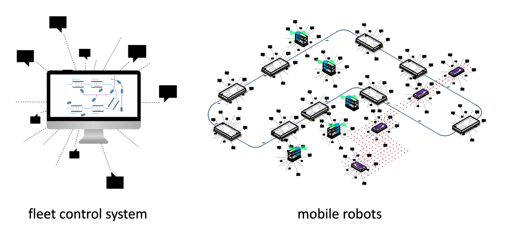
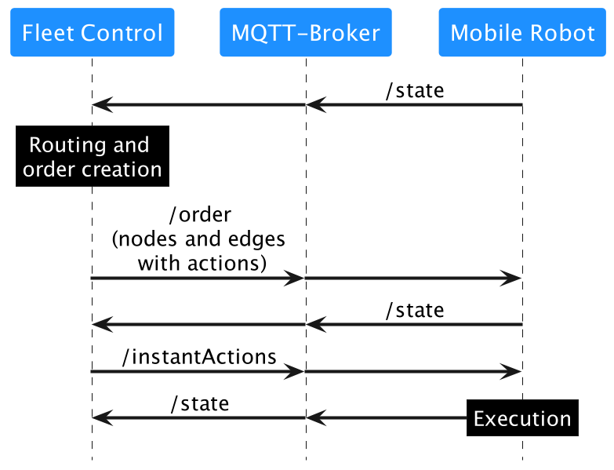
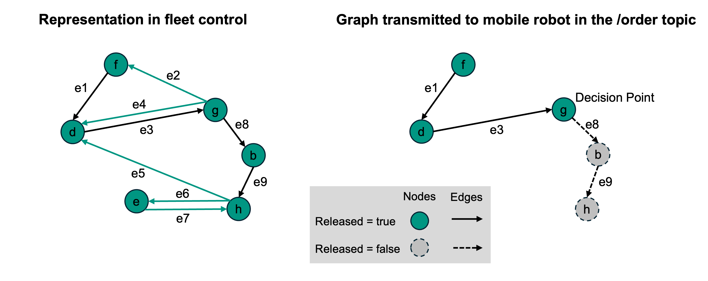

# mobile robot 与 fleet control 之间的通信接口

## VDA 5050

## Version 3.0.0



# Disclaimer (免责声明)
以下说明旨在为实现 mobile robot 与 fleet management system 之间通信的接口提供实施指导。这些内容向所有用户免费开放，且不具约束力。任何选择应用这些指南的各方有责任确保在具体情况下的正确和适当使用。
用户在应用本指南时必须考虑当时适用的技术水平。采用这些建议并不能免除各方对其自身行为的责任。这些声明并不声称是详尽无遗的，也不构成对现行法律的权威解释。它们不能替代对相关政策、立法或法规的审查和遵守。
此外，必须考虑各自产品的具体特征及其各种潜在的实际应用。所有用户的行为均需自行承担风险。VDA、VDMA 以及参与制定或应用这些建议的任何个人概不承担任何责任。
如果您在应用这些建议时发现任何不准确之处或存在误解的潜在风险，请立即通知 VDA，以便进行必要的修正。

**Publisher (出版发行)**
Verband der Automobilindustrie e. V. (VDA)
Behrenstraße 35, 10117 Berlin,
Germany
www.vda.de

**Copyright (版权声明)**
Association of the Automotive Industry (VDA)
仅在注明出处的情况下才允许进行复制及任何其他形式的重制。

Version 3.0.0


## Table of contents (目录)
[0 Foreword](#0-foreword)<br>
[1 Introduction](#1-introduction)<br>
[2 Scope](#2-scope)<br>
[3 Definitions](#3-definitions)<br>
  [3.1 Mobile Robot](#31-mobile-robot)<br>
  [3.2 Moving](#32-moving)<br>
  [3.3 Driving](#33-driving)<br>
  [3.4 Automatic driving](#34-automatic-driving)<br>
  [3.5 Manual driving](#35-manual-driving)<br>
  [3.6 Line-guided mobile robot](#36-line-guided-mobile-robot)<br>
  [3.7 Freely navigating mobile robot](#37-freely-navigating-mobile-robot)<br>
[4 Transport protocol](#4-transport-protocol)<br>
  [4.1 Connection handling, security and QoS](#41-connection-handling-security-and-qos)<br>
  [4.2 Topic levels](#42-topic-levels)<br>
  [4.3 Topics for communication](#43-topics-for-communication)<br>
[5 Process and content of communication](#5-process-and-content-of-communication)<br>
  [5.1 General](#51-general)<br>
  [5.2 Implementation Phase](#52-implementation-phase)<br>
  [5.3 Functions of the fleet control](#53-functions-of-the-fleet-control)<br>
  [5.4 Functions of the mobile robots](#54-functions-of-the-mobile-robots)<br>
[6 Protocol specification](#6-protocol-specification)<br>
  [6.1 Order](#61-order)<br>
    [6.1.1 Concept and logic](#611-concept-and-logic)<br>
    [6.1.2 Orders and order updates](#612-orders-and-order-update)<br>
    [6.1.3 Order cancellation](#613-order-cancellation)<br>
    [6.1.4 Order rejection](#614-order-rejection)<br>
    [6.1.5 Corridors](#615-corridors)<br>
  [6.2 Actions](#62-actions)<br>
    [6.2.1 Instant actions](#621-instant-actions)<br>
    [6.2.2 Action blocking types and sequence (Action 阻塞类型与执行顺序)](#622-action-blocking-types-and-sequence)<br>
    [6.2.3 Predefined actions (预定义 Action)](#623-predefined-actions)<br>
  [6.3 Maps (地图)](#63-maps)<br>
    [6.3.1 Map distribution (地图分发)](#631-map-distribution)<br>
    [6.3.2 Maps in mobile robot state (mobile robot 状态中的地图)](#632-maps-in-the-mobile-robot-state)<br>
    [6.3.3 Map download (地图下载)](#633-map-download)<br>
    [6.3.4 Enable downloaded maps (启用已下载的地图)](#634-enable-downloaded-maps)<br>
    [6.3.5 Delete maps on the mobile robot (删除 mobile robot 上的地图)](#635-delete-maps-on-the-mobile-robot)<br>
  [6.4 Zones (区域)](#64-zones)<br>
    [6.4.1 Zone types (Zone 类型)](#641-zone-types)<br>
    [6.4.2 Zone set transfer (Zone 集传输)](#642-zone-set-transfer)<br>
    [6.4.3 Communication for interactive zones (交互式 zone 的通信)](#643-communication-for-interactive-zones)<br>
    [6.4.4 Interaction between zones (zone 之间的交互)](#644-interactions-between-zones)<br>
    [6.4.5 Error handling within zones (zone 内的错误处理)](#645-error-handling-within-zones)<br>
  [6.5 Connection (连接)](#65-connection)<br>
  [6.6 State (状态)](#66-state)<br>
    [6.6.1 Concept and logic (概念与逻辑)](#661-concept-and-logic)<br>
    [6.6.2 Traversal of nodes and edges (Node 与 edge 的遍历)](#662-traversal-of-nodes-and-edges)<br>
    [6.6.3 Base request (Base 请求)](#663-base-request)<br>
    [6.6.4 Information (信息)](#664-information)<br>
    [6.6.5 Errors (错误)](#665-errors)<br>
    [6.6.6 Operating Mode (操作模式)](#666-operating-mode)<br>
    [6.6.7 Clearing the order on the mobile robot (清除 mobile robot 上的 order)](#667-clearing-the-order-on-the-mobile-robot)<br>
    [6.6.8 Idle state of the mobile robot (mobile robot 的 idle 状态)](#668-idle-state-of-the-mobile-robot)<br>	
    [6.6.9 Action states (Action 状态)](#669-action-states)<br>
    [6.6.10 Request use of Corridors (请求使用 Corridors)](#6610-request-use-of-corridors)<br>
  [6.7 Visualization (可视化)](#67-visualization)<br>
  [6.8 Sharing of planned paths for freely navigating mobile robots (共享自由导航 mobile robot 的计划路径)](#68-sharing-of-planned-paths-for-freely-navigating-mobile-robots)<br>
  [6.9 Request/response mechanism (请求/响应机制)](#69-requestresponse-mechanism)<br>
  [6.10 Factsheet (数据表)](#610-factsheet)<br>
[7 Message specification (消息规范)](#7-message-specification)<br>
  [7.1 Symbols of the tables and meaning of formatting (表格符号及格式含义)](#71-symbols-of-the-tables-and-meaning-of-formatting)<br>
    [7.1.1 Optional fields (可选 Fields)](#711-optional-fields)<br>
    [7.1.2 Permitted characters and field lengths (允许的字符及 field 长度)](#712-permitted-characters-and-field-lengths)<br>
    [7.1.3 Notation of fields, topics and enumerations (Fields, topics 及枚举值的表示方法)](#713-notation-of-fields-topics-and-enumerations)<br>
    [7.1.4 JSON data types (JSON 数据类型)](#714-json-data-types)<br>
  [7.2 Protocol header (协议头部)](#72-protocol-header)<br>
  [7.3 Implementation of the order message (order 消息的实现)](#73-implementation-of-the-order-message)<br>
    [7.3.1 Format of action parameters (Action 参数的格式)](#731-format-of-action-parameters)<br>
  [7.4 Implementation of the instantAction message (instantAction 消息的实现)](#74-implementation-of-the-instantaction-message)<br>
  [7.5 Implementation of the response message (response 消息的实现)](#75-implementation-of-the-response-message)<br>
  [7.6 Implementation of the zoneSet message (zoneSet 消息的实现)](#76-implementation-of-the-zoneset-message)<br>
  [7.7 Implementation of the connection message (connection 消息的实现)](#77-implementation-of-the-connection-message)<br>
  [7.8 Implementation of the state message (state 消息的实现)](#78-implementation-of-the-state-message)<br>
  [7.9 Implementation of the visualization message (visualization 消息的实现)](#79-implementation-of-the-visualization-message)<br>
  [7.10 Implementation of the factsheet message (factsheet 消息的实现)](#710-implementation-of-the-factsheet-message)<br>


# 0 Foreword (前言)

该接口规范由德国汽车工业协会 (Verband der Automobilindustrie e. V., VDA) 与德国机械设备制造业联合会 (VDMA e. V.) 联合制定。
VDA 代表德国汽车行业，包括 OEM（整车厂）及 Tier-1/Tier-n 供应商，并贡献了其在车辆架构、系统集成与安全关键型通信方面的专业知识。
VDMA 代表欧洲整个机械与工厂工程行业的众多企业，带来了自动化技术、机械互操作性及生产系统标准化方面的丰富知识。
两家机构通力合作，以确保该接口规范能够反映当前的工程需求，支持稳健且可扩展的系统集成，并实现在异构环境下的稳定数据交换。他们的联合开发过程强调统一的通信模型、与既有工业标准的兼容性，以及跨领域接口的长期可维护性。这种合作确保了最终的规范能够在汽车、机械及混合工业应用中得到可靠的实施，从而支持高度的互操作性、运行安全性及面向未来的系统架构。
卡尔斯鲁厄理工学院 (KIT) 物料搬运与物流研究所 (IFL) 是机械工程系的一部分，专注于结合科研、教学与工业应用。其跨学科团队致力于解决未来物流的各项挑战，包括物料流分析、自动化、机器人技术、数字化、AI、可持续性及系统设计。
该研究所受 VDA 和 VDMA 委托，负责监督 VDA 5050 的开发。它通过主导开发工作、支持问题审查以及管理官方 GitHub 仓库来参与这一进程。


# 1 Introduction (引言)
本建议书描述了中央 fleet control 与 mobile robots 之间交换信息的通信接口。
本建议书的目标是在集中式 fleet control 系统的监督下，支持 mobile robot 车队的集成与高效运行。这一目标通过实施标准化、供应商中立的通信接口来实现，从而确保 fleet control 系统与各个 mobile robot 之间的互操作性。
各国的技术指南与法律框架可能会在此背景下提供一般性指导。它们可能在规划、运营、安全性或自动化系统协调等方面提供指示性信息。此外，国家标准及监管规定有助于确保在统一的整体框架内考量技术流程与专业术语。
本建议书采用语义化版本控制模式。主版本变更 (x.0.0) 通常涉及不兼容的更改，例如引入新的不可选 Fields。次要版本变更 (3.x.0) 一般会引入新功能，例如为 visualization 添加一个可选参数。补丁版本变更 (3.0.x) 通常解决较小的修正，比如修复文档中的拼写错误。
欢迎各利益相关方提交有关修改或增强该接口的提案。此类提案应通过以下 GitHub 仓库提交：<https://github.com/vda5050/vda5050>。


# 2 Scope (适用范围)

本文档描述了 fleet control 系统与 mobile robots 之间标准化且供应商中立的通信接口。其目的是提供一个通用参考，以支持在多个 mobile robot 于 fleet control 系统协调下共同运行的环境中的互操作性。本规范的使用是可选的且非强制的，由各利益相关方自行决定是否应用。

本规范的目标包括：

- 降低在将 mobile robot 连接至 fleet control 系统时的复杂性。
- 实现在共享物理环境中，由不同制造商生产的异构 mobile robot 车队能够协同运行。
- 提供一套通用且独立于领域的接口定义，适用于具有不同导航原理、物理尺寸、载荷处理或操作能力以及不同自主级别的 mobile robot。

本规范不涉及以下主题：

- 安全要求：本文档未定义功能、操作或系统的安全要求，且不应作为安全标准被看待或应用。
- 交通管理逻辑：未包含交通协调的策略、算法或决策过程（例如，路径规划、优先级排序、拥堵处理或死锁解除）。
- 其他通信接口：排除了与 fleet control 系统和 mobile robots 之间通信无关的接口，如连接外围设备、基础设施组件或外部 IT 系统的接口。
- 项目协调与实施程序：不包含项目管理活动、集成方法学、调试工作流、验证与验收程序及类似组织流程。
- 运营责任：本文档未在操作人员、系统集成商、车辆制造商或 fleet control 供应商之间，就规划、操作、维护或安全方面分配责任。
- 网络安全措施：未规定用于安全通信或数据保护的机制、技术或流程。

## 3.2 Moving (移动)
mobile robot 或其任何组件经历空间位置或方向变化的 state，包括车轮、载荷处理设备或机器人本体的运动。

## 3.3 Driving (行驶)
mobile robot 具有非零平移和/或旋转速度的操作 state。

## 3.4 Automatic driving (自动行驶)
mobile robot 在无人工干预的情况下运行的 Driving state。

## 3.5 Manual driving (手动行驶)
mobile robot 在人类直接控制下运行的 Driving state。

## 3.6 Line-guided mobile robot (导引式 mobile robot)
遵循预定义轨迹的 mobile robots。预定义轨迹由 fleet control 作为 order 的一部分发送，或以显式/隐式方式作为 node 之间的直接连接定义在机器人上。

## 3.7 Freely navigating mobile robot (自由导航 mobile robot)
自行规划轨迹的 mobile robots。如果 fleet control 在 order 中发送了轨迹，机器人应当遵循该轨迹。


# 4 Transport protocol (传输协议)

考虑到连接中断和消息潜在丢失的影响，预计通信将通过无线网络进行。

消息协议为 Message Queuing Telemetry Transport (MQTT)，需结合 JSON 格式使用。
为保证兼容性，至少需要 MQTT 3.1.1 版本。
MQTT 允许将消息分发到不同的子频道，这些子频道被称为 "topics"。
MQTT 网络中的参与者订阅这些 topics 并接收与其相关的信息。

JSON 格式允许协议未来通过附加参数进行扩展，同时也支持通过 Schema 进行验证。

### 4.1 Connection handling, security and QoS (连接处理、安全性与 QoS)

MQTT 协议为客户端提供了设置遗嘱消息 (last will) 的选项。
如果客户端因任何原因意外断开连接，broker 将会把遗嘱消息分发给其他已订阅的客户端。
关于此功能的使用说明请参见第 [6.5 Connection](#65-connection) 节。

如果 mobile robot 与 broker 断开连接，它将保留所有 order 信息，并执行 order 直到最后被释放 (released) 的 node。

为了减少通信开销，对于 topics `order`, `instantActions`, `state`, `factsheet`, `zoneSet`, `responses` 和 `visualization` 应当使用 MQTT QoS level 0 (Best Effort)。对于 topic `connection` 应当使用 QoS level 1 (At Least Once)。

协议安全需要通过 broker 配置予以考量，但本指南中不作深入探讨。


### 4.2 Topic levels (Topic 层级)

由于云提供商对于 topic 结构存在强制要求，因此这里并未严格定义 MQTT topic 结构。
对于基于云的 MQTT broker，可能需要单独调整 topic 结构，但它应大致遵循本文建议的结构。
以下章节中定义的 topic 名称是强制性的。

对于本地 broker，建议的 MQTT topic 层级如下：

**interfaceName/majorVersion/manufacturer/serialNumber/topic**

示例：
```
vda5050/v3/KIT/0001/order
```

MQTT Topic Level | Data type | Description
---|---|---
interfaceName | string | 所用接口的名称
majorVersion | string | VDA 5050 建议书的主版本号，以 "v" 开头
manufacturer | string | mobile robot 的制造商
serialNumber | string | 唯一的 mobile robot 序列号，由以下字符组成：<br>A-Z <br>a-z <br>0-9 <br>_ <br>. <br>: <br>-
topic | string | Topic (例如 order 或 state)，参见第 [4.4 Topics for Communication](#43-topics-for-communication) 节

>表 1 建议的 MQTT topic 层级说明

由于 `/` 字符用于定义 topic 层级结构，因此它不得出现在上述任何 fields 中。
通配符 `+` 和 `#` 以及为 broker 内部 topics 保留的字符 `$` 也同样不应被使用。

### 4.3 Topics for communication (用于通信的 Topic)

该协议使用以下 topics 在 fleet control 和 mobile robots 之间交换信息。

Topic name | Published by | Subscribed by | Used for | Implementation | Schema
---|---|---|---|---|---
order | fleet control | mobile robot | Communication of orders (order 的通信) | mandatory | order.schema
instantActions | fleet control | mobile robot | Communication of the actions that are to be executed immediately (需要立即执行的 action 的通信) | mandatory | instantActions.schema
state | mobile robot | fleet control | Communication of the mobile robot state (mobile robot 状态的通信) | mandatory | state.schema
visualization | mobile robot | visualization systems | High frequency communication of position and planned path (位置与计划路径的高频通信) | optional | visualization.schema
connection | broker / mobile robot | fleet control | Indicates when mobile robot connection is lost. Not to be used by fleet control for checking the mobile robot health, added for an MQTT protocol level check of connection (指示 mobile robot 何时丢失连接。不应用于 fleet control 检查 mobile robot 健康状态，此为 MQTT 协议层级的连接检查) | mandatory | connection.schema 
factsheet | mobile robot | fleet control | Parameters or vendor-specific information to assist set-up of the mobile robot in fleet control (用于辅助在 fleet control 中设置 mobile robot 的参数或供应商特定信息) | mandatory | factsheet.schema
zoneSet | fleet control | mobile robot | Transfer of zone sets from fleet control to the mobile robot (将 zone set 从 fleet control 传输至 mobile robot) | optional | zoneSet.schema
responses | fleet control | mobile robot | Fleet control's responses to requests from within the mobile robot's state (Fleet control 针对 mobile robot 状态中请求的 responses) | optional | responses.schema

>表 2 fleet control 与 mobile robot 之间的通信 Topics


# 5 Process and content of communication (通信流程与内容)

## 5.1 General (概述)

在 driverless transport system 的运行中，至少存在以下参与者：

- DTS 的运营商（operator）提供基础信息
- fleet control 组织和管理运行过程
- mobile robot 执行 orders

图 1 描述了运行阶段的通信内容。
在实施或修改阶段，需要手动对 mobile robot 和 fleet control 进行配置。


>图 1 - 信息流的结构

## 5.2 Implementation Phase (实施阶段)

在实施阶段，由 fleet control 和 mobile robots 组成的 DTS 会被设置好。
运营商定义了必要的框架条件，所需的信息可由其手动输入，也可通过从其他系统导入来存储在 fleet control 中。
这主要涉及以下内容：

- 路线定义：
使用布局交换格式 (Layout Interchange Format, LIF)，可以将路线导入至 fleet control。LIF 是一种用于在 driverless transport mobile robots 集成商与（第三方）fleet control system 之间交换轨道布局的文件格式（LIF – Layout Interchange Format, VDMA 2024-03）。
或者，运营商也可以在 fleet control 中手动实现路线。
路线可以是单行道、针对某些 mobile robot 组限行（基于尺寸比例）等。
- 路线网络配置：
在路线内定义了用于装卸载的站点、电池充电站、外围环境（闸门、电梯、屏障）、等待位置、缓冲站点等。
- Mobile robot 配置：mobile robot 的物理属性（尺寸、可用载荷搬运装置等）由运营商进行存储。
mobile robot 应当通过 topic `factsheet` 以特定的方式传达这些信息，具体定义见本文档的第 [7.10 Implementation of the factsheet message](#710-implementation-of-the-factsheet-message) 节。

上述路线及路线网络的配置不属于本文档的范围。
它们构成了 fleet control 基于这些信息和待完成的运输需求，从而实现 order 控制与行驶路径分配的基础。
需要由机器人车队执行的 orders，将通过 MQTT 传输给各个 mobile robot。
随后，mobile robot 在执行 order 的同时，也会不断地通过 MQTT 向 fleet control 报告其 status。

## 5.3 Functions of the fleet control (fleet control 的功能)

fleet control 系统至少要执行以下功能：

- 向 mobile robots 分配 orders
- 路线计算与对导引式 mobile robot 的引导（考虑每个 mobile robot 个体物理属性的限制，例如尺寸、机动性等）
- 阻塞（"deadlocks"）的检测与解除
- 能源管理：充电 orders 可以中断运输 orders
- 交通控制：缓冲路线与等待位置
- 环境的（临时）改变，例如释放特定区域或更改最大速度
- 与门、闸、电梯等外围系统的通信
- 通信错误的检测与解决

## 5.4 Functions of the mobile robots (mobile robots 的功能)

每个 mobile robot 应当执行以下功能：

- 定位
- 执行相关的路线（导引式或自由导航）
- 执行 actions
- 持续传输其 status


# 6 Protocol specification (协议规范)

本节将描述通信协议的详细信息。
该协议指定了 fleet control 与 mobile robot 之间的通信。

## 6.1 Order (Order 协议)

topic `order` 是一个 MQTT topic，mobile robot 通过该 topic 接收 order，其中包含指示机器人移动或执行 action 的指令。


### 6.1.1 Concept and logic (概念与逻辑)

传输 order 的核心是一个 node-edge-graph（节点-边-图）片段，用于定义要行驶的路线。
mobile robot 将按要求遍历 node 和 edge 以完成该 order。
fleet control 掌握着所有相连 node 和 edge 的完整全图。该图中可能包含各种限制条件，例如允许哪台 mobile robot 遍历哪条 edge。
这些限制条件不会传达给 mobile robot。
fleet control 在发送给相关 mobile robot 的 order 中，仅包含该机器人被允许遍历的 edge。


>图 2 - fleet control 中的图表示法以及在 orders 中传输的图

在 order 消息中，node 和 edge 以两个列表的形式传递。
这些列表中的 node 和 edge 的顺序也决定了应当被遍历的顺序。'sequenceId' 在 node 与 edge 之间共享，并且定义了遍历的顺序。第一个 node 的 `sequenceId` 为 0，第一条 edge 的 `sequenceId` 为 1，第二个 node 的 `sequenceId` 为 2，以此类推。带有 `sequenceId` n 的 edge 连接了带有 `sequenceId` n-1 与 n+1 的两个 node。`sequenceId` 在一个 order 中必须是连续的。

对于一个有效的 order，至少应当包含一个 node，并且 edge 的数量应当等于 node 的数量减一。

order 中的第一个 node（`sequenceId` = 0）应当是 mobile robot 轻而易举就能到达的，并且始终是已被释放（released）的状态。
这意味着 mobile robot 要么已经停在 node 上，要么 mobile robot 处于该 node 的偏差范围内。因此，第一个 node 不应当在 `nodeStates` 中被报告。

Node 与 edge 都有一个名为 `released` 的布尔属性。
如果 node 或 edge 处于 released 状态，则 mobile robot 将被期望遍历它。
如果 node 或 edge 没有被 released，则 mobile robot 绝不能遍历它。
